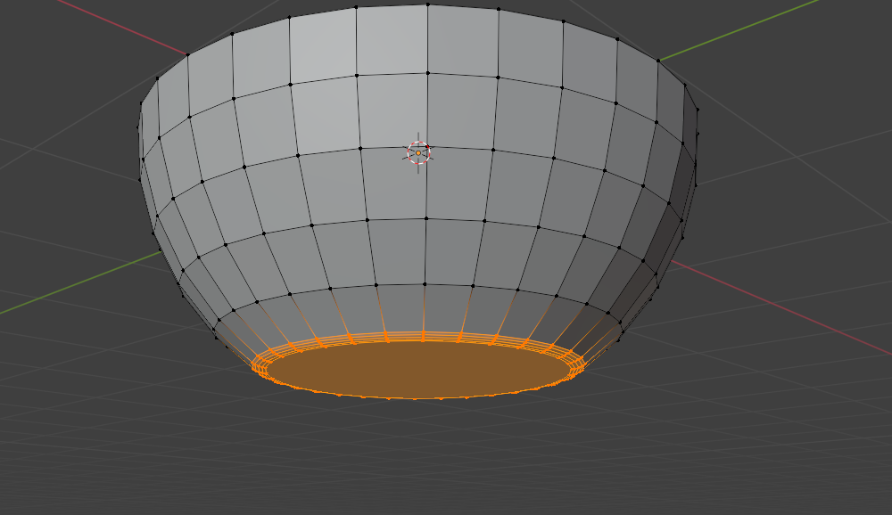
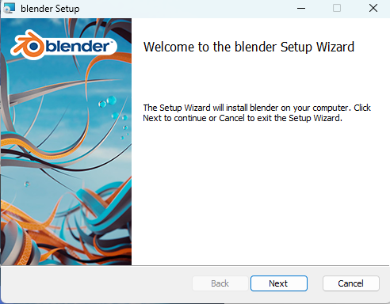
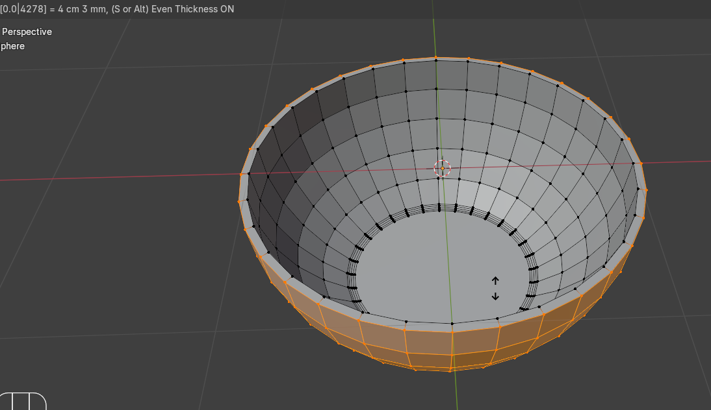
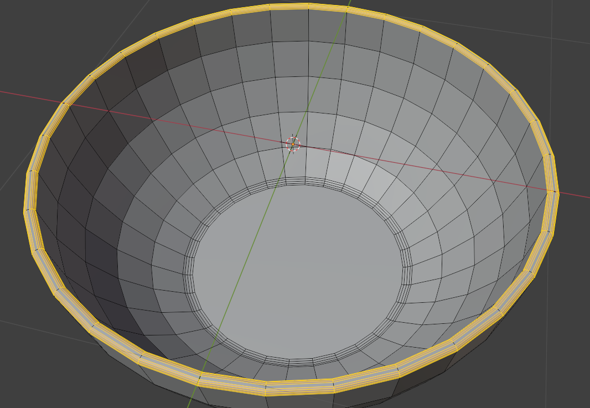

# 第2章：在电脑上安装 Blender

在开始你的 3D之旅之前，你需要下载 Blender，这是一个完全免费的开源 3D建模软件。

以下是一些下载步骤，给可能需要帮助的人。

打开这个页面，点击下载按钮。

https://www.blender.org/

页面截图

页面截图

下载 Blender 4.0.2。

这里总是有最新的稳定版本，我通常都会下载这个。

下载完成后打开文件，你会看到这个窗口。

在这里点击"Next"，接下来会出现这个页面。

勾选"I accept the terms…"方框，然后点击"Next"。

如果你想安装在显示的位置，就点击"Next"，或者浏览选择其他位置。

然后点击"Next"。

完成啦！现在你已经安装好了 Blender，我们可以开始你的 3D建模之旅了！走吧！

