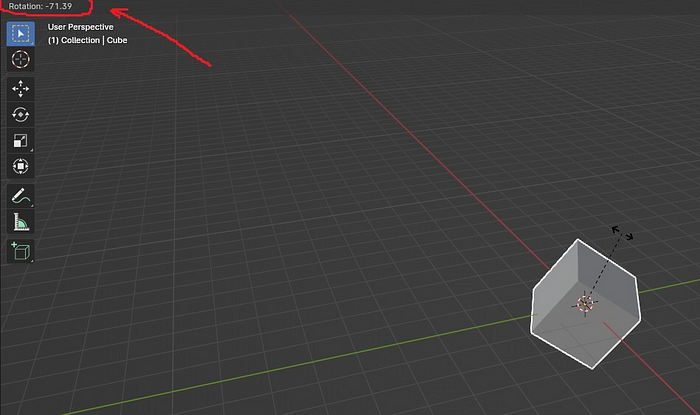
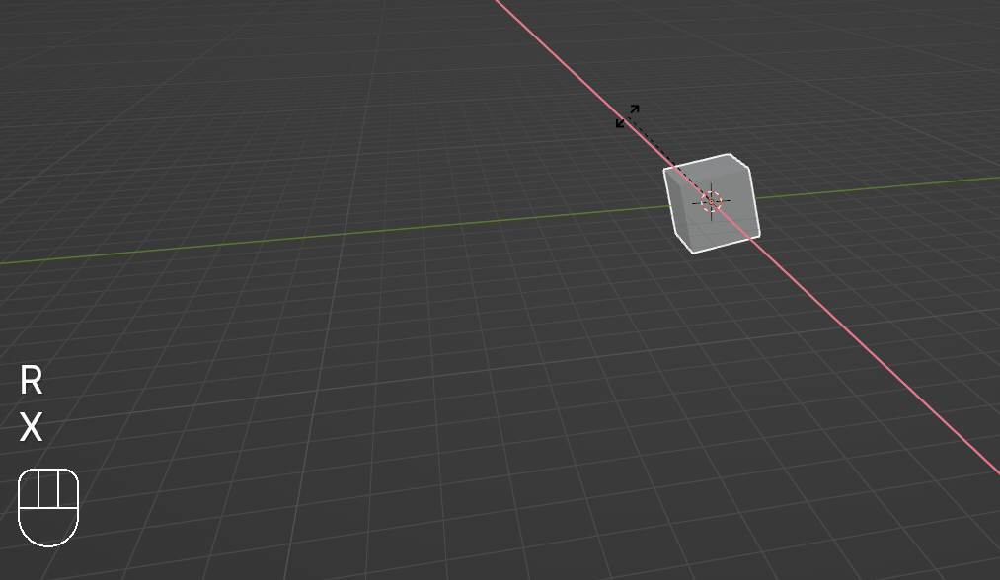
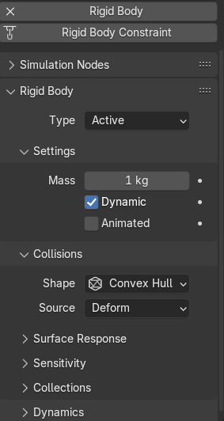
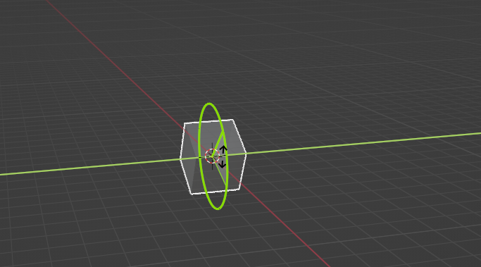
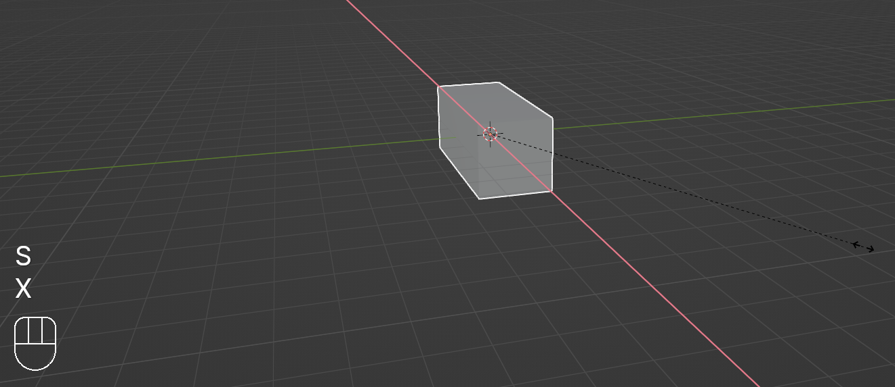
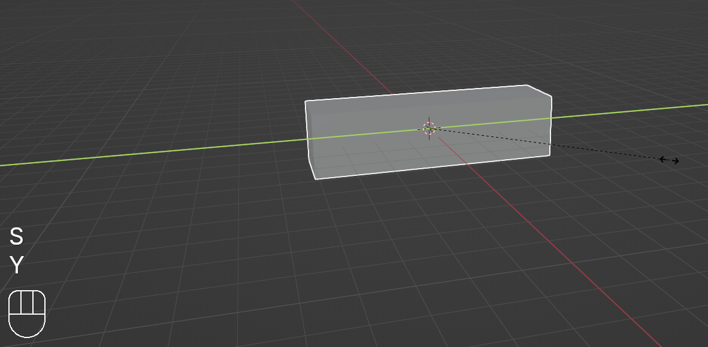
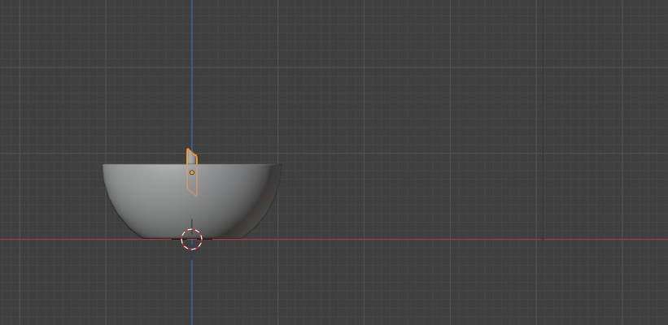
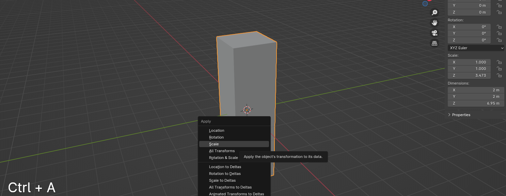

# 第4章：旋转和缩放（调整大小）物体

上次我们学会了如何在 Blender 中移动和删除立方体。

今天我们来学习如何旋转和缩放它。

如何用快捷键旋转立方体（角度旋转）？这是旋转的角度。

在左下角你可以看到旋转角度的数值。

如何用快捷键旋转立方体（轴向旋转）？

1. 用 LMB 选中立方体。

2. 如果想沿某个轴旋转，只要按 R+（其中一个轴）。

`R+X` —— 沿 X 轴旋转。

`R+Y` —— 沿 Y 轴旋转。

`R+Z` —— 沿 Z 轴旋转。

3. 最后用 LMB 确认旋转。

如何不用快捷键旋转立方体（轴向旋转）？

1. 点击工具栏（箭头指向的位置）——点击旋转按钮启用它。

2. 会出现三个彩色圆环——每个颜色代表一个轴。

3. 选择你想要的轴，然后按住 LMB，沿所选轴的方向旋转。

不用快捷键沿 X 轴旋转立方体。作者截图。

不用快捷键沿 Y 轴旋转立方体。作者截图。

不用快捷键沿 Z 轴旋转立方体。作者截图。

我们学会了如何移动和旋转立方体（或其他任何物体）。

现在来学习如何缩放（调整大小）物体。

如何用快捷键缩放（调整大小）立方体？

1. 用 LMB 选中立方体。

2. 按 S，然后用鼠标把立方体缩放到你想要的大小。

3. 最后用 LMB 确认缩放。

如何用快捷键沿某个轴缩放（调整大小）立方体？

1. 用 LMB 选中立方体。

2. 如果想沿某个轴缩放，只要按 S+（其中一个轴）。

`S+X` —— 沿 X 轴缩放。

`S+Y` —— 沿 Y 轴缩放。

`S+Z` —— 沿 Z 轴缩放。

3. 最后用 LMB 确认缩放。

如何不用快捷键缩放（调整大小）立方体？

1. 点击工具栏（箭头指向的位置）——点击缩放按钮启用它。

2. 会出现三条彩色线——每条颜色代表一个轴。

3. 选择你想要的轴，然后按住它，往你想（并且能）的方向缩放。

4. 最后用 LMB 确认缩放。

不用快捷键沿 X 轴缩放立方体。作者截图。

不用快捷键沿 Y 轴缩放立方体。作者截图。

不用快捷键沿 Z 轴缩放立方体。作者截图。你已经学会了在物体模式下变换物体（移动、旋转和缩放）。

## 重要提示！

在编辑模式下编辑网格之前，一定要先应用变换。

否则，物体模式和编辑模式下的数值会不一致。

## 如何应用缩放到物体？

缩放。作者截图。

如你所见，这里 X 的缩放 = 1，Y 的缩放 = 1，但 Z 的缩放 = 3.473。这是什么意思？

我们没有改变 X 和 Y 的缩放，所以它们的数值保持不变。

这里的数值代表百分比。1=100% 表示原始大小，2=200%，3=300% 等等。

我们沿 Z 轴缩放了物体，所以它的数值变了，不再是 1。

X、Y 和 Z 的缩放数值应该始终保持 1。

要应用 Z（或 X、Y 如果需要）的缩放，按"CTRL+A"然后应用缩放。

点击后所有数值都会被应用。不需要分别对 X、Y、Z 各做一次。

恭喜！现在你知道如何在 Blender 中移动、旋转和缩放立方体了！

我就讲到这儿，免得你觉得太晕。