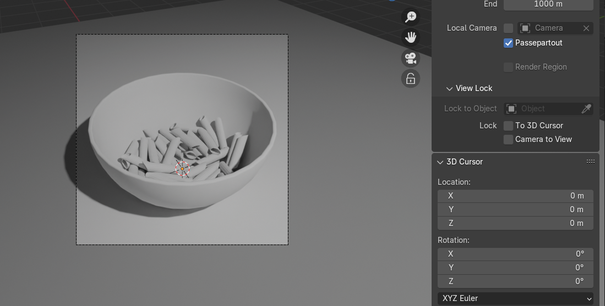
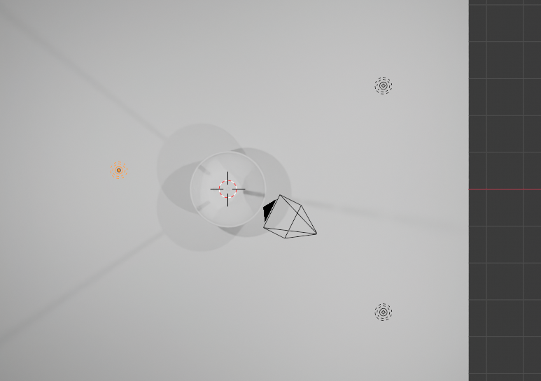
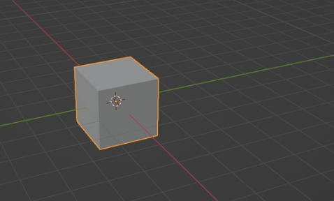
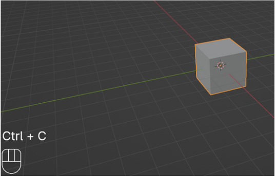
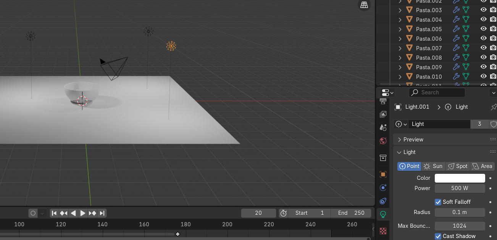
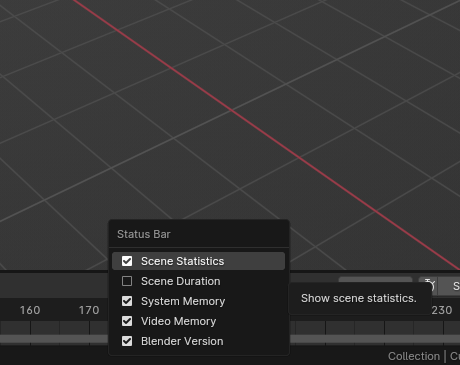

# 第8章：复制物体到场景

现在来学习如何复制物体到场景。

有几种方法，但试着记住用快捷键的那个。

不用快捷键复制物体

1. 用 LMB 选中立方体。
2. 用 RMB 点击它，从菜单中选择"Copy objects"。

如果你再按 RMB 选择"Paste Objects"，你的物体（这里是立方体）就会被复制，但它会和原来的立方体在同一位置。

判断你已经复制了物体的一个方法是看大纲视图里现在有两个立方体：Cube 和 Cube.001。

另一个方法是选中立方体，看到同一位置还有另一个。

用快捷键复制物体

1. 用 LMB 选中立方体。

2. 按"CTRL+C"复制物体。

3. 按"CTRL+V"粘贴物体

在教你编辑模式之前，你需要先了解几件事。

右下角这部分包含一些重要的场景统计信息。

如果没显示，只要用 RMB 点击那条黑条（状态栏），选择 Scene Statistics。

首先你会看到所选集合的名称 - Collection，所选物体的名称 - Cube，该物体的顶点数 - 8，面数 - 6，以及集合中的物体数量。之后还有内存和显存等其他重要信息，但等到我们开始建模和渲染时再细说。

最后一个数字是你当前使用的 Blender 版本 - 我目前是 4.0.2。

当你复制物体时，顶点数、三角面和面数会相应增加。

但有没有办法让场景里有比如一千个立方体，而顶点数、面数和三角面数却仍然像只有一个立方体那样？

有的。这个厉害的技巧你会在接下来的某一章学到。