# 第10章：挤出

终于该学习第一个可以给物体添加几何的工具了——挤出。你可以挤出顶点、边和面。

用"TAB"切换到编辑模式。你可以点击箭头指向的位置激活"挤出"。

如果你激活后按住 LMB，会出现这个菜单，有更多选项。

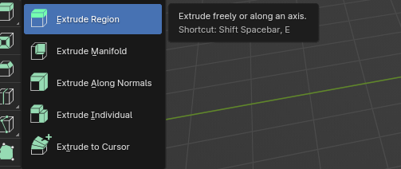

## 不用快捷键进行挤出

挤出区域

首先选择一种选择类型：顶点、边或面。

用 LMB 激活"挤出区域"按钮。

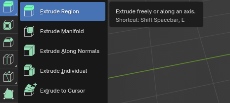

现在根据你第一步选的类型，你可以挤出它。

如果你选了顶点，可以挤出顶点。

选中一个顶点后，你会看到这个。

如果你想沿顶点法线方向挤出，只要点击那个加号，然后用 LMB 拖动，你会得到第二个顶点。

如果你想自由挤出，不要点加号。在白色圆圈里点击，然后用 LMB 拖动顶点。

要挤出边而不是顶点，切换到边选择。

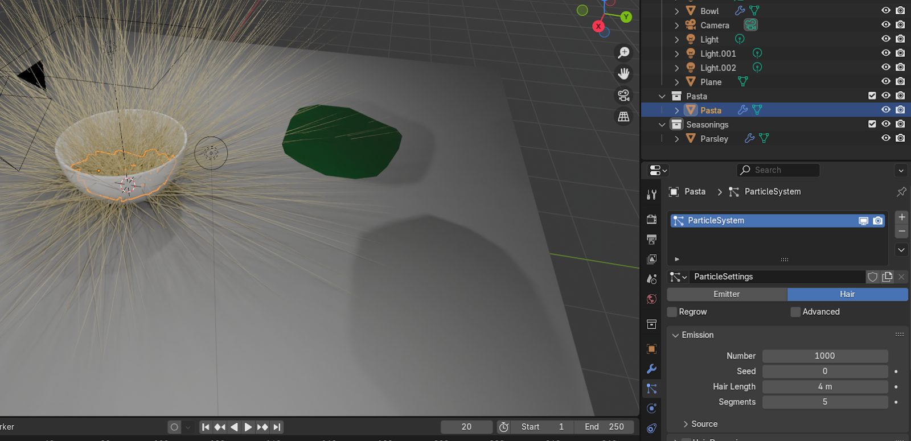

和顶点一样，要沿轴挤出，点击加号然后用 LMB 拖动。

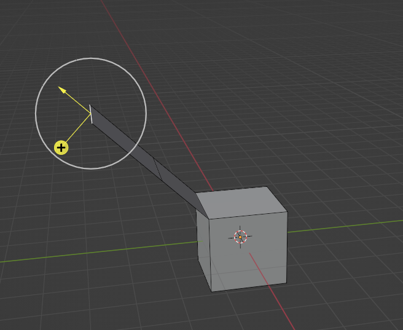

如果你想自由挤出，只要在白色圆圈里点击然后用 LMB 拖动边。

如果你想挤出面，切换到面选择。

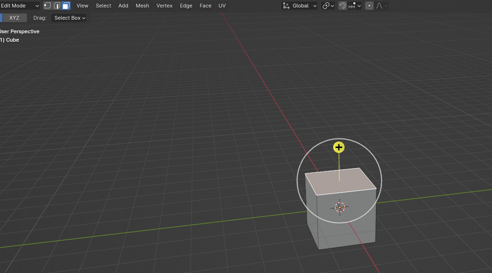

挤出面的方式和顶点、边一样。

以上都是"挤出区域"。正如你看到的，可以自由挤出或沿轴挤出。

挤出封闭面

第二个选项是"挤出封闭面"。正如这里说的：挤出，溶解形成平面的边，并交叉新边。

让我给你展示挤出区域和挤出封闭面的区别。

这是挤出区域的面。你可以看到，当我挤出面时，我得到了更多面，和原来的面之间有环切分隔。

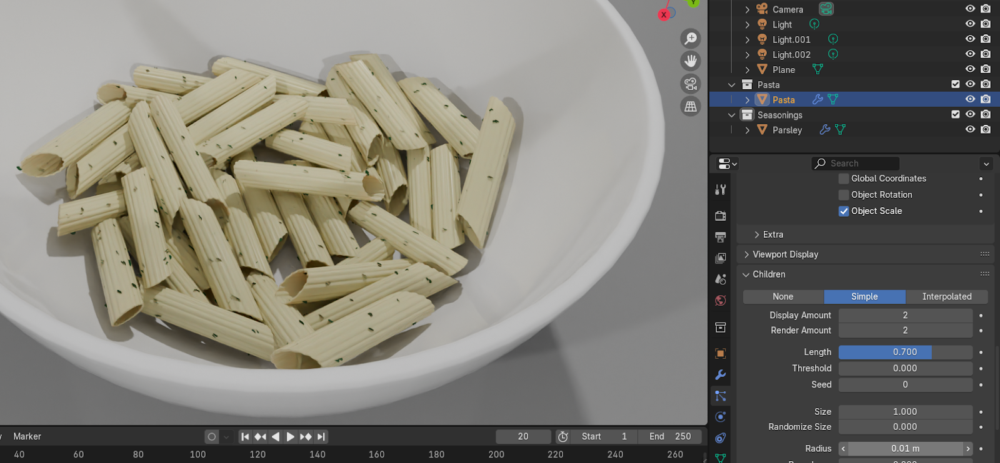

但当我挤出封闭面时，我不会得到额外的面。整个就是一个面，没有环切。

现在看出区别了吗？左边是挤出封闭面，右边是挤出区域。

你也可以看到两个选项的多边形数量不同。

挤出区域 - 顶点 12，边 20，面 10，三角面 20。

挤出封闭面 - 顶点 8，边 12，面 6，三角面 12。

法线

（声明：从这章开始，我会用 Blender 4.2版本）

要理解沿法线挤出是什么意思，我需要先解释什么是法线。

法线显示顶点或面指向的方向。

要查看法线及其方向，用"TAB"切换到编辑模式，点击网格编辑模式叠加层。

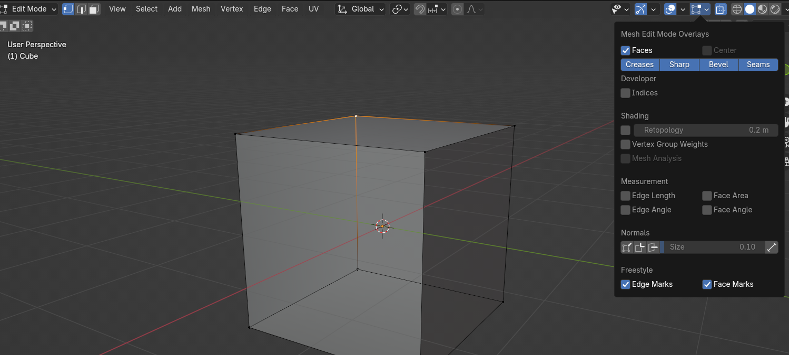

然后点击法线，选择第一个——显示顶点法线，和第三个——显示面法线为线条。我会增大法线尺寸以便更好地给你解释。

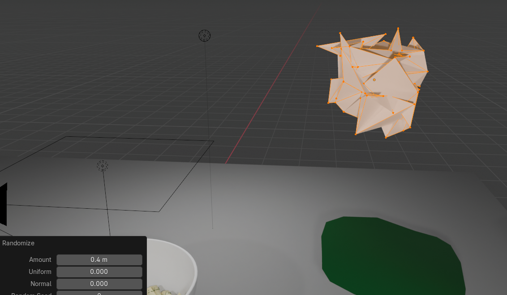

那些从立方体伸出的浅蓝色线是面法线，深蓝色线是顶点法线。

面法线只是告诉你面指向哪个方向。

这个立方体有两面：里面和外面。法线告诉我们立方体的哪部分是外面（蓝线），哪部分是里面（里面没有线，只有外面有，这样我们就知道方向）。

你可以在下一个例子中更清楚地看到。

但如果看起来像这样，你就能看出有什么奇怪的地方了。

第二种方法（我觉得更简单更快）是检查面方向。

点击视口叠加层，打开"Face orientation"。

在看立方体之前，最重要的是记住红色表示里面，蓝色表示外面。

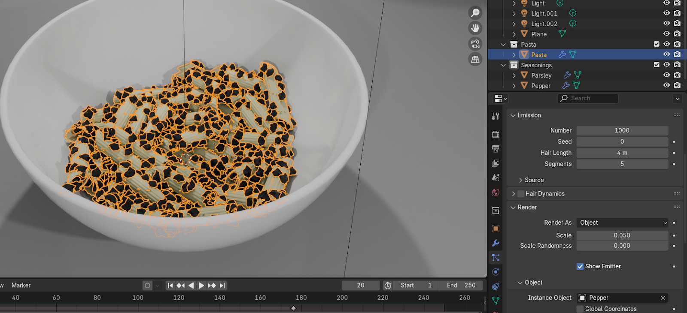

如你所见，立方体上的颜色也不一致。从法线方向我们能看到，从面方向我们也能看到，底部应该是里面，不是外面。

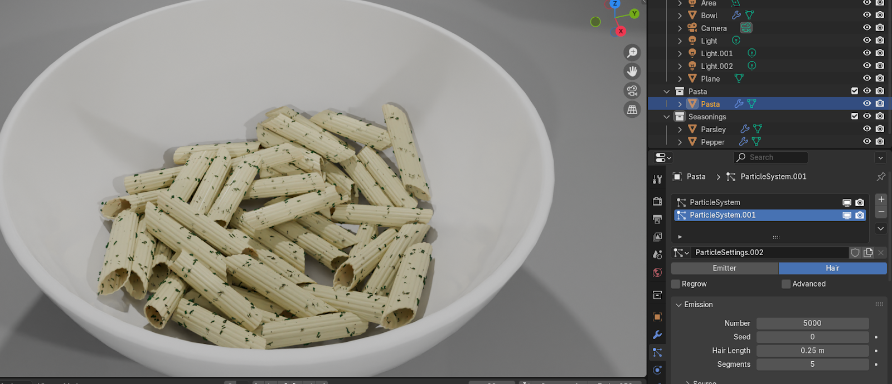

那怎么修改呢？用"A"全选，去 `Mesh → Normals → Recalculate Outside`，或者用"A"全选后直接按"SHIFT+N"。

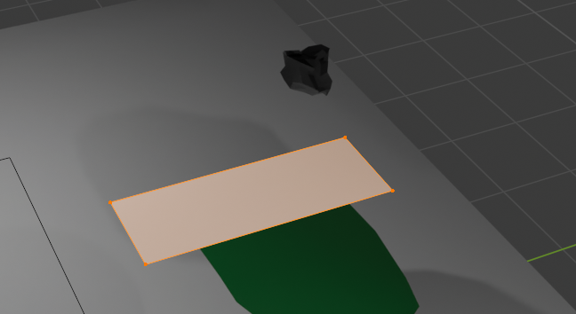

如你所见，现在所有面都正确了。

## 注意！

有些情况下，重新计算外面不起作用，你需要手动选择一个面并翻转它。

怎么做呢？

用 LMB 选择你想翻转的面。

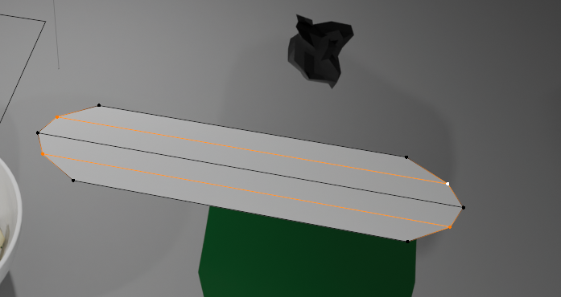

去 `Mesh → Normals → Flip`。

现在一切都正确定向了。你可以像打开时那样关闭法线和面方向显示。

希望你理解了这部分，因为法线在很多情况下很重要。你很快就会学到其中一种情况。

现在终于来学习如何沿法线挤出面。

沿法线挤出

就像之前那样，选择"挤出"按钮，现在选择"沿法线挤出"。

沿法线挤出是指沿局部法线一起挤出区域。

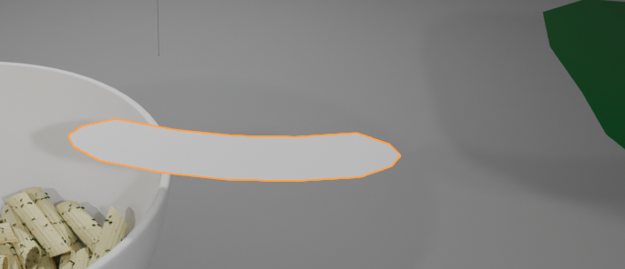

我再打开面方向来给你展示一些东西。

如果你想沿法线挤出，只要用 LMB 选择你想挤出的面，点击那个黄色圆圈，拖动到你想挤出的距离。

当面显示正确的方向（蓝色是外面）时，沿法线挤出也正常工作。但如果有一个面方向错误像这样，你会看到这个黄色圆圈也显示在里面。

这就是为什么你的面应该始终正确定向。

如果你还没意识到用沿法线挤出能让建模更轻松，让我给你展示一个好例子。

想象你想挤出所有这些面。

如果你用挤出区域，你会得到这样的结果。

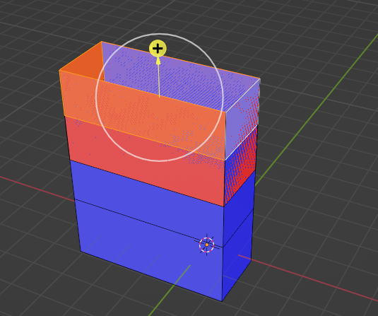

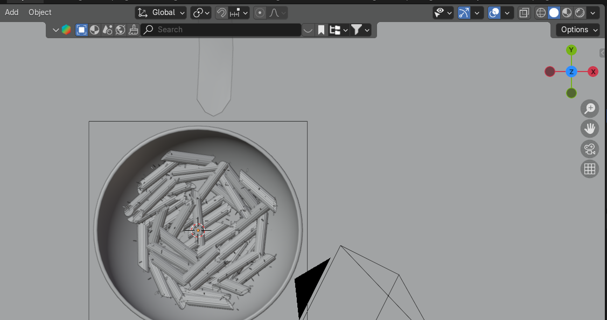

但如果你用沿法线挤出，你会得到这个。

但如果有一个面方向错误，像这样，

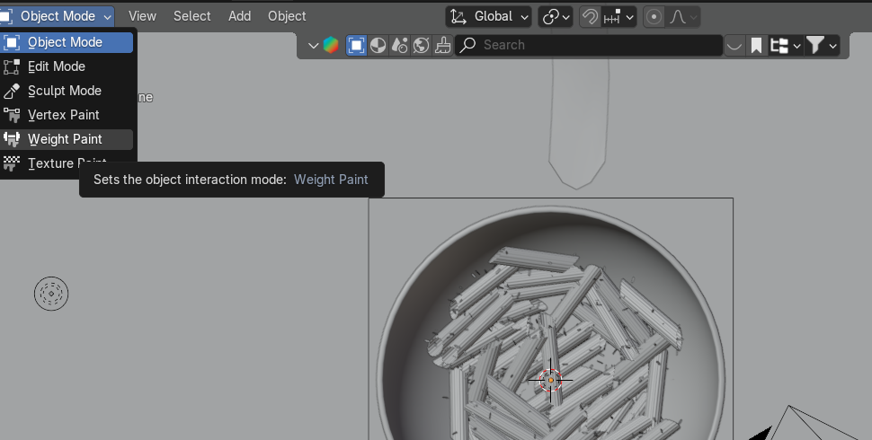

你会得到这个。

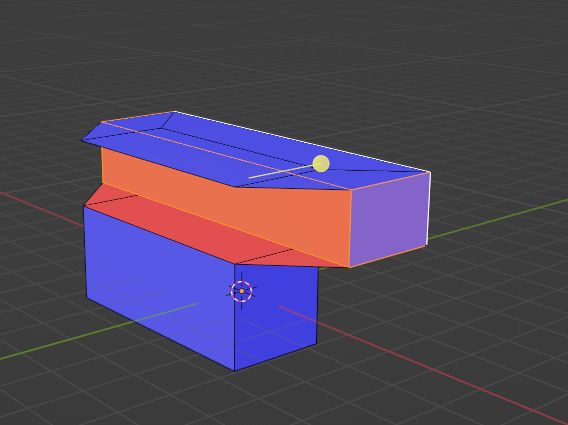

挤出各自

就像之前那样，选择"挤出"按钮，现在选择"挤出各自"。

挤出各自是指每个面单独沿局部法线挤出。

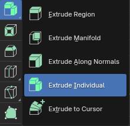

让我给你展示一个例子。

用"A"选择整个立方体，选择"挤出各自"。

现在用 LMB 拖动黄色圆圈，像之前的例子那样挤出。

你会得到这样的结果。

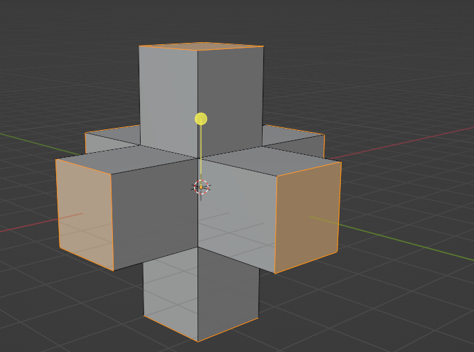

或者如果你选择那两个面，你会得到这样的结果。

同样重要的是所有面都显示正确的方向，所以挤出前检查面方向。

这是个简单易懂的工具，我觉得不用多说了。

挤出到游标

就像之前那样，选择"挤出"按钮，现在选择"挤出到游标"。

挤出到游标是指复制并挤出选中的顶点、边或面到鼠标游标位置。

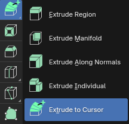

让我给你展示这个工具有多有趣。

用键盘上的 1 切换到顶点选择。

选择你想要的顶点，选择"挤出到游标"。

现在你只要在场景中用 LMB 点击，就会在你点击的位置挤出那个顶点。

你也可以选择多个顶点。

如果你想挤出边，用键盘上的 2 切换到边选择。

选择你想要的边，选择"挤出到游标"。

现在你只要在场景中用 LMB 点击，就会在你点击的位置挤出那条边。你也可以选择多条边。

如果你想挤出面，用键盘上的 3 切换到面选择。

选择你想要的面，选择"挤出到游标"。

现在你只要在场景中用 LMB 点击，就会在你点击的位置挤出那个面。

你也可以选择多个面。

完成啦！

现在你知道怎么使用挤出工具了！下一章我们会学另一个工具，然后我会教你做你的第一个 3D模型。