# 第19章：渲染你的第一个动画

添加相机。

点击相机图标。

按"N"打开侧边栏，去 View，打开 Camera to View。

现在你可以按你已学的方式调整视角。

在做任何其他事情之前，先调整渲染动画设置。

去渲染属性。

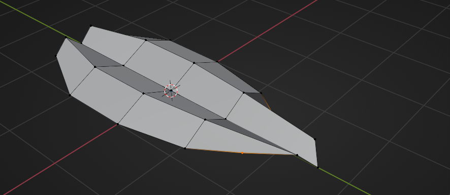

把渲染 Samples 改成 512 甚至 256。

重要的是记住采样数越少质量越低，但渲染时间越短。这只是示例，所以我用低的采样数。

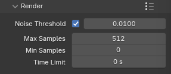

你可以把渲染分辨率改成 1024x1024、1920x1080或其他适合你需求的。这完全取决于你的想法和需要。

我会保持 1920x1080。

帧率是连续图片（帧）被捕获或显示的频率（速率）。通常用每秒帧数或 fps表示。动画 fps越高越流畅，但代价是渲染时间增加（因为你每段动画要渲染更多帧）以及文件大小增加。

把帧率从 24 fps 改成 30 fps。

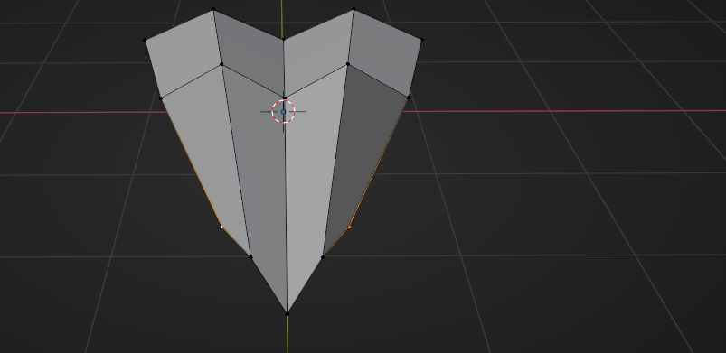

左边的 Start 和 End 与右边的 Frame Start 和 End 相同，两边同时变化，所以你不需要改任何那边。

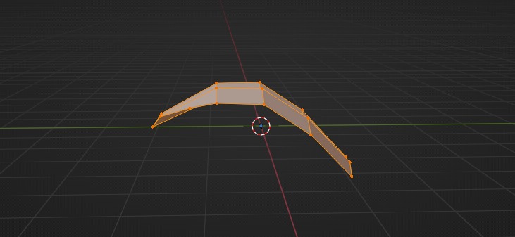

去 Output——动画保存的地方。

点击右边的文件夹

选择你想保存动画的位置后，点击 accept。

比如，我想放在这里。

下一步是选择文件格式。

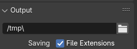

有不同选项，但现在我解释最常见的两种。

你可以把动画渲染为图片（JPEG、PNG、BMP……）或视频（FFmpeg video）。

有什么区别呢？

如果你把动画渲染为图片，意味着你会为每帧得到一张图片，你需要把它们在 Blender图片序列器（或其他视频编辑器）里连接在一起。

渲染为图片有什么优点？

● 你可以随时停止和继续渲染 ● 如果几帧有问题可以更容易修复动画，只需重新渲染那些帧 ● 你对动画有更多控制 ● 视频质量更高

渲染为图片有什么缺点？

● 渲染完成后要做一些工作（用序列器把所有单独帧转成视频） ● 取决于文件类型，文件夹大小可能很大

如果你把动画渲染为视频（"FFmpeg video"），意味着你会为整个动画得到一个视频，不需要再连接。

渲染为视频有什么优点？

● 更快 ● 如果不在第三方软件做合成，完成后工作不多

渲染为视频有什么缺点？

● 你不能随意停止和继续渲染 ● 如果渲染过程中动画出问题，通常要全部重来，可能损失几小时甚至几天的进度 ● 你对动画整体控制较少

这次，我会渲染为视频。

当你选择那个选项，会得到新选项如 Encoding。

打开 Container。

选择 MPEG-4 (.mp4)。

如果你有好的电脑和显卡，把输出质量改成 High Quality。否则，选择中等质量或更低。

这只是练习，不需要最高质量渲染动画。但将来如果有重要项目，你可能需要更高质量渲染，即使渲染时间更长。

你可能会用其他选项，但以后课程和实践中你会学到更多。

这些是基本渲染设置。现在可以回到准备渲染场景了。

添加平面作为背景，这样你的蛋糕不是悬在空中（除非你想那样）。

Shift+A -> Mesh -> Plane

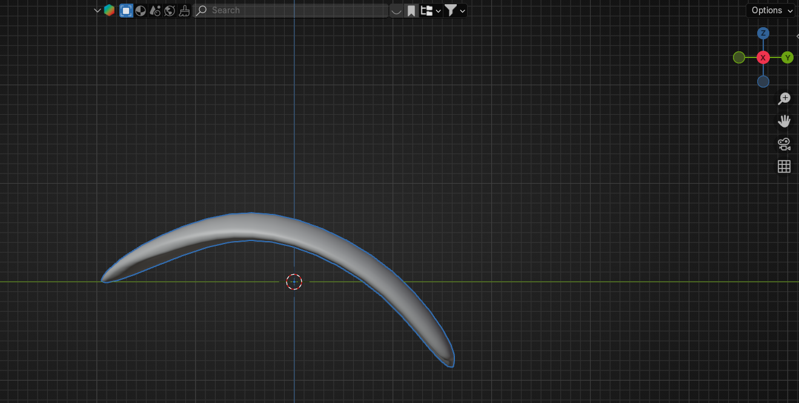

打开 Camera to View

按相机视图缩放平面。

像这样。

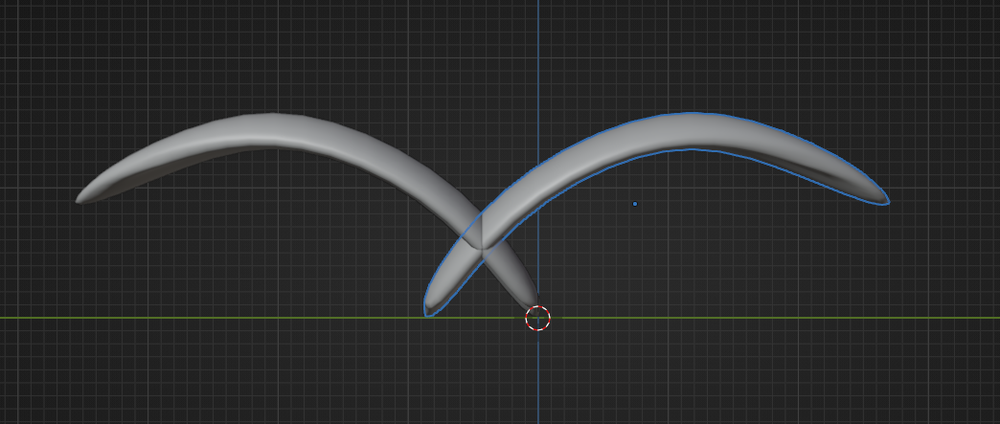

现在你可以切换到编辑模式挤出平面并倒角，让它看起来更好。

沿 Z轴挤出蛋糕后面的边。

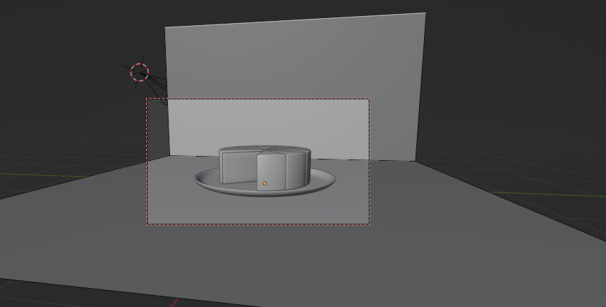

选择这个中间环

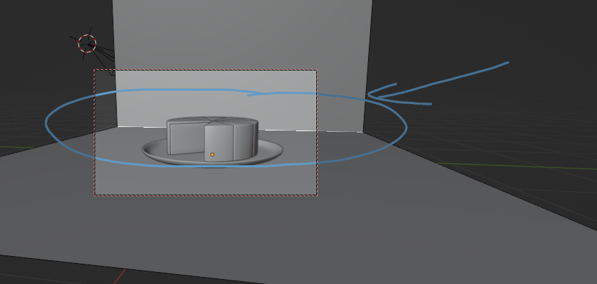

用"CTRL+B"倒角，同时滚动鼠标滚轮添加更多段数。

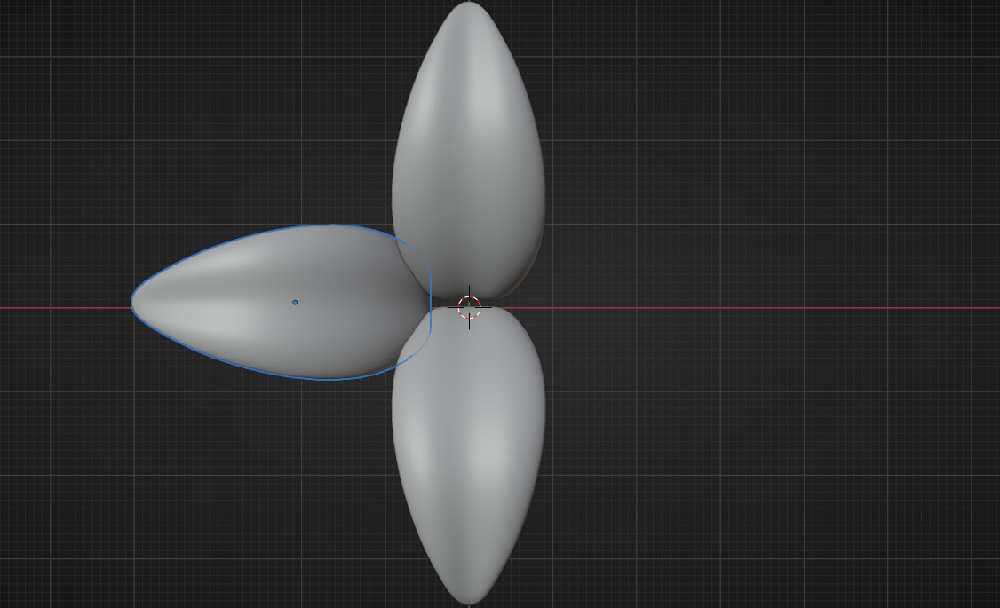

如果需要，用"A"全选，沿 Y轴进一步缩放平面。

切换到物体模式，选择平面 -> RMB -> Shade smooth。

再次开始你的动画，检查相机角度是否一切正常。

我想让它这样，所以不改什么。

你可以再切换到渲染视图，看看能不能做些什么让渲染更好。

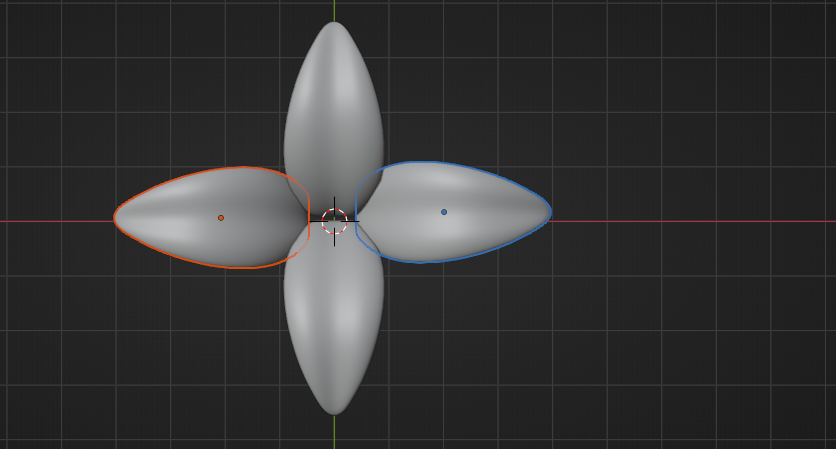

比如，我想让平面颜色不同，所以我会改它。

选择平面，去材质属性，点击 New。

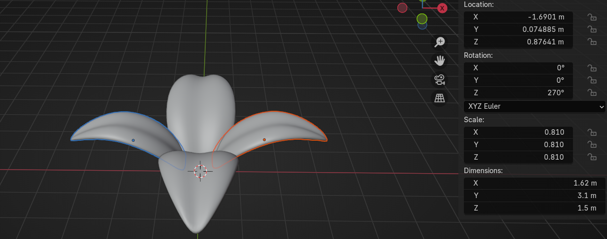

把材质重命名为"Background"或你想要的名字。

选择你喜欢的任何基础颜色。

如果满意了，点击 Render - Render animation，等待完成。取决于你的设置，可能需要一阵子，但这只是简单的小动画，应该不会太长。

完成啦！现在你知道怎么做盘子和蛋糕并让它动起来了。