# Chapter 23: Modeling and texturing of a pumpkin

Since Halloween is approaching, I decided to teach you how to model and texture a pumpkin in Blender.

Let's start with the modeling. (You can check out the video tutorial on my YouTube channel: https://youtu.be/s9HeDfgO6nU?si=C4KRc9KMnQ9IS5P)

This time, you will delete the cube because this basic shape isn't ideal for modeling a pumpkin.

Delete the cube by pressing 'X'.

Add a mesh - UV Sphere.

A new panel appeared in the bottom-left corner. This is how the sphere looks with 32 segments. Since you don’t need that much topology for a simple pumpkin model, you can reduce the number of segments.

I changed it from 32 to 21.

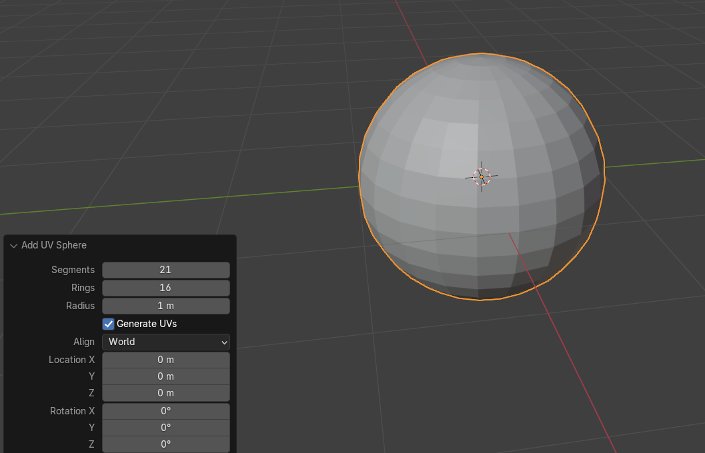

Switch to edit mode with “TAB”.

Select this top vertex

Move to the bottom of the pumpkin

And while holding “CTRL”, click the LMB on the bottom vertex to select the whole loop.

Select every third loop. You can select additional loops by holding 'SHIFT' and clicking 'CTRL' on the desired loop.

When you selected all the loops

Turn on the proportional editing with “O”

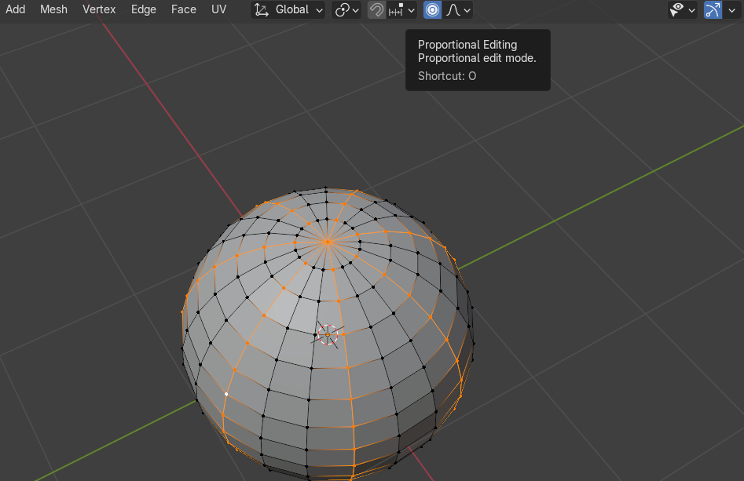

make the area of the influence smaller by scrolling the mouse wheel

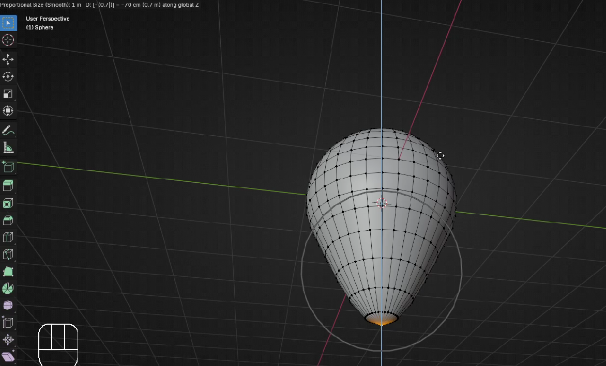

and scale it with “S”.

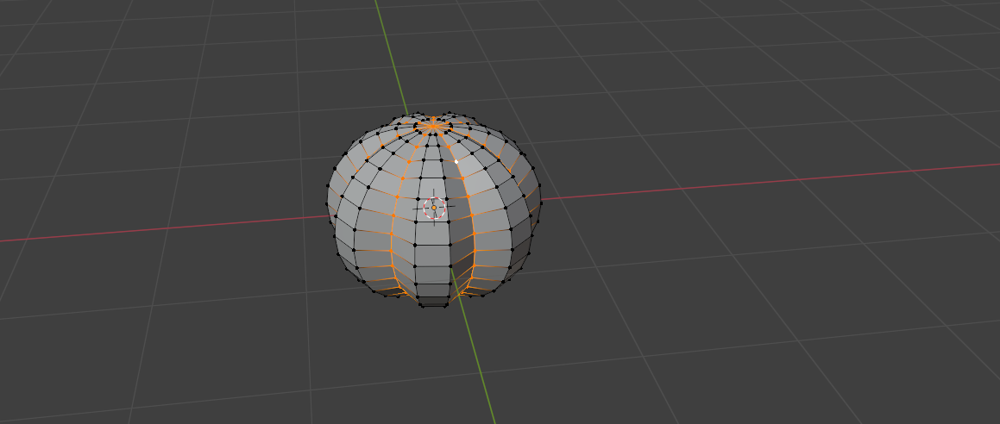

Then scale it using '`S+Z`' to make it look more like a pumpkin.

Select only the top vertex

make the area of influence a bit bigger

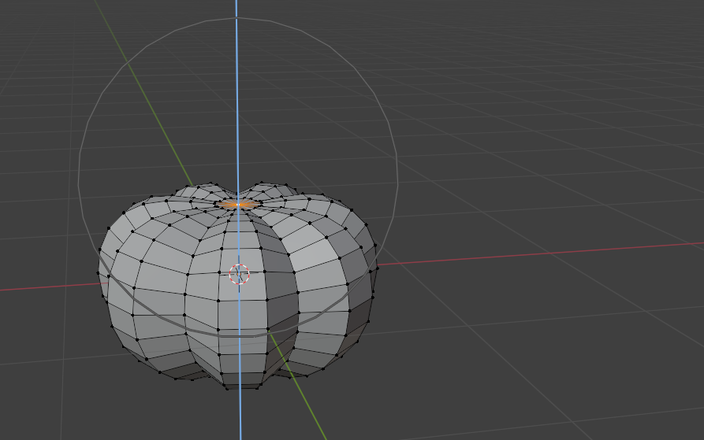

and move it down a bit with “`G+Z`”.

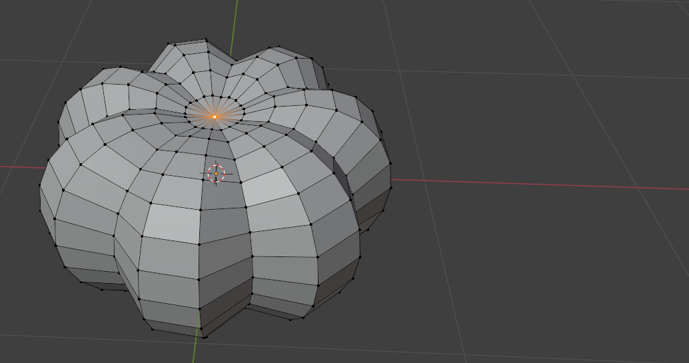

Select only the bottom vertex, and do the same.

Switch to object mode with “TAB” and rename the sphere to pumpkin.

Switch to Edit Mode by pressing 'TAB' and select the loop by holding 'ALT' and clicking with the LMB.

Duplicate it with “SHIFT+D” and move it up with “Z”.

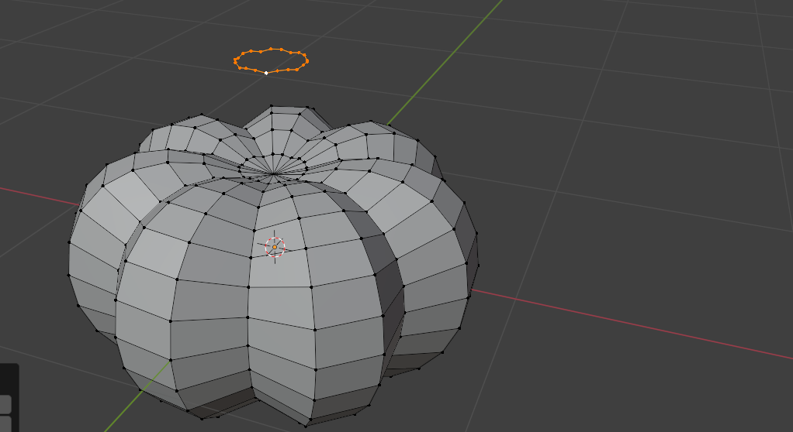

Press “P” and choose separate collection.

Switch to object mode, select that separated part and rename it to “Stem.”

Switch back to Edit Mode. Select the stem, then go to *`Select → Checker`* Deselect to choose every second vertex.

Since you have an odd number of vertices, they won’t be evenly selected, but this won’t affect the stem. In fact, the slight imperfections will make it look more realistic.

Scale it with “S”.

Switch to the back orthographic view with “CTRL+1” on Numpad or click on the Y on the Gizmo.

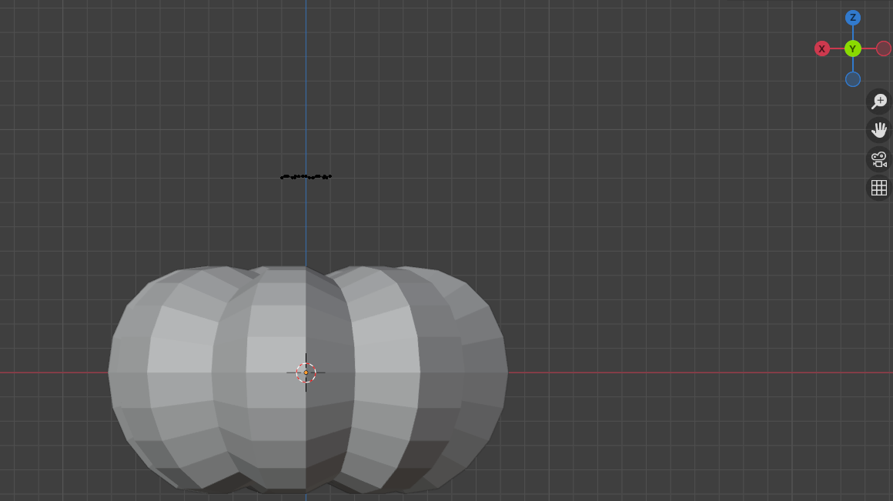

Select all with “A”.

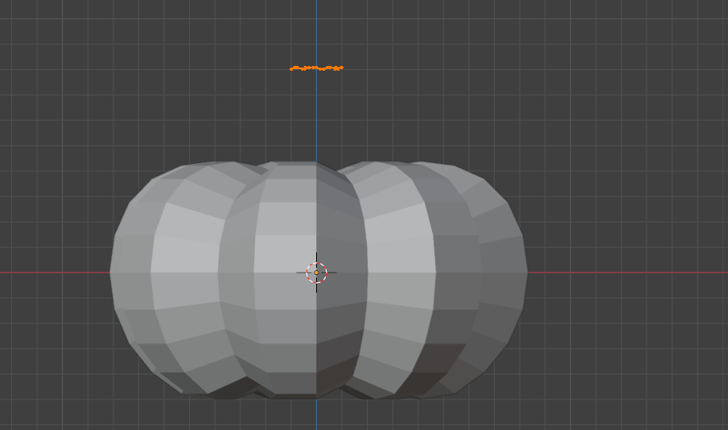

Extrude with “E”

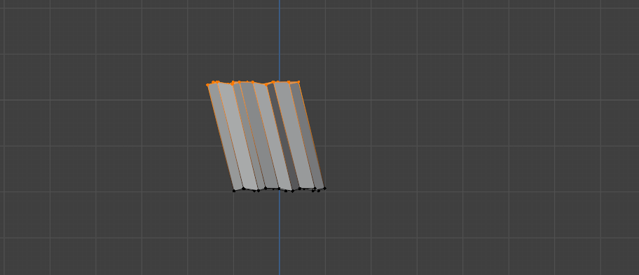

Extrude it with “E” one more time.

Rotate with “R”

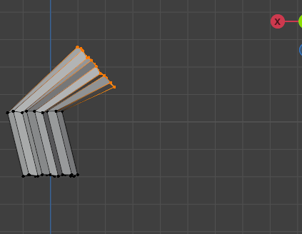

and scale with “S.”

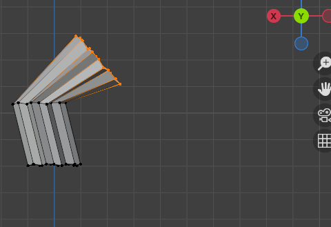

Turn off proportional editing with “O” and fill with an “F.”

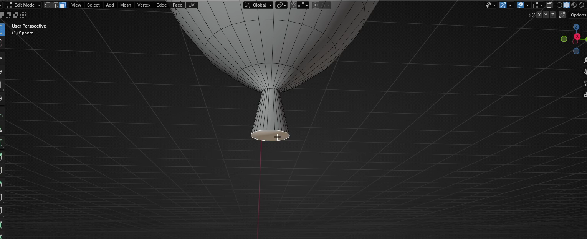

Inset a new face with an “I”.

And extrude inside with “E.”

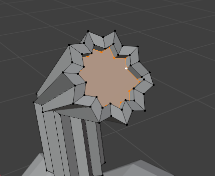

Switch to object mode with “TAB” and select the Pumpkin.

Go to modifier properties. Add *`modifier → Generate → Subdivision`* subsurface.

Change Levels Viewport to 2.

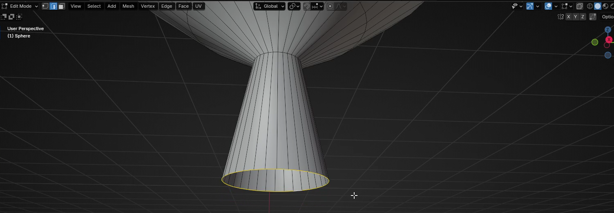

Click the RMB and choose shade smooth.

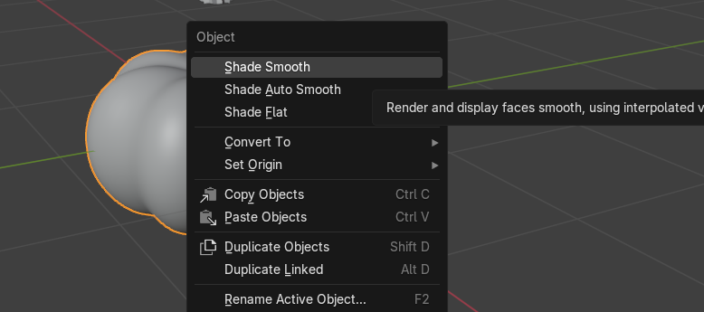

Select the Stem. Go to modifier properties. Add *`modifier → Generate → Subdivision`* subsurface.

Change Levels Viewport to 2.

As you can see, something seems off with the stem. Do you remember what I told you about face orientation? Let's go over it again, just in case.

Click on overlays and turn on Face orientation.

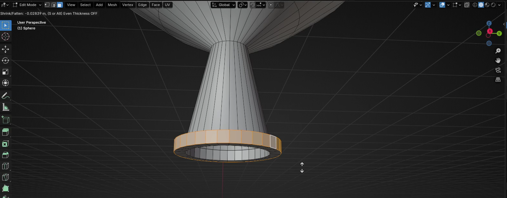

Face orientation shows the direction in which the normals are facing.

The blue color indicates that the face is facing outward, while the red color indicates it's facing inward.

Ideally, most of the mesh should appear blue rather than red, so you need to flip the red faces to ensure all surfaces are facing the correct direction.

Switch to Edit Mode by pressing 'TAB' and select all by pressing 'A'.

Go to Mesh - Normals - Recalculate Outside.

Switch to object mode with “TAB.”

Click on overlays and turn off Face orientation.

Switch to edit mode with “TAB.”

Add a loop with “CTRL+R” and move it up.

Add one more loop and move it down.

Add loop once again and move it up as shown.

Choose the bottom loop while holding “ALT”+ LMB and scale it with “S” to the inside.

Switch to object mode with “TAB.”

Move the Stem down along Z-axis with “`G+Z`.”

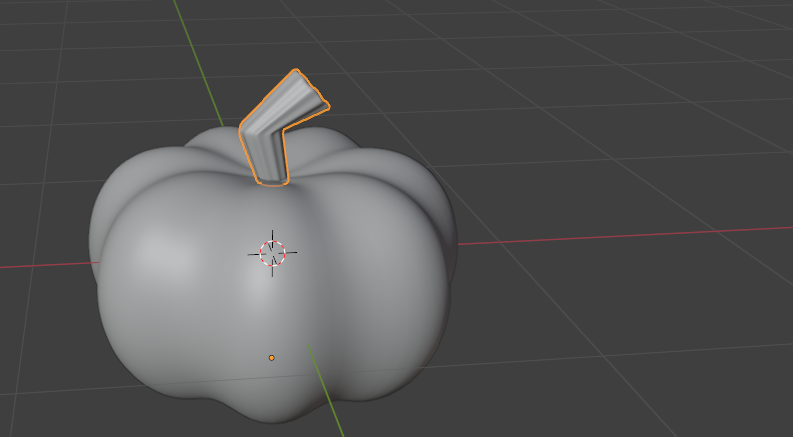

Click on the camera icon. Click “N” to open the right sidebar.

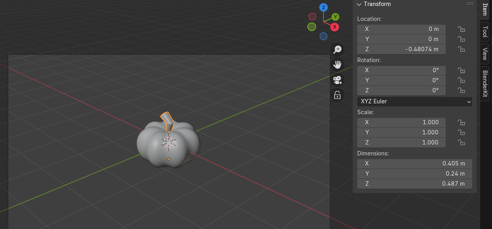

Choose view and turn on Camera to view.

Adjust the camera. When you're satisfied, turn of camera to view to move freely without losing your perfect rendering angle.

Switch to rendered mode.

Change the render engine to Cycles and the device to GPU if your graphics card is better than the processor. Also, turn on denoise in the viewport.

Click Blue Z on the Gizmo or 7 on your keyboard for the view from the top.

Select the point light that you already had on the scene and duplicate it with “SHIFT+D.” (If you deleted it, just go to *`Add → Light → Point`*.)

Move it with “G.”

Choose both lights and move them with “G” a bit if needed.

Choose a second point light and duplicate it with “SHIFT+D.”

Move it with “G” as shown.

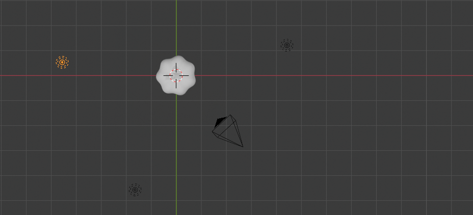

Click on the light icon on the right and change the power to 500.

Do the same for the second light.

Select the stem and go to the material properties.

Click new and rename the material to Stem.

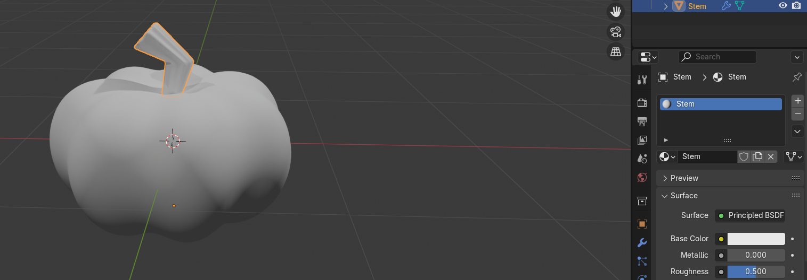

Select the Pumpkin and go to the material properties.

Click new and rename the material to Pumpkin.

Place the cursor on the upper side of the screen as shown, and when you see a plus,

just pull it down to the left while holding the left mouse click.

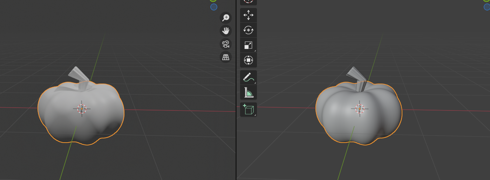

Open the shader editor in the window you just created.

Click “N” to hide that sidebar on the right because you don’t need it.

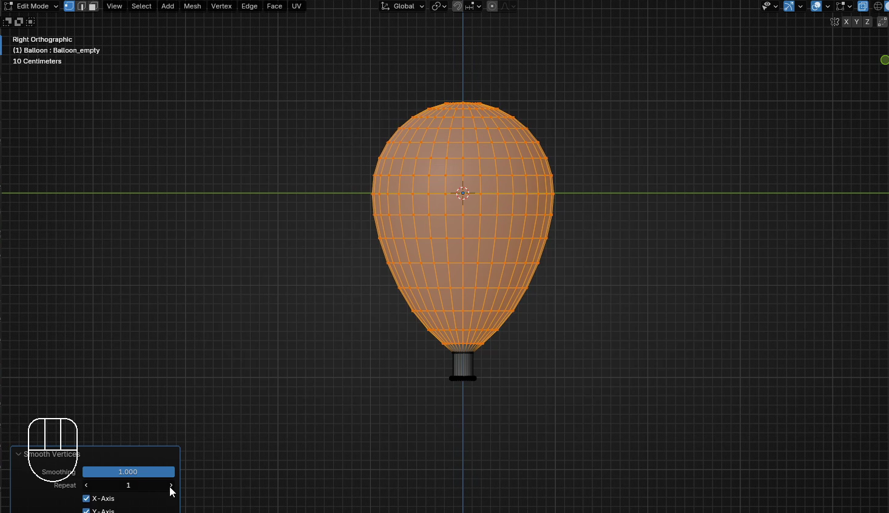

*`Add → Input → Geometry`*.

Connect Pointiness from Geometry with Fac from Color ramp to create some edge highlights on the pumpkin.

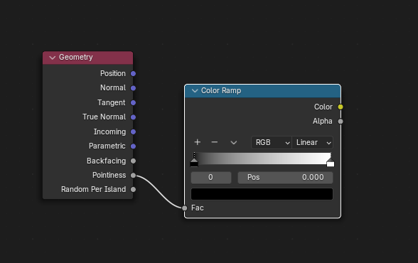

Connect Color from ColorRamp with Base Color from Principled BSDF.

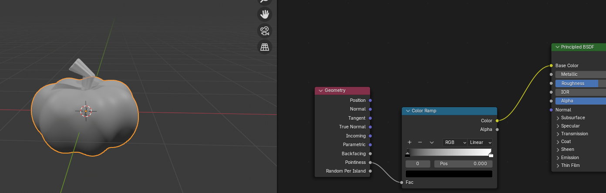

Move the first color picker more to the right. Change the first color in Color ramp to some brown.

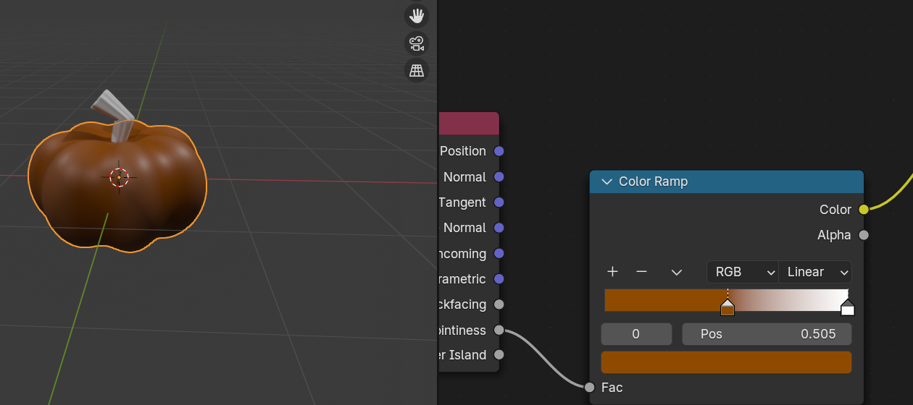

Move the second color picker the left.

Change the second color in Color ramp to light orange.

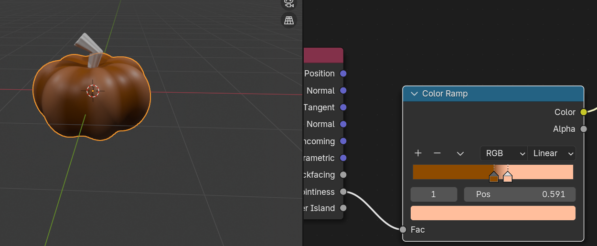

Adjust the colors more if necessary.

Select the stem. Add a Geometry. Connect Pointiness from Geometry with Fac from Color ramp.

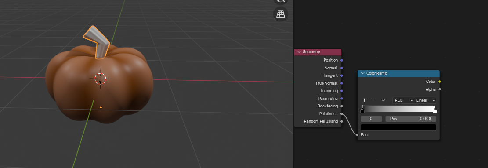

Connect Color from Color ramp with Base Color from Principled BSDF.

Move the first color picker more to the right.

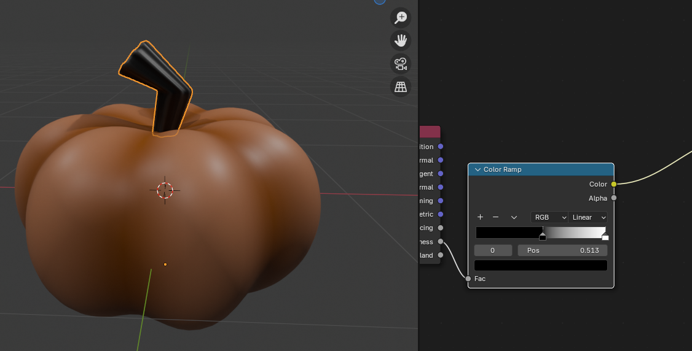

Right mouse click on the stem, shade smooth.

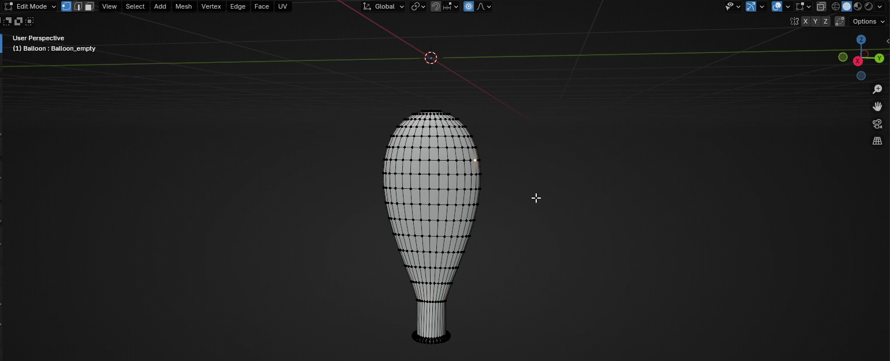

Change the first color in Color ramp to dark green.

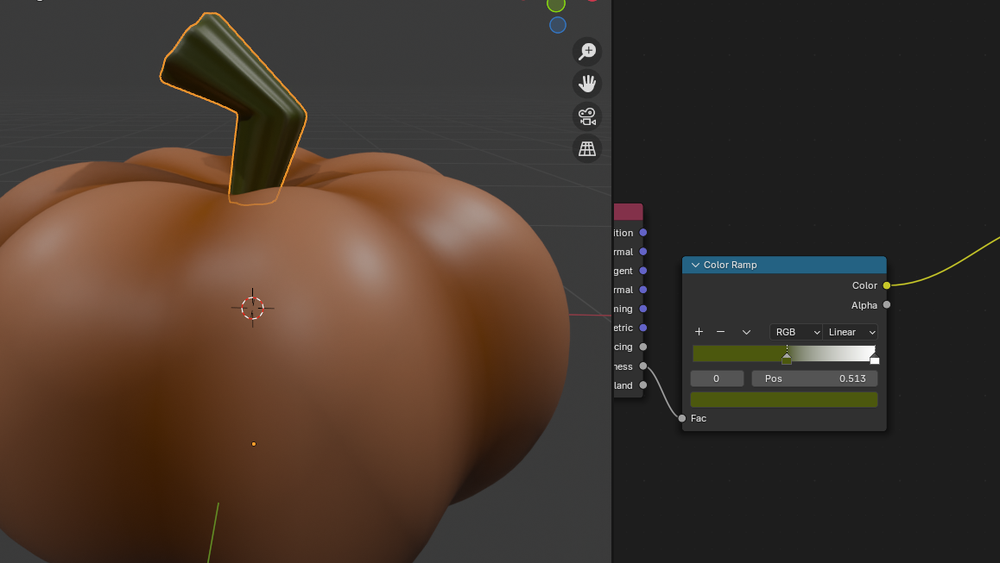

Move the second color picker more to the left.

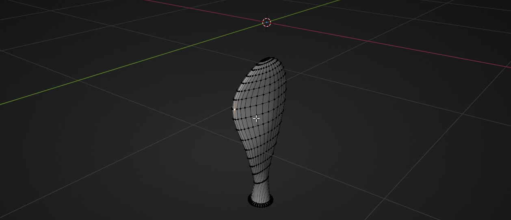

Change the second color in Color ramp to llight green. And adjust any other color if necessary.

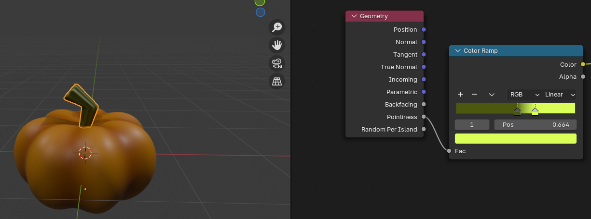

If you like how your pumpkin looks, click Render and render image.

Congratulations! You’ve learned how to model and texture a Pumpkin in Blender!

Happy Blending!

Byee, see you next time!