# Chapter 30b: New Blender 5.0 feature: circle array - modeling a flower

Beginners guide to Blender

Hello everyone! I am SaTales, and today it’s time for a new Blender lesson

If you haven’t heard already, Blender 5.0 is out!

You can download it from the official Bender page,Blender.org

The new Blender version is full of amazing features. I wanted to show all of them, but fornow, I decided to first go with one of my favorites - the circle array.

So let’s get started!

(Full video on my YouTube channel:https://youtu.be/2b3mqOPaAZQ)

Firstly, select the camera and light and delete them with “X”.

Select the cube with LMB, and go to modifiers.

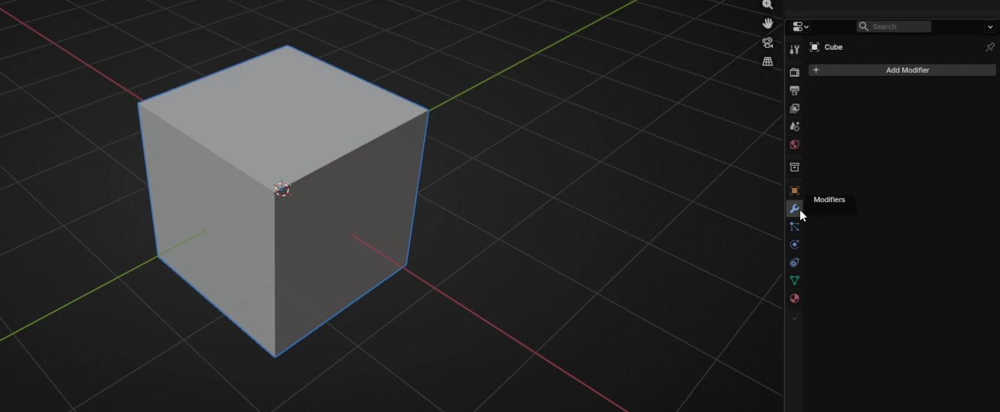

Beginners guide to Blender

Go to Add *`modifier → Generate → Subdivision`* subsurface.

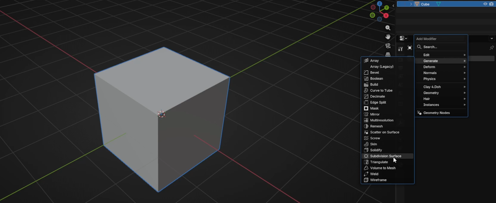

Change Levels Viewport and Render to 3.

Click RMB and choose Shade Smooth

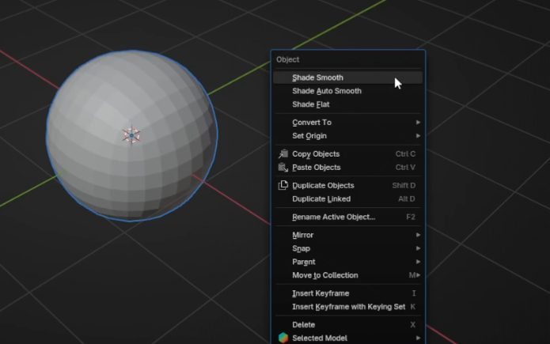

Beginners guide to Blender

Switch to edit mode with “TAB”.

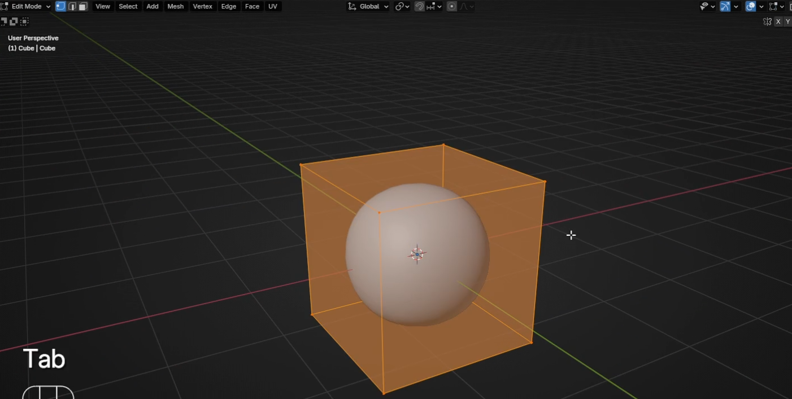

Scale it with “`S+Z`” for around 0.25.

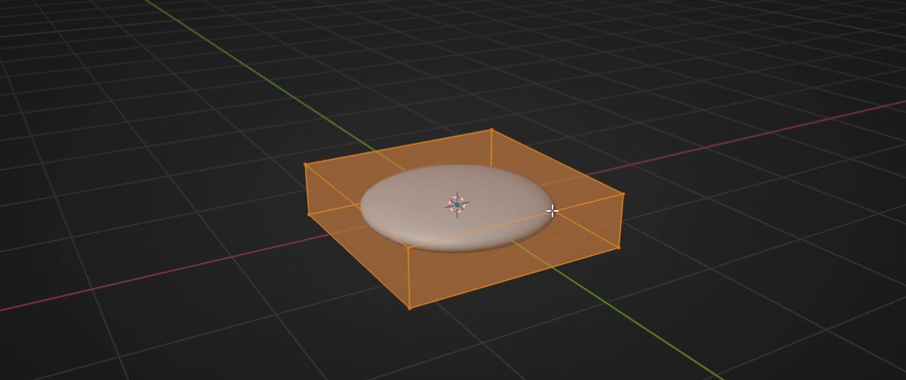

Add a loop with “CTRL+R”

Beginners guide to Blender

Switch to selecting vertices with 1 and select these two vertices.

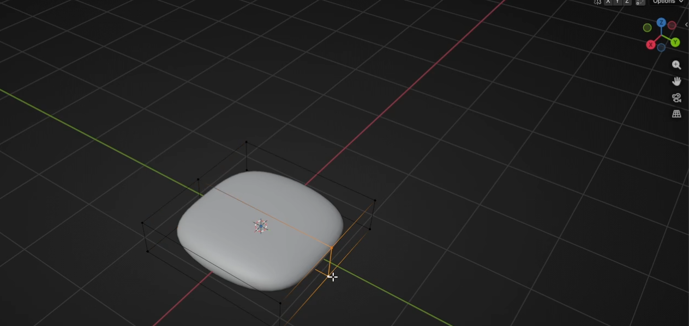

Move them with “`G+Y`” for around 1.5.

Add a new loop with “CTRL+R”

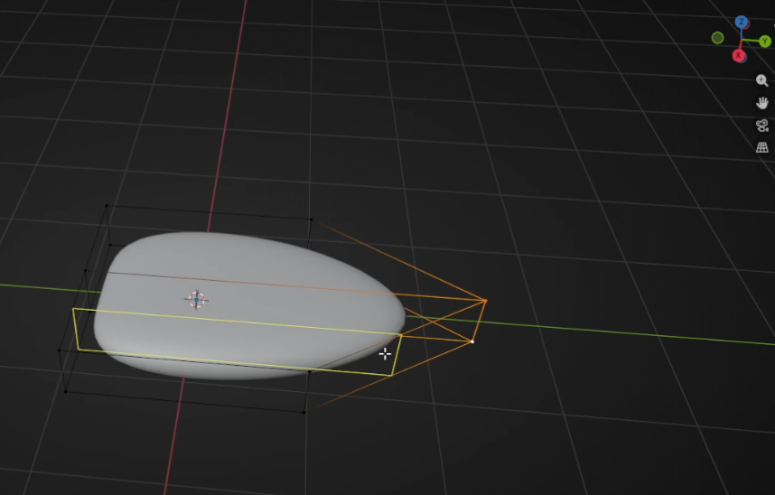

Beginners guide to Blender

And add one more

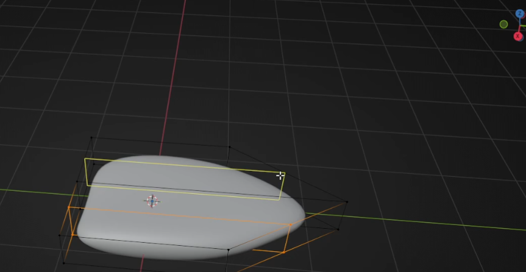

Switch to selecting edges with 2 and choose both loops

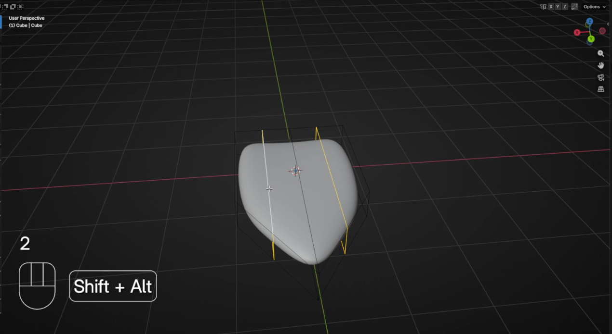

And move them up with “`G+Z`” for around 0.4

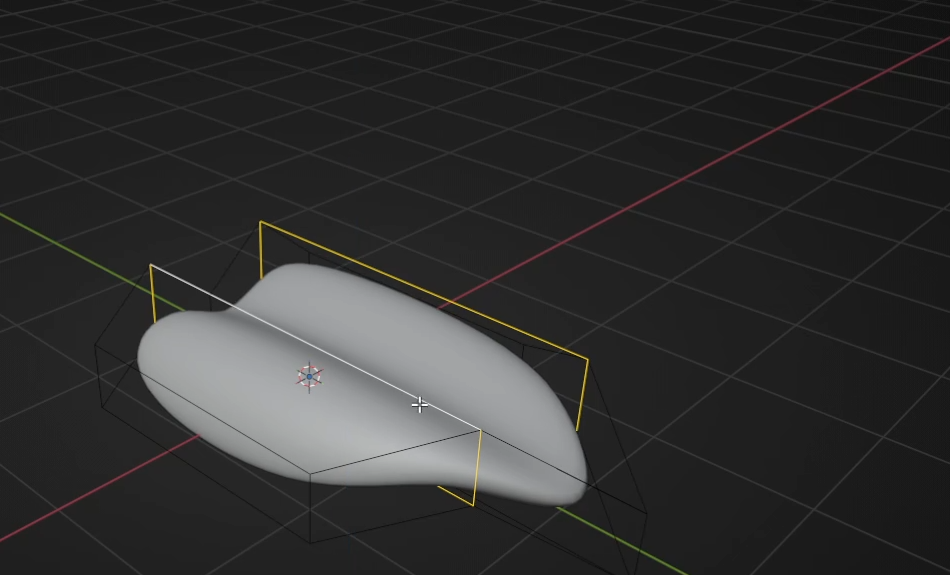

Beginners guide to Blender

Switch to selecting edges with 2. Select these two edges.

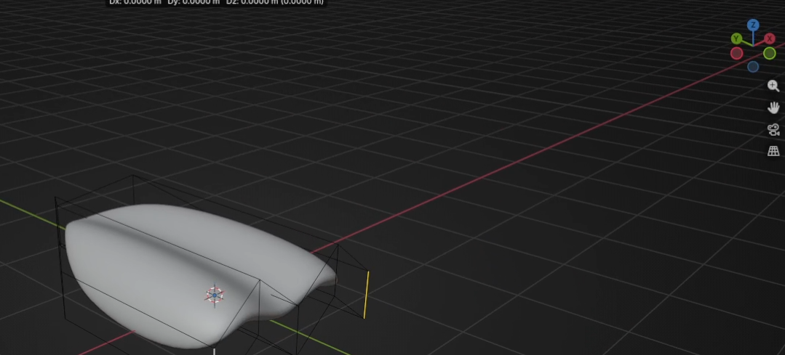

Move them with “`G+Y`” to the left for around 0.6

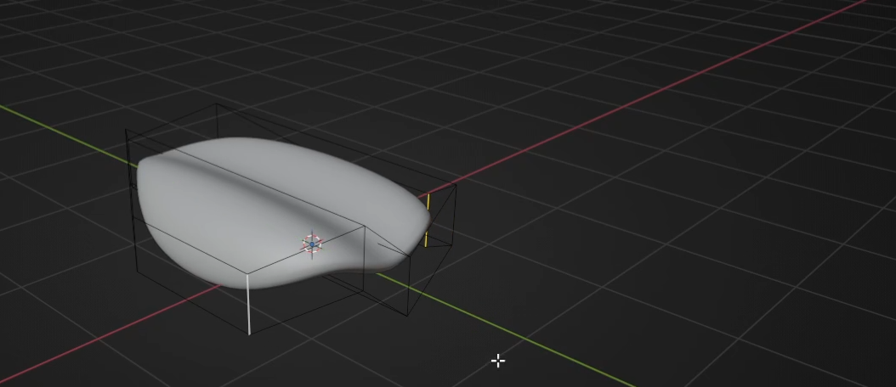

Switch to object mode with “TAB”

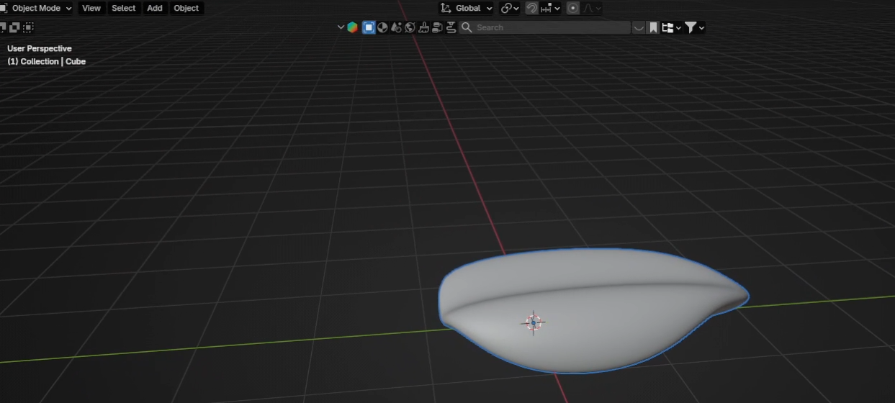

Beginners guide to Blender

Go to *`modifier → Add`* *`Modifier → Array`* (not Array Legacy, that is the old one)

Change Shape to Circle.

Beginners guide to Blender

Change radius to around 0.95

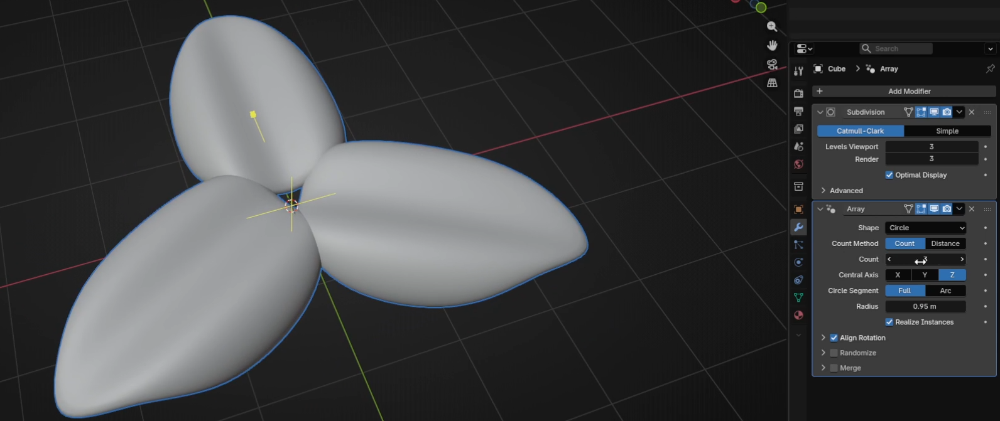

And count to 6 (or any other number you want)

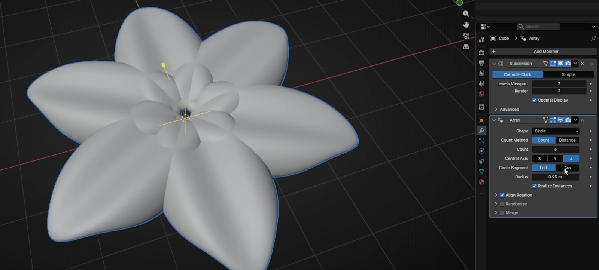

And now adjust the radius again. I changed it to 1.38

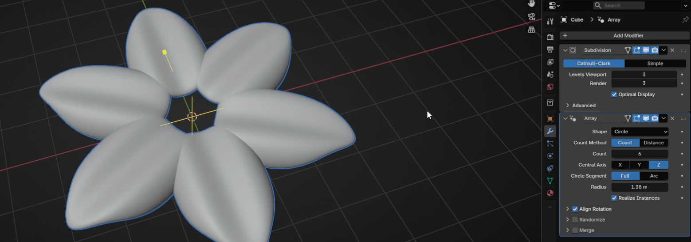

Beginners guide to Blender

You can play even more with count and radius if you don’t like how your flowercurrently looks. In the end, I decided to count 9 and with a radius of 1.84.

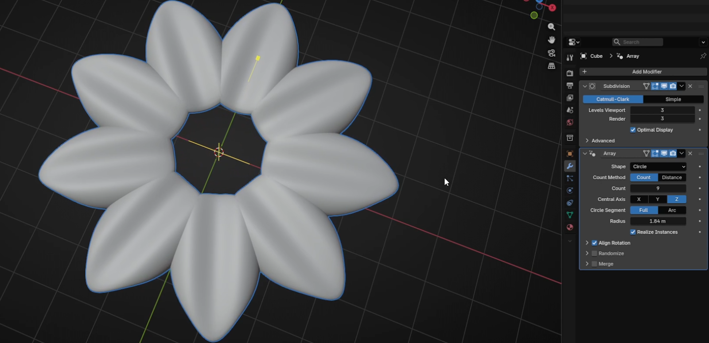

Go to *`Add → Mesh → UV`* Sphere

Beginners guide to Blender

Scale it with “S” as you think it is the best. RMB and choose Shade Smooth.

Scale it with “`S+Z`” as you think looks the best.

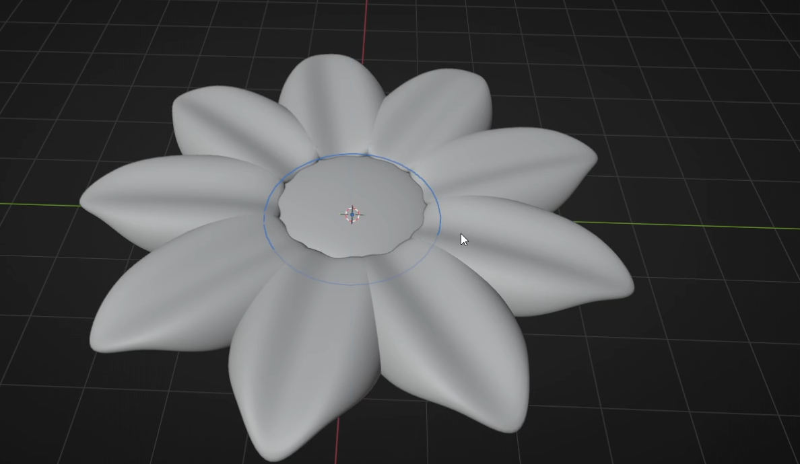

And move it up a bit with “`G+Z`”. Press “CTRL+A” and apply the scale.

Beginners guide to Blender

You can again change the look of your flower by adjusting the number in the count.

This is just one example of how a new array can simplify modeling in Blender.

Did you think of anything else?

Let me know in the comments!

If you had fun learning with me, don’t forget to subscribe to my channel.

I recently started a Patreon with more exclusive content, including 3D models, .blendfiles, and sharing my experience on how to sell your 3D models, how to find clients inArchViz, etc. You can also download a free Blender guide based on this lesson, sofeel free to check it out if you prefer text tutorials over video tutorials. It is updatedregularly.

There is something for both free and paid members, so don’t forget to check the

The link in the description.

And if you have any questions, write them down in the comments :D

Happy Blending, everyone! Bye, see you next time.