# Chapter 3: You Installed Blender, Now What? - Moving and Deleting Objects

Chapter 3 - You Installed Blender, Now 
What? - Moving and Deleting Objects 
Now it’s finally time to open the Blender.​
​

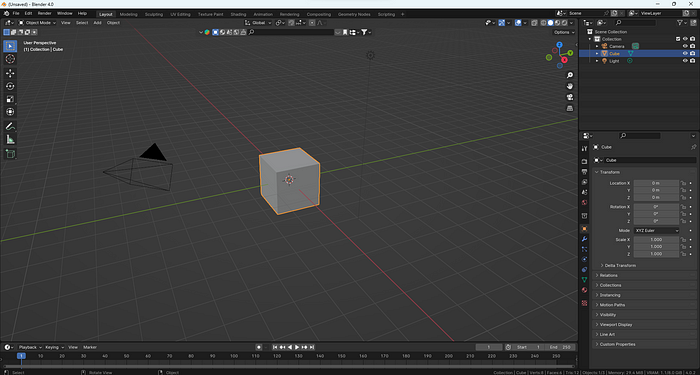

Blender start screen. Screenshot by author. 
​
First, what you will see in your scene are three objects: the camera, the cube, and the light.

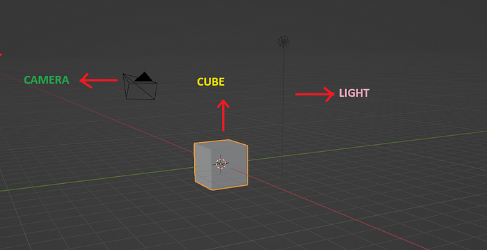

Camera, cube, light. Screenshot by author. 
Before we start doing anything in Blender, there are two important things to know:​
1.​
You can model one thing in Blender in various ways, and most of the time, they 
are all correct. 
2.​
There are many shortcuts in Blender. Try to use and learn them from the start 
because your modeling will be much easier that way.​

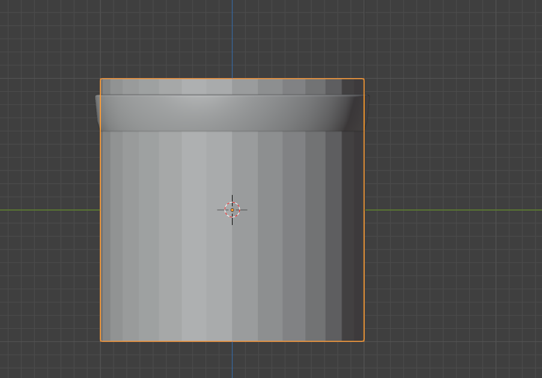

If you click here, you will get a dropdown menu with different modes.​
​
First, we will talk about 
OBJECT MODE:
​
​
In object mode, you can move, rotate, and scale (resize) objects, but without changing their 
geometry.​
​
So let’s select our object, 
THE CUBE.​
​
You can select things in Blender by clicking the left mouse button (LMB) on them.  
If there is no orange outline, the object, in this case, the cube, isn’t selected.​

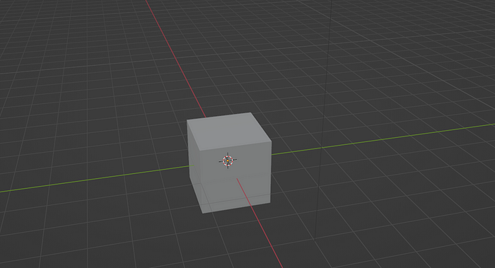

If there is an orange outline, the cube is selected. 

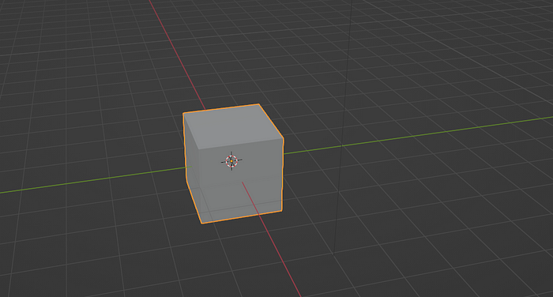

If you want to deselect the cube, click outside of it.​
When you do that, the orange outline disappears.​
Before we move on, I will show you another way to determine which object is selected. 
This is an outliner. It is used to organize all data, select and deselect objects, hide or 
show objects, and so on. 

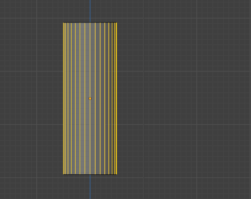

​
I’ll explain the other functions another time, but for now, I want to tell you about active 
objects and how to select and deselect them. 
This is a sign for a mesh in Blender. 

You can see this gray background around the mesh sign ( we will talk about what 
mesh is a bit later).​
That gray background means that your object is active.​
For now, it’s enough to know that there’s something called an active object. 
Just as you selected a cube previously with LMB by clicking directly on it, you can 
also select it by clicking LMB in the outliner on the name of your object (mesh).​
In this case, your object is called a Cube. 

​
You will know that a cube is selected by seeing the orange outline on the cube, but 
also by seeing the blue background behind the name of the object (in this case, a 
Cube). 

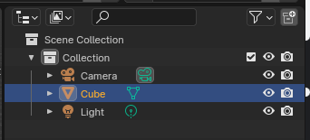

Now that you know how to select a cube, let’s try to move it.​
But before that, the camera and light aren’t important right now, so let’s delete them.​
To delete an object (in this case, the camera), select the camera and press “X” or 
“Del” to remove it from your scene. You can delete the light in the same way.   

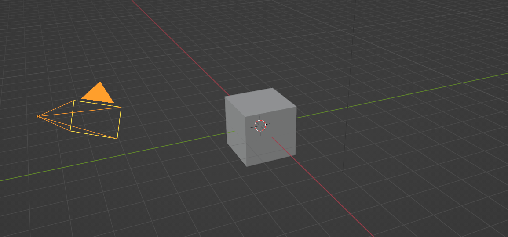

Now that your scene is clean, let’s finally move the cube.​
It is time to learn your first shortcut in BLENDER!​
Are you ready? Ok, let’s do it!​
​
How to move a cube by using a shortcut? 

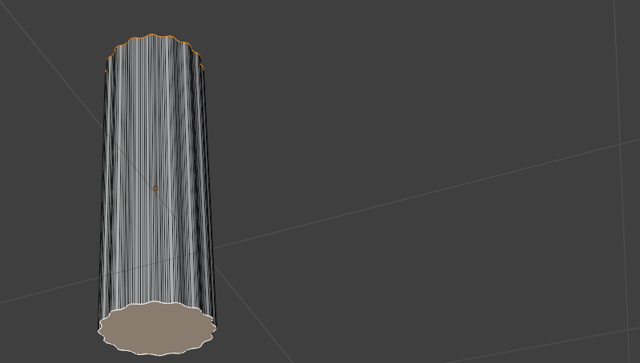

1.​
Select the cube with the LMB. 
2.​
Press G. 
3.​
Now, move the cube with your mouse to the position where you want it to 
be. 
4.​
Confirm the position with the LMB. 
AXES IN BLENDER 

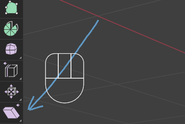

X and y axes. Screenshot by author. 

X and Z axes. Screenshot by author. 

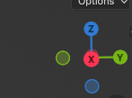

Gizmo showing x,y, and z axes. Screenshot by Author. 
In Blender, we have three axes: X (the red one) — for left and right, ​
Y (the green one) — for front and back, ​
and Z (the blue one) — for top and bottom. 
How do you move a cube along the axes? 
As you already learned, we move a cube with G.​
If we want to move it along an axis, just press G + (one of the axes). 

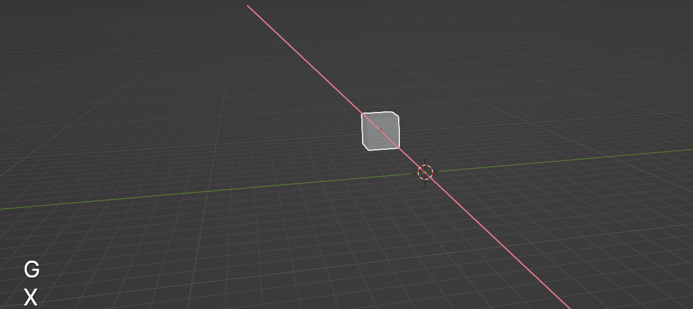

Moving a cube along the X axis. Screenshot by author. 

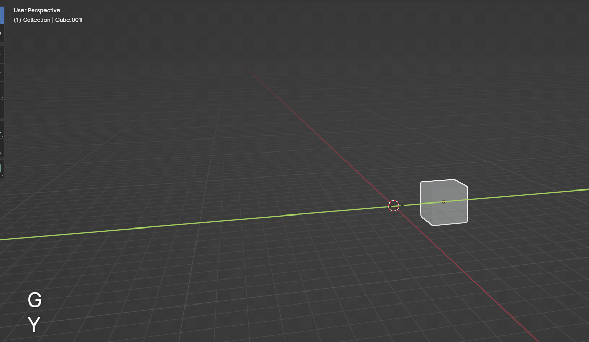

                                    Moving a cube along the Y axis. Screenshot by author. 
  Moving a cube along the Z axis. Screenshot by author. 

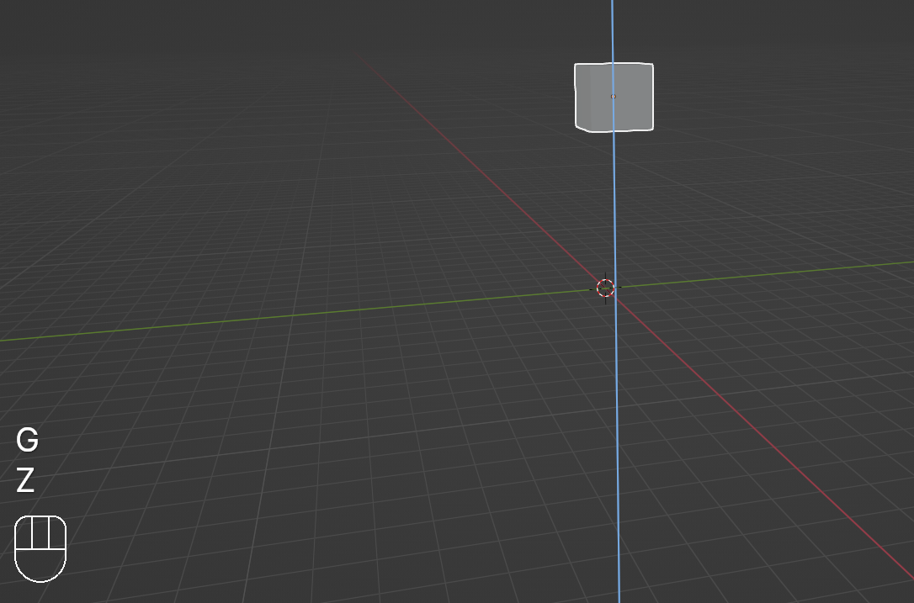

G + X — to move it along the X-axis.​
G + Y — to move it along the Y-axis.​
G + Z — to move it along the Z-axis.​
Finally, confirm the position with the LMB.​
Like I mentioned before, there are lots of ways to do the same thing in Blender.​
We can move the cube in one more way.
Moving a cube with the MOVE button 
1.​
Click here (where the arrow is pointing) —and turn on the Move button. 

2. Three arrows will appear, each color representing one axis. 

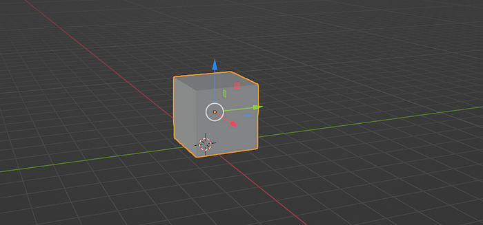

3. Select the arrow you want, then while holding it, move it in the direction you want 
(and can). 

​
    Moving a cube along the X axis. Screenshot by author. 

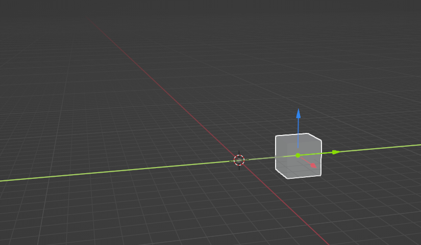

                                            Moving a cube along the Y axis. Screenshot by author.

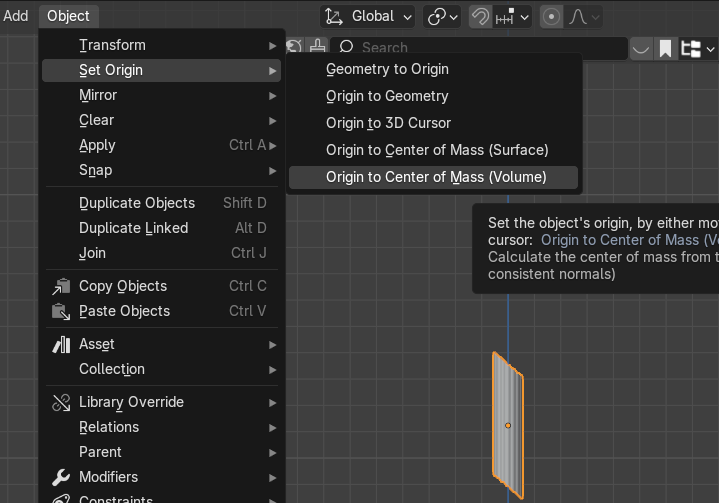

     Moving a cube along the Z axis. Screenshot by author. 
Congratulations! Now you know how to move your cube in Blender! 