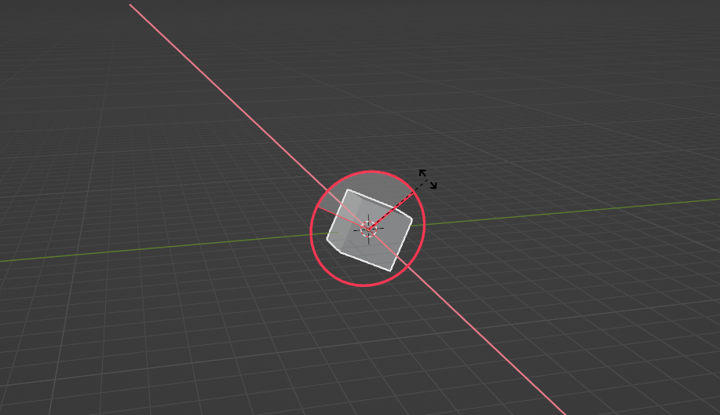
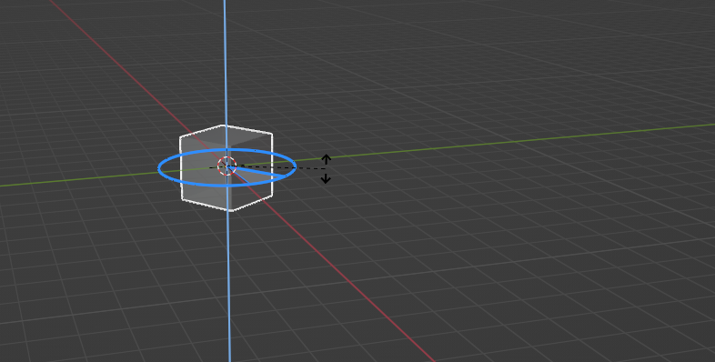
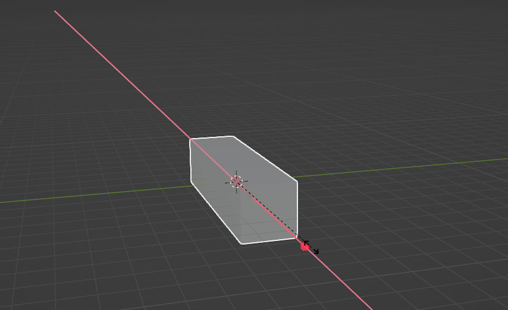
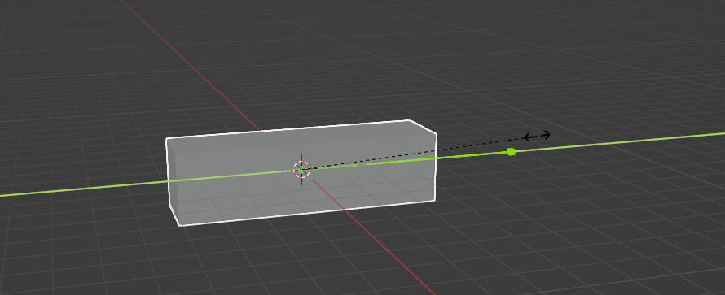
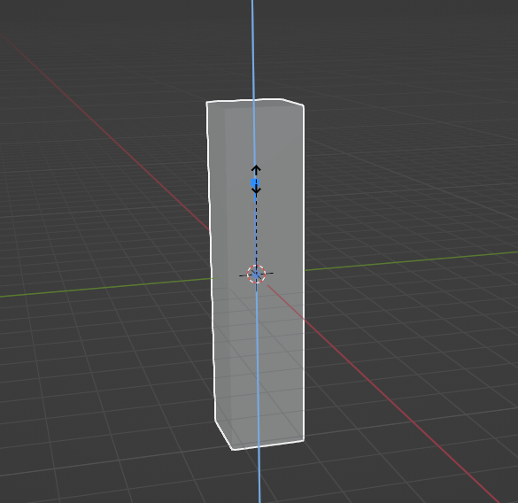
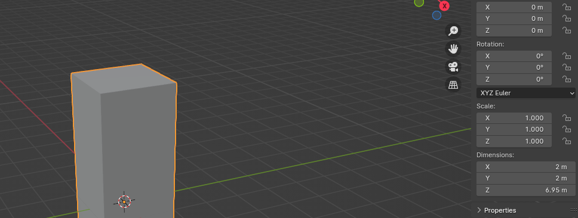

# Chapter 4: Rotating and Scaling (Resizing) Objects

 
Chapter 4 - Rotating and Scaling (Resizing) 
Objects
 
Last time, we learned how to move and delete a cube in Blender.
Today, we will learn how to rotate it and scale it. 

How to rotate a cube by using a shortcut (angle 
rotation)? 
 
This is the angle of the rotation. 
 
 
In the left corner, you can see the value of a rotation angle. 
 
 
 
 
 
 
 
 
 
 
26 

 
How to rotate a cube by using a shortcut (axis 
rotation)?
 
1. Select the cube with the LMB. 
2. If you want to rotate it along the axes, just press R+ (one of the axes). 

R+X — to rotate it along the X-axis.

 

R+Y — to rotate it along the Y-axis. 
 
 
 
27 

 
R+Z — to rotate it along the Z-axis. 
 
3. In the end, confirm the rotation with the LMB. 
How to rotate a cube without using a shortcut (axis 
rotation)? 
 
1. Click on the toolbar (where the arrow is pointing) — and click on the Rotate button to 
enable it.

 
28 

 
2. Three colored circles will appear—each color representing one of the axes. 
3. Select the axis you want, then while holding the LMB, rotate it in the direction of the 
selected axis. 
 
 
Rotating a cube without using a shortcut along the X axis. Image by author. 
 
Rotating a cube without using a shortcut along the Y axis. Image by author. 
 
 
 
29 

 
Rotating a cube without using a shortcut along the Z axis. Image by author. 
 
We learned how to move and rotate a cube (or any other object). 
Now it is time to learn how to scale (resize an object). 
 
How to scale (resize) a cube by using a shortcut? 
 
 
1. Select the cube with the LMB. 
2. Press S, and scale the cube with your mouse to your desired size. 
     3. In the end, confirm the scale with the LMB. 
 
 
30 

 
How to scale (resize) a cube along an axis by using a 
shortcut?
 
1. Select the cube with the LMB. 
2. If you want to scale it along the axes, just press S+(one of the axes).
 
S+X — to scale it along the X-axis. 

 
S+Y — to scale it along the Y-axis. 

 
 
 
 
31 

 
S+Z — to scale it along the Z-axis. 

 
 
3. In the end, confirm the scale with the LMB. 

How to scale (resize) a cube without using a shortcut? 
 
1. Click on the toolbar (where the arrow is pointing) — and click on the Scale button to 
enable it. 
 
32 

 
2. Three colored lines will appear — each color for one axis. 
3. Select the axis you want, then while holding it, scale it in the direction you want 
(and can). 
4. Finally, confirm the scale with the LMB. 
Scaling a cube without using a shortcut along the X axis. Image by author. 
 
 
Scaling a cube without using a shortcut along the Y axis. Image by author. 
 
 
 
33 

 

Scaling a cube without using a shortcut along the Z axis. Image by author. 

You learned how to transform objects (move, rotate, and scale) in the Object mode. 
 
 
IMPORTANT THING! 
 
Make sure you apply the transforms before editing the mesh in edit mode. 
Otherwise, the values between the object mode and the edit mode will not match. 
 
 
 
 
34 

 
HOW TO APPLY SCALE TO THE OBJECT? 
 

Scale. Image by Author. 
 
As you can see here, the scale of X = 1, the scale of Y = 1, but the scale of 
Z= 3,473.
What does that mean? 
We didn’t change the scale of X and Y, so those numbers stayed the same. 
Numbers here represent percentages. 1=100% which represents the original size, 2=200%, 
3=300% and so on. 
We have scaled the object along the Z-axis, so its value has changed and is no longer 1. 
 
 
 
 
 
 
 
35 

 
The scale values for X, Y, and Z should remain 1 at all times. 
 

To apply the scale of Z (or X or Y if needed), click “CTRL+A” and apply the scale. 
When you click that, all values are applied. You don’t need to do it for each value X, Y, and Z 
separately. 
 
Congratulations! Now you know how to move, rotate, and scale your cube in Blender! 
I will stop here so you don’t feel overwhelmed. 
 
 
 
 
 
 
 
 
 
36 
