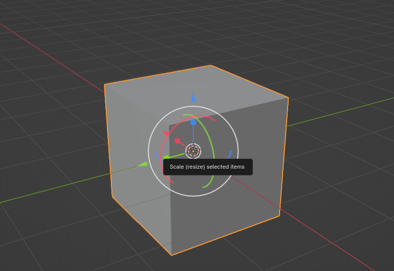
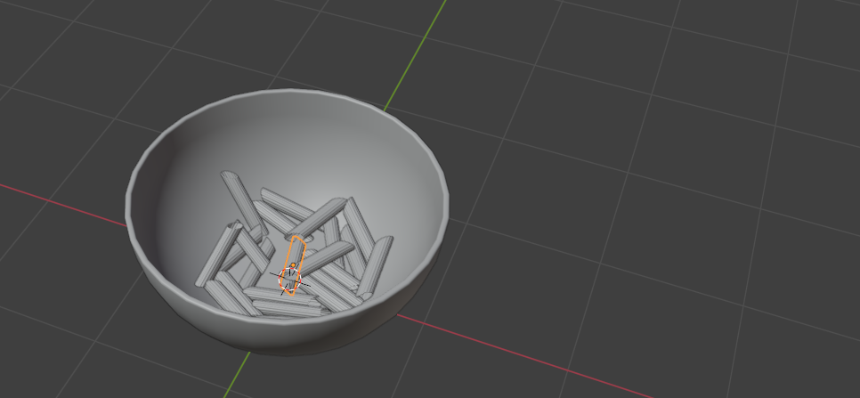
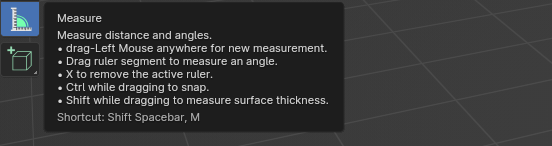
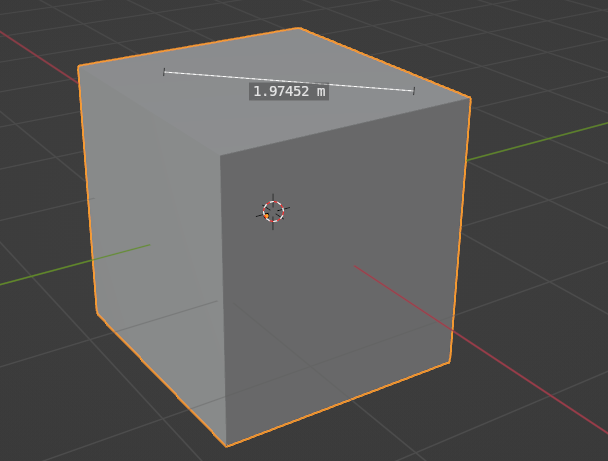
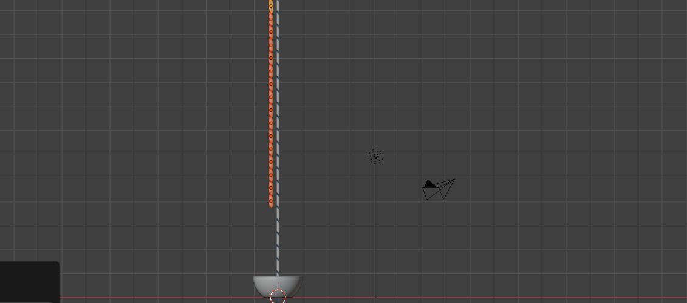

# Chapter 5: Transform, annotate, measure, and add a cube button

Chapter 5 - Transform, annotate, measure, and add a cube button 
​Transform button 
 There's only one button left in Object mode that you can use to transform objects. ​​Unlike the move, scale, and rotate buttons, which you use to perform only one action at a time, the transform button supports any combination of move, rotate, and scale at once. 

I used this button maybe three times in the beginning while I was still learning Blender, but nowadays, I do not use it at all. Still, it is good to know what it is for. 

37 
Annotate button​ 
This is a button that I started to use while writing Blender guides. 
Before that, I didn’t use it at all. It is for making annotations on the active data. 
If you click on the Annotate button, you will get a drop-down menu.  

​​You can choose between Annotate, Annotate Line, Annotate Polygon, and Annotate Eraser. ​​All of these tools are easy to understand, so I won’t explain them in more detail. 
You can even change color, opacity, and thickness, stabilize stroke, etc… 

38 
Measure button 
​The Measure button measures distance and angles. 

Click LMB and drag it around to measure what you want. 

39 
Drag the ruler segment to measure an angle. 

If you click “X,” you delete the active ruler. 
To snap, hold “CTRL” while dragging a rule. 
Hold “SHIFT” while dragging the ruler to measure the thickness of the surface. 
Add a cube button 

This button is easy to understand, so I won’t explain it in more detail. ​​You just need to choose what you want to add to the scene (Cube, Cone, Cylinder, UV Sphere, or Ico Sphere),  and then draw it into the scene. 
40 