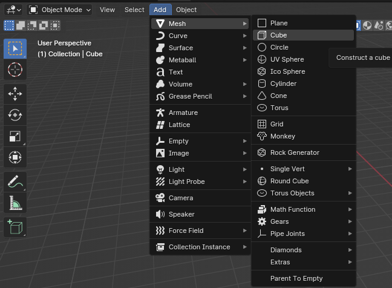
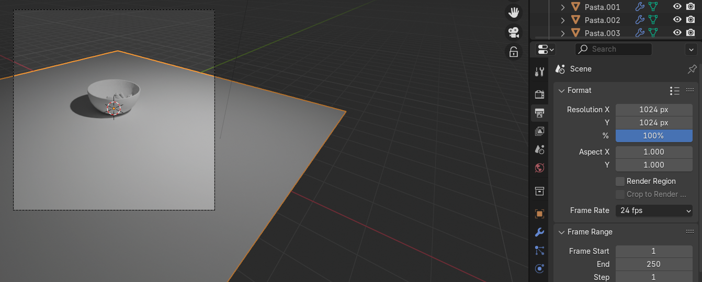

# Chapter 7: Adding the object to the scene

Chapter 7 - Adding the object to the scene 
When you open Blender, a default cube is always waiting for you. 
Some of us delete that cube and add a new one, some of us use that cube for our scene, 
and some of us delete the cube and add another object. 
Either way, you need to know how to add new objects because at some point, you will need 
something else besides the cube. 
So, how do you add a new object? 
There are a few ways. 
The first way is without using any shortcuts. 
Just go to Add —> Mesh —> and choose any object that you want to add  
(plane, cube, circle, UV sphere, ICO Sphere, Cylinder, Cone, Torus…). 

The second way is by using a shortcut (try to remember this method for easier and 
quicker modeling). 
Just click “SHIFT+A” and you will get this menu. Choose Mesh and add the object that you 
want. 

