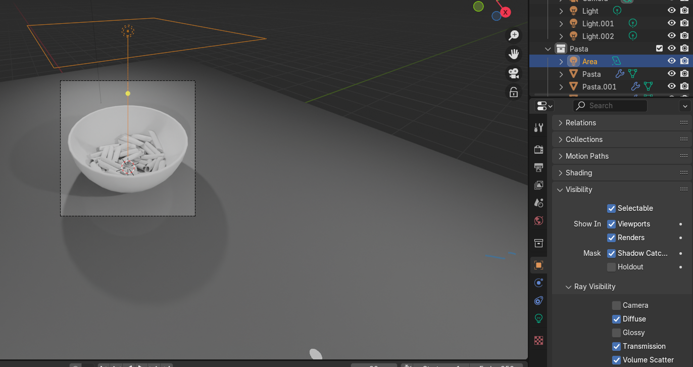
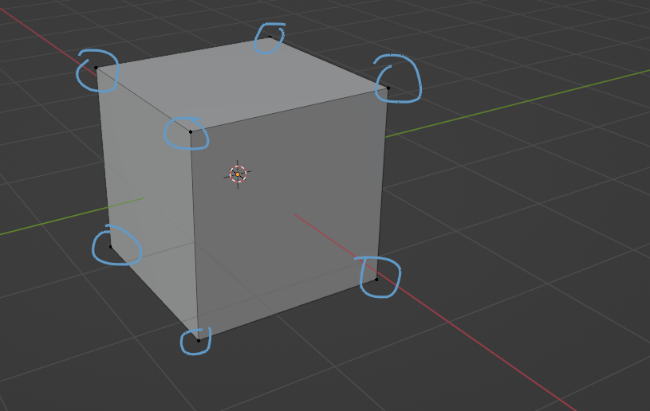
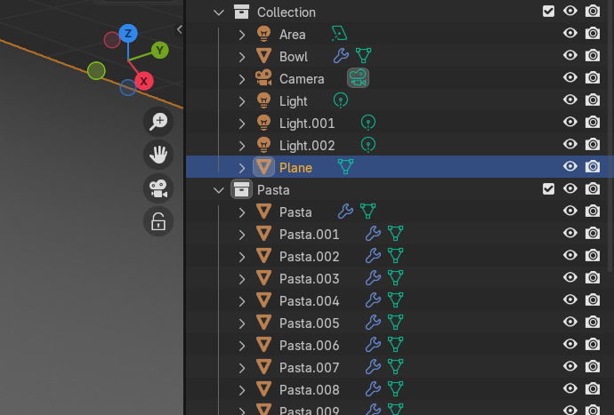
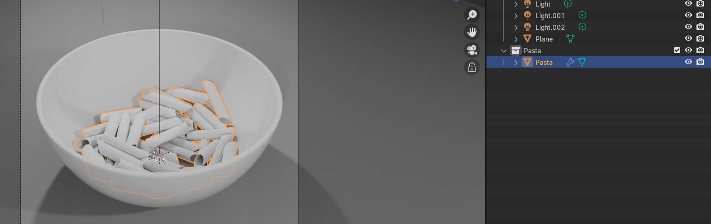
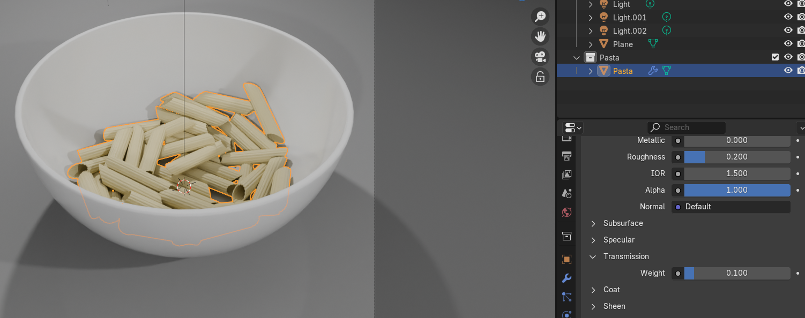
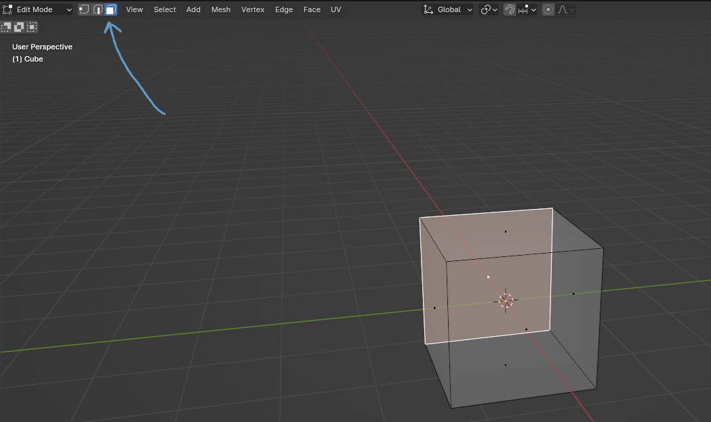
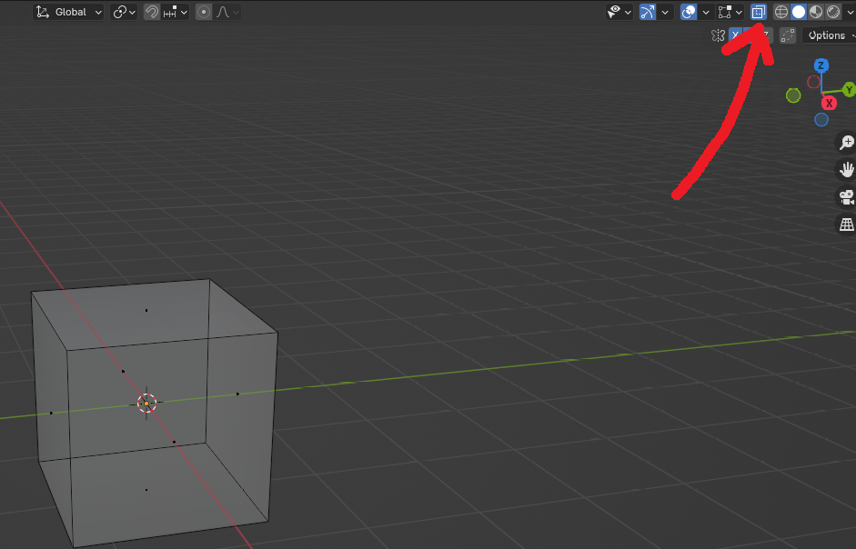

# Chapter 9: Edit mode

Chapter 9 - Edit mode 
There is a lot of stuff to show you in the object mode, but a lot of it is connected to the edit 
mode, so it is time to switch from object mode to edit mode. 
You can switch from object mode to edit mode from this menu by clicking on Edit mode. 

Or you can just press “TAB” to switch from object mode to edit mode and vice versa. 
When you were in object mode, the cube didn’t look like this, but now that we can edit it, its 
look has changed 
In the object mode, you can only move, rotate, or scale your object, add and apply modifiers, 
and change its material, but in the edit mode, you can actually edit the topology. 
Vertex selection 

​
​
First, let’s learn what a cube is made of. 
This arrow is pointing to the vertex selection.
So what is a vertex or vertices? 

Vertices are represented as all those small dots that you can see. 
So our cube has 8 vertices. 

If you want to switch to vertex selection, you can do that by selecting this part or simply 
pressing 1 on your keyboard (not numpad). 

If you want to switch to edge selection, you can do that by selecting this part or simply with 2 
on your keyboard (not the numpad). 

But what is an edge? 
An edge connects two vertices. That means that this cube has 12 edges. 

And this is a face. 

If you want to switch to face selection, you can do that by selecting this part or simply with 3 
on your keyboard (not numpad). 
A face is the area between: three vertices - triangles, four vertices - quadrangles, or 
more vertices - n-gons with an edge on every side. 
That means that this cube has 6 
faces. 
Maybe you realized how I was showing the transparent cube (as I can see through it). That 
is called X-ray. You can activate it by clicking where the arrow is pointing or simply by 
pressing “ALT+Z”. You can turn it off the same way, either by clicking on the screen or by 
keyboard. 

You are already familiar with the move, rotate, and transform buttons, so I don’t need to 
explain them again. What is different is that in the edit mode, you can move, rotate, or scale 
instead of the whole cube, parts of cube. 
So you can move vertices, you can scale faces, or rotate edges. 

In the next chapter, you will learn a new tool, but until then, try to play around with those 
tools that you are already familiar with in edit mode, just to get a feeling. 