# Chapter 10: Extrude

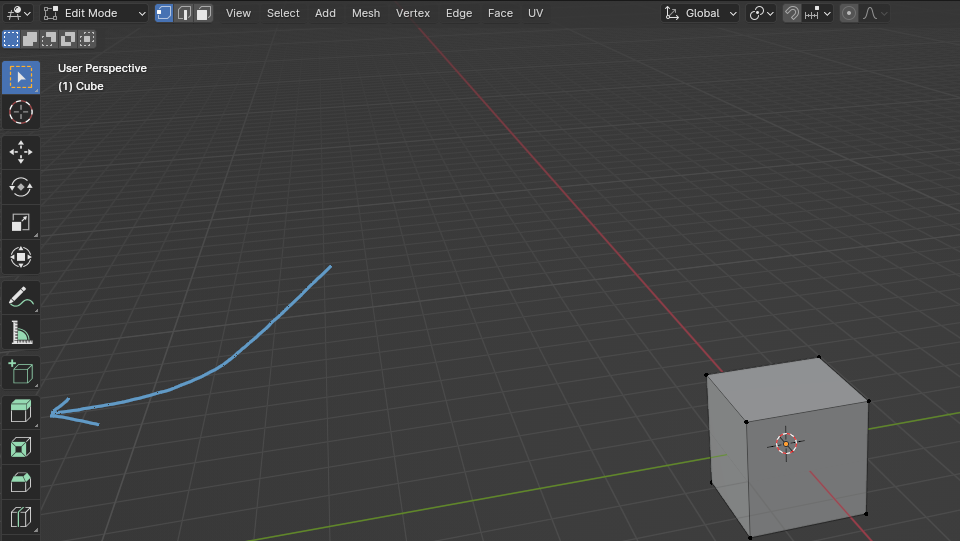

 
Chapter 10 - Extrude 

It is finally time to learn the first tool with which you can add geometry to the object - 
EXTRUDE.

You can extrude vertices, edges, and faces. 
Switch to edit mode with “TAB”.  You can activate “Extrude” by clicking where the arrow is 
pointing. 
 
If you click and hold LMB after you activate it, you will get this menu for some extra 
possibilities. 
 
 
 
 
57 

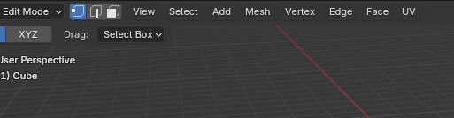

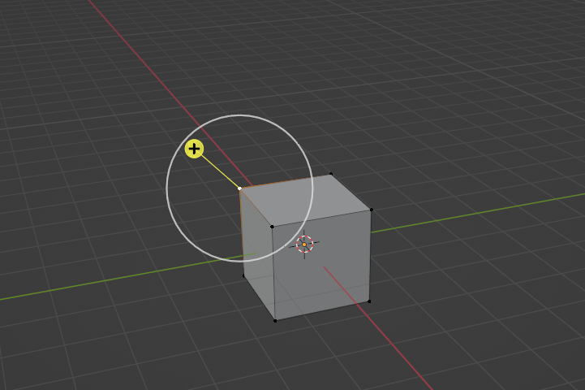

 
EXTRUDING WITHOUT USING THE SHORTCUT 
Extrude region 
 
First, choose a type of selection: vertex, edge, or face. 
 
Activate the “Extrude region” button with LMB. 
 
Now, depending on what you chose in the first step, you can extrude that. 
If you choose vertices, you can extrude vertices. 
When you select a vertex, you will get this. 
 
 
58 

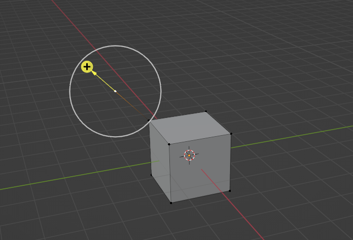

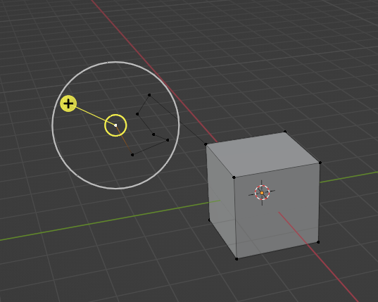

 
If you want to extrude it along the vertex normal, just click on that plus sign and drag 
it with the LMB, and you will get a second vertex. 
 
If you want to extrude it freely,  don’t click on the plus sign. Instead, click somewhere 
inside the white circle and drag the vertex with the LMB. 
 
 
 
 
59 

 
To extrude edges instead of vertices, switch to edge selection. 
 
Just as with vertices, to extrude it along the axes, click the plus sign and drag it with the 
LMB. 
 
 
 
 
 
60 

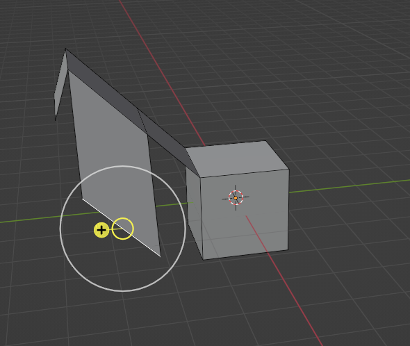

 
 
If you want to extrude it freely, just click somewhere inside the white circle and drag 
the edge with the LMB. 
 
If you want to extrude faces, switch to face selection. 
 
 
 
 
61 

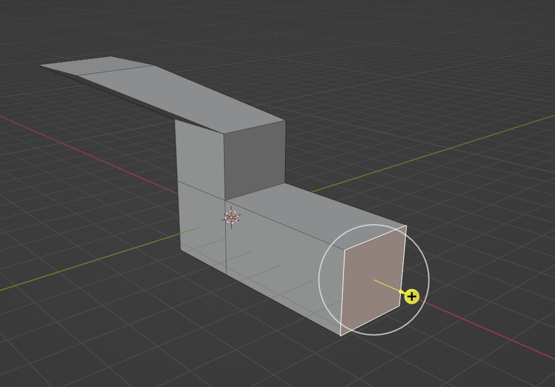

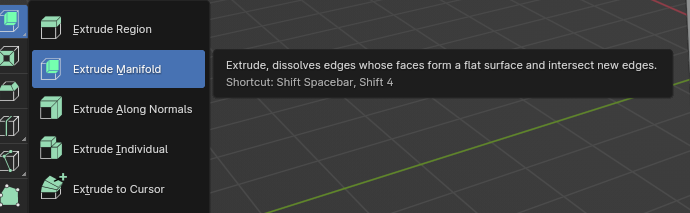

 
Extruding faces works just like it does for vertices and edges. 
 
All that was “Extrude Region”. As you just saw, you can extrude it freely or along an axis. 
 
Extrude manifold
 
The second option that you have is “Extrude Manifold”. As it says here: extrude, dissolves 
edges whose faces form a flat surface, and intersect new edges. 
 
 
 
 
 
62 

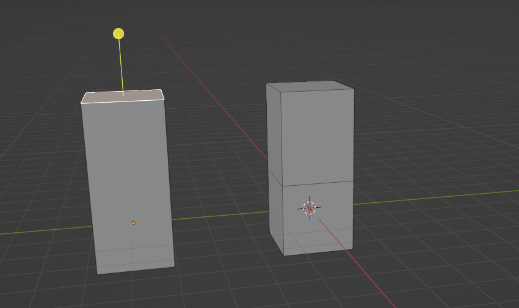

 
Let me show you the difference if you extrude a region and if you extrude a manifold. 
This is the extruding region faces. As you can see, when I extruded the face, I got more 
faces separated with the loop from the first face. 
 
But when I extrude manifold, I don’t get additional faces. It is all one face without a loop. 
Can you now see the difference? The left one is an extruding manifold, the right one is an 
extruding region. 
 
You can also see how the number of polygons is different between those two options. 
 
 
 
63 

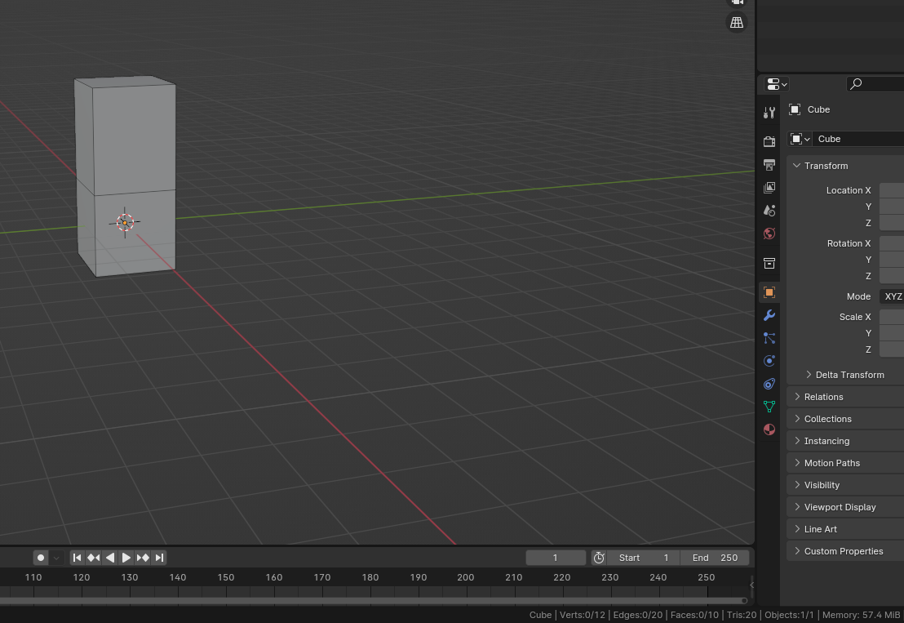

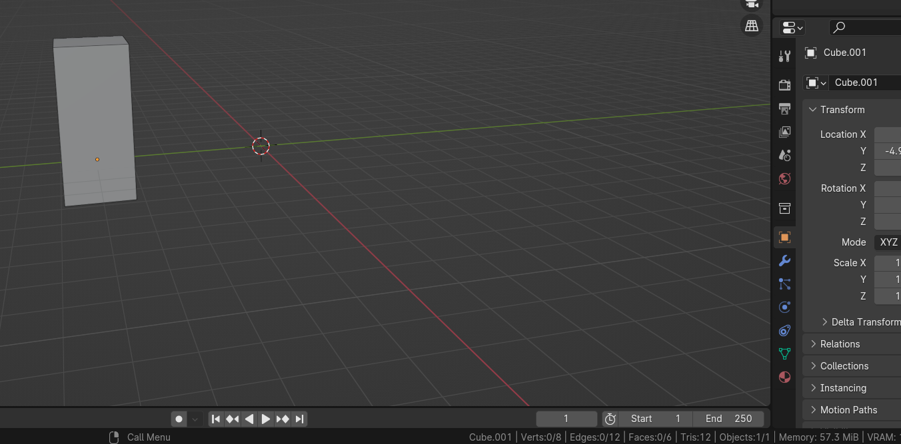

 
Extrude region - vertices 12, edges 20, faces 10,  tris 20. 
 
Extrude manifold - vertices 8, edges 12, faces 6,  tris 12. 
 
Normals  
 
(disclaimer: from this chapter on, I will be using Blender version 4.2) 
 
To know what it means to extrude along normals, I need to first explain what normals are. 
Normals show which way a vertex or face is pointing. 
64 

 
To see normals and their direction, switch to the edit mode with a “TAB” and click on the 
Mesh Edit Mode Overlays. 
 
After that, click on normals, and choose the first one, Display Vertex Normals, and the third 
one, Display face normals as lines. I will increase the size of the normals so I can explain to 
you better what they are. 
 
Those light blue lines that are coming out from our cube are face normals, and those dark 
blue lines that are coming out from our cube are vertex normals. 
Face normals are just showing you which way the face is pointing. 
 
65 

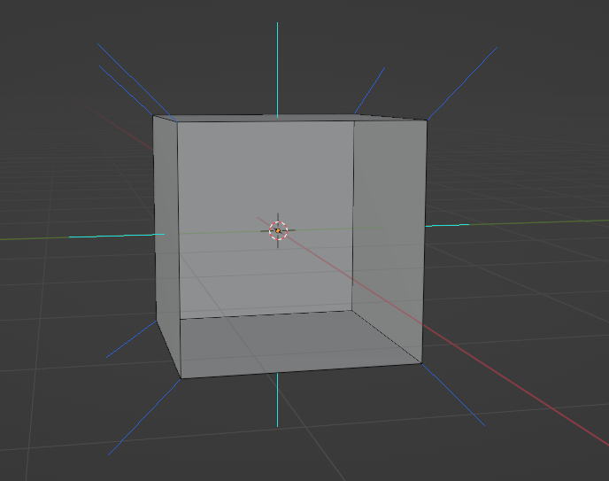

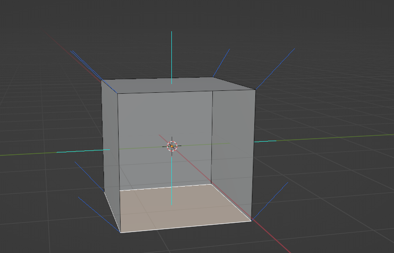

 
This cube has two sides: inside and outside. Normals are showing us which part of our cube 
is outside (blue line) and which part is inside (there is no line in the inside part, just outside, 
and that is how we know sides). 
You can see that more clearly in the next example. 
 
But if it looks like this, you can already see that something strange is going on. 
 
 
 
66 

 
The second way (easier and quicker, at least in my opinion) is to check face orientation. 
Click on Viewport overlay and turn on “Face orientation”. 
Before we see our cube, the most important thing to remember is that red means inside and 
blue means outside. 
 
As you can see, even colors do not match on our cube. Just as we could see from normals 
orientation, we can also see from the face orientation that the bottom part should be inside, 
not outside. 
 
67 

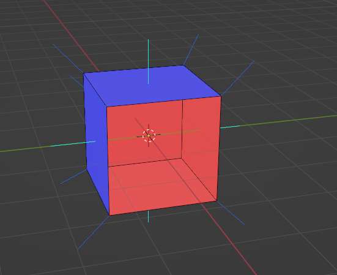

 
So how do we change that?

Select all with “A” go to mesh → normals → recalculate outside or after selecting all with “A” 
just click “SHIFT+N”. 
 
As you can see, now all faces are as they should be. 
 
ALERT ! 
In some cases, recalculate outside doesn’t work, and you need to choose a face and 
flip it by yourself. 
How to do that? 
 
 
68 

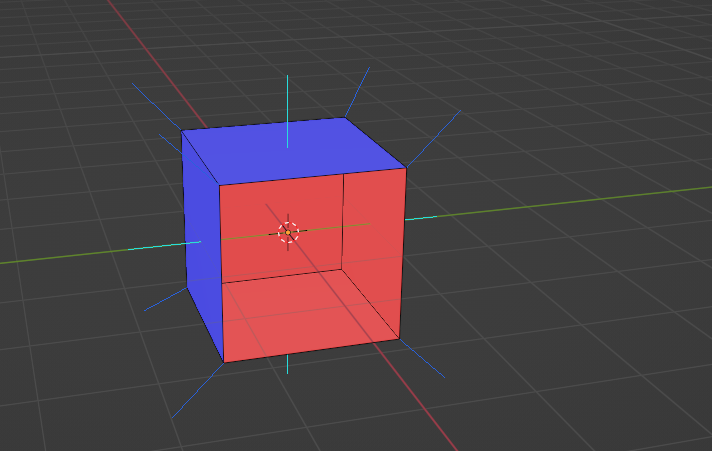

 
Select the face you want to flip with LMB. 
 
Go to Mesh → Normals → Flip. 
 
Now everything is correctly oriented again. You can turn off normals and face orientation just 
like you turned them on. 
 
69 

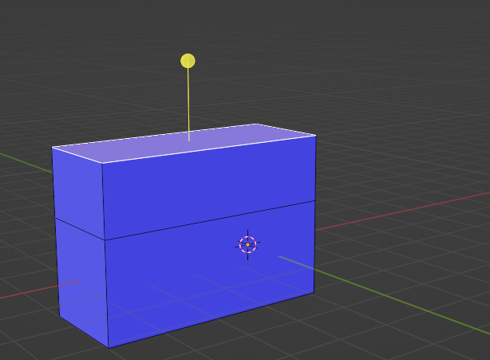

 
 
I hope you understood this part because normals are important in a lot of cases. You will 
learn one of those cases soon. 
Now let’s finally learn how to extrude faces along normals. 
Extrude along normals 

Just as you did before, choose “Extrude” button, and now choose “Extrude Along Normals”. 
Extrude along normals means to extrude region together along local normals. 
 
I will turn on face orientation again just to show you something. 
If you want to extrude along normals, just choose the face that you want to extrude with LMB 
and click on that yellow circle, and drag it for how much you want to extrude the face. 
 
70 

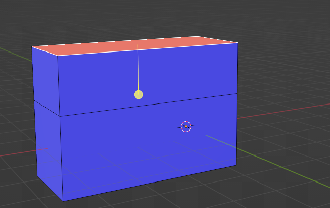

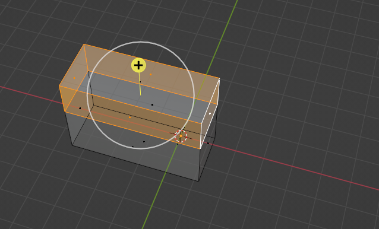

 
When faces are showing the correct side (blue is outside), extrude along normals is also 
working correctly. But if you have a face on the wrong side like this, you can see that this 
yellow circle is also showing on the inside. 
 
That is why your faces should always be correctly oriented. 
If you still haven’t realized how you can make your modeling easier by using extrude along 
normals, let me show you a good example. 
Imagine you want to extrude all these faces. 
 
 
 
 
71 

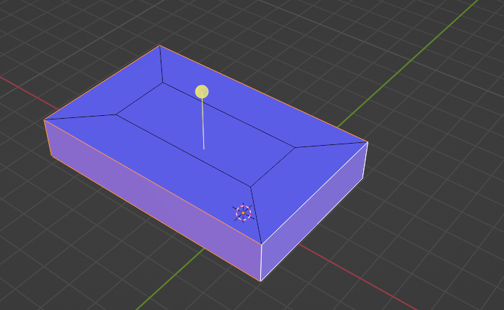

 
If you use the extrude region, you will get something like this. 
 
 
But if you use extrude along normals, you will get this. 
 
 
 
72 

 
But if one of our faces were on the wrong side, like this, 
 
you will get this. 
 
 
 
 
 
73 

 
Extrude individual 
 
Just as you did before, choose “Extrude” button, and now choose “Extrude Individual”. 
Extrude individual means to extrude each individual face separately along local normals. 
 
Let me show you an example. 
Select the whole cube with “A”, and select “Extrude Individual”. 
Now drag the yellow circle with the LMB to extrude it as you did in previous examples 
You will get something like this. 
 
 
 
 
 
 
74 

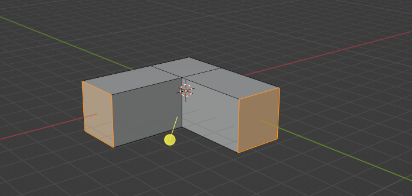

 
Or if you choose those two faces, you get something like this. 
 
Again, it is important that all faces are showing the right direction, so check Face orientation 
before extruding. 
It is an easy and self-explanatory tool, so I don’t think I need to say more about it. 
Extrude to cursor 
 
Just as you did before, choose “Extrude” button, and now choose “Extrude To Cursor”. 
Extrude to cursor means to duplicate and extrude selected vertices, edges, or faces towards 
the mouse cursor. 
 
Let me show you an example of how fun this tool is. 
Switch to vertex selection with 1 on your keyboard. 
Select the vertex that you want, and select “Extrude to Cursor”. 
 
 
 
75 

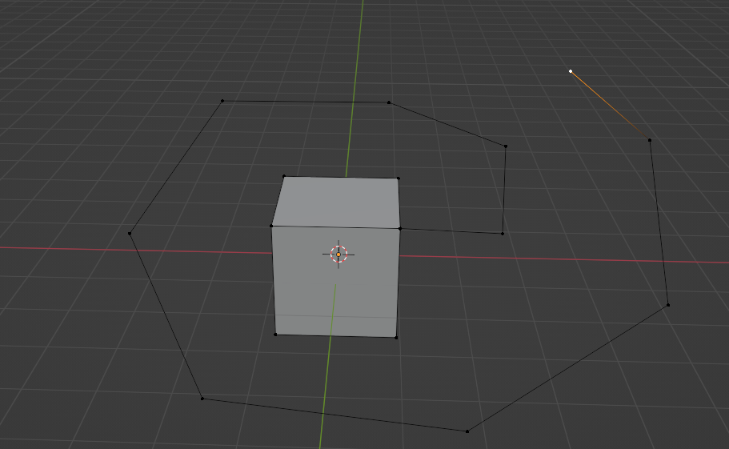

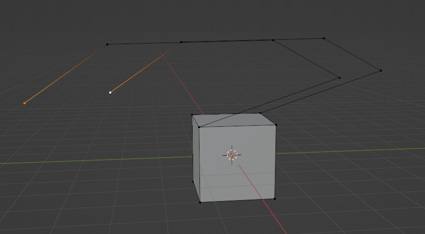

 
Now you just click with the LMB on your scene, and you are extruding that vertex where you 
click with your LMB. 
 
You can select more than one vertex as well. 
 
Now, if you want to extrude edges, switch to edge selection with 2 on your keyboard. 
Select the edge that you want, and select “Extrude to Cursor”. 
 
 
 
 
 
 
76 

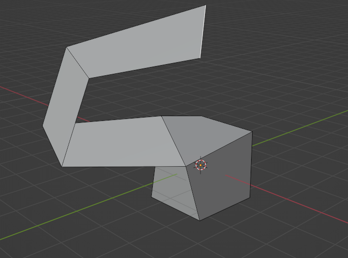

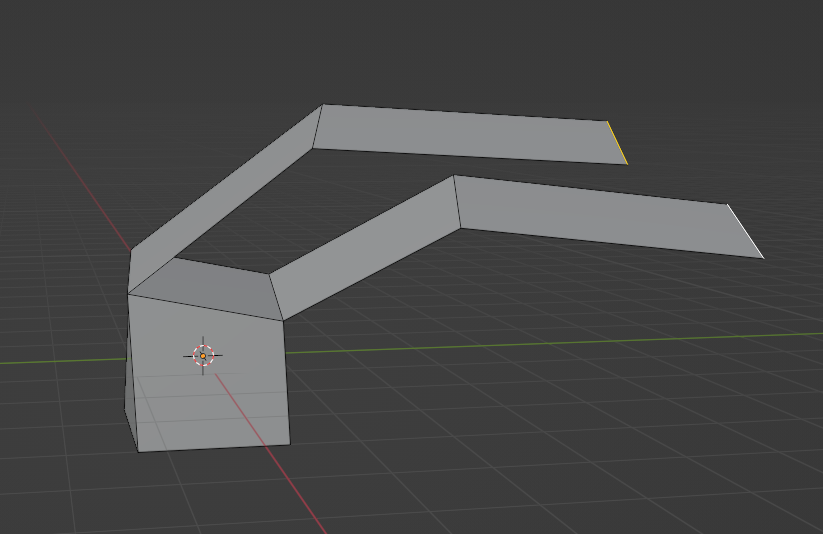

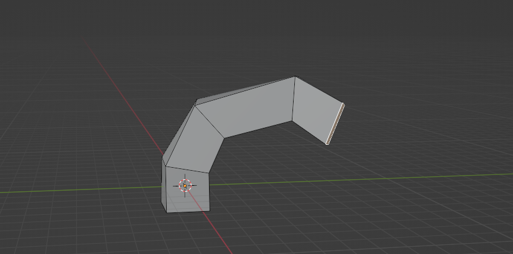

 
Now you just click with the LMB on your scene, and you are extruding that edge where you 
click with your LMB. You can select more than one edge as well. 
 
 
 
 
And if you want to extrude faces, switch to face selection with 3 on your keyboard. 
Select the face that you want, and select “Extrude to Cursor”. 
Now you just click with the LMB on your scene, and you are extruding that face where you 
click with your LMB. 
 
77 

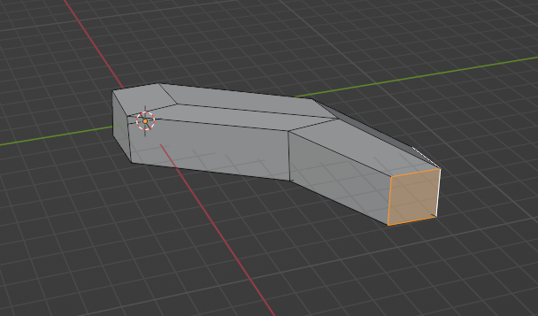

 
You can select more than one face as well. 
 
That is it! 
Now you know how to use an extrude tool! In the next chapter, we will learn another tool, 
and then I will teach you how to make your first 3D model. 
 
 
 
 
 
 
 
 
 
 
 
 
 
 
 
 
 
78 
