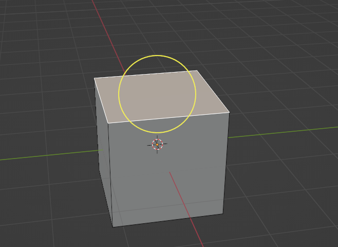
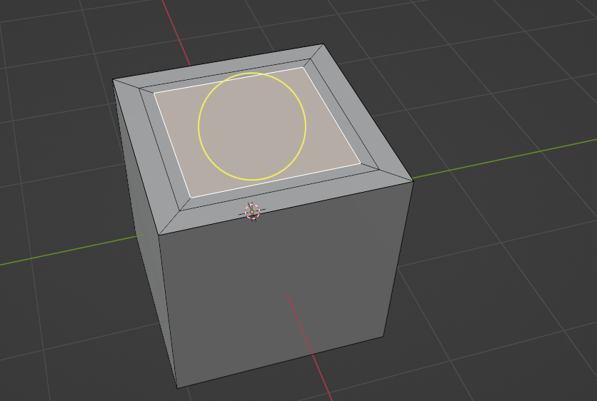

# Chapter 11: Inset

 
Chapter 11 - Inset 
It is time to learn the second tool with which you can inset new faces into selected faces  - 
INSET. 
Switch to edit mode with “TAB”.   
You can activate “Inset” by clicking where the arrow is pointing. 
 
As you could probably realize from the explanation, the inset tool can only inset faces. 
So if you choose vertices or edges, nothing will happen. 
So let’s activate the “Inset” tool and select one face on our cube. 
As you can see, the yellow circle appeared. 
 
79 

 
If you hold an LMB and move it inside that yellow circle, you can inset new faces like this. 
When you are satisfied with the size of your inset, release LMB. 
 
To be honest, it is much easier to inset faces with a shortcut, so remember that shortcut for it 
is “I”. 
So just select the face, press “I” on your keyboard, and move it with LMB to scale the inset. 
In the en,d just confirm it with LMB. 
You can inset more faces at once at the same time. 
 
 
 
 
 
 
 
 
 
 
 
 
 
80 

 
If you are inseting more faces at once but they are connected, if you press “I” only once, you 
will get this. 
 
But if you want to inset both faces separately, just press “I” two times from the start and you 
will get this. 
 
 
 
 
 
 
 
 
 
 
 
 
 
81 
