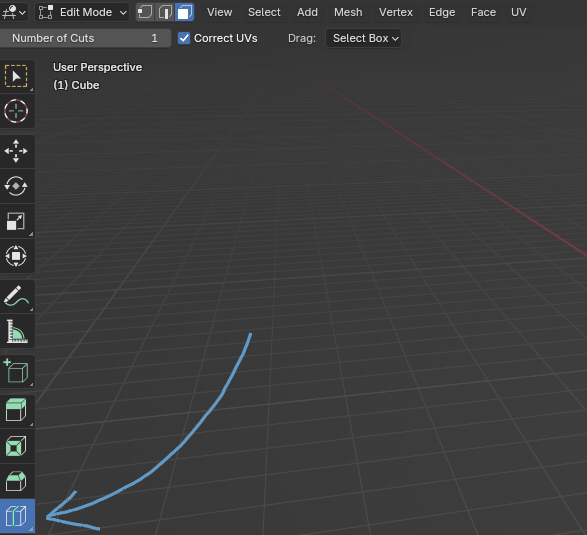
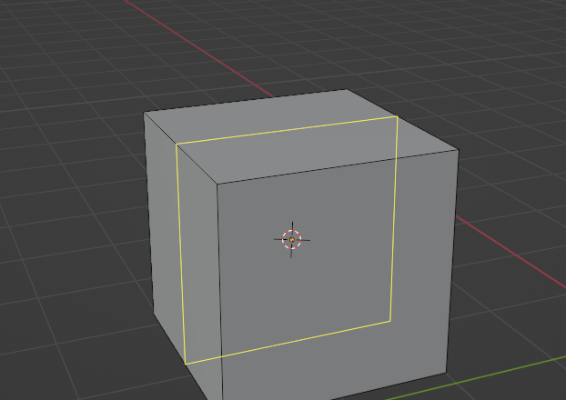
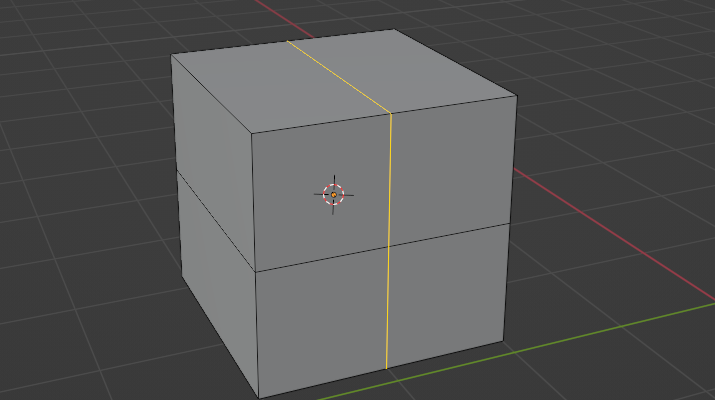
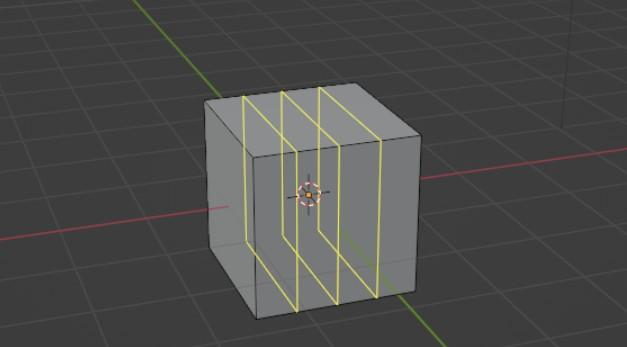
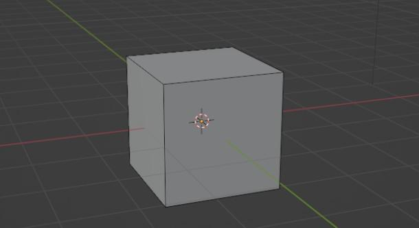
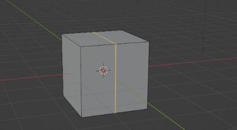
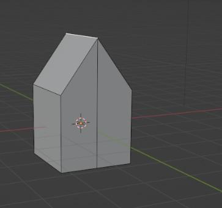

# Chapter 13: Loop cut

 
Chapter 13 - Loop cut 
It is time to learn the fourth tool - LOOP CUT. 
Loop cut  - cut the mesh loop and slide it. 
Switch to edit mode with “TAB”.   
You can activate “Loop cut” by clicking where the arrow is pointing. 
 
When you activate the “Loop cut” tool and move the mouse near the object, in this case a 
cube, loops will appear. 
 
 
88 

 
You can confirm the loop cut with the LMB. 
 
I will show you the shortcut for the loop cut right away because it is so much easier to use it 
while modeling. 
 
Shortcut for the loop cut to appear on your object is “CTRL+R.” 
When you confirm it with LMB, you can move it by moving the mouse left, right, up, or down, 
depending on the position of your loop cut. 
When you are satisfied with the position, just confirm it with LMB. 
 
 
89 

 
Before confirming it with LMB, if you scroll the mouse wheel up or down, your loop cuts will 
increase or decrease. 
 
After you click LMB once again, you can move them with the mouse, and if you click the 
LMB for the third time, you will confirm the position of your loops. 
Maybe this tool doesn't look fun at all, but you will see later what you can do with it. 
Actually, I will show it quickly right away.
 
EXAMPLE: 
You have a cube on the scene like this. 
 
If you add a loop cut like this 
 
90 

 
And then grab this top edge with “G+Z” up, you will get a…. 
 
HOUSE!  
Well, kind of…it is hard to make a house in just two steps, but you get a point. 
I will now stop explaining without modeling. There is a lot of stuff that I didn’t show you, but 
the easiest way to learn is while actually modeling something, so it is time to learn how to 
model in Blender. 
 
 
 
 
 
 
 
 
 
 
 
 
 
 
 
 
 
91 
