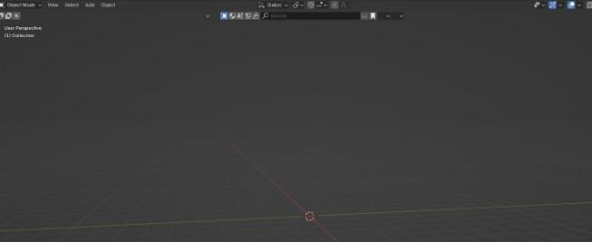

# Chapter 14: Your first 3D model

 
Chapter 14 - Your first 3D model 
I was thinking about the best first model for you to understand modeling in Blender, and 
decided to start with a chess piece pawn. 
It is fun and satisfying when you see in the end that you can model it. 
So let’s start! 
First, we will find an image reference. 
I found it on Pixabay.com. 
(https://pixabay.com/vectors/chess-game-pawn-piece-recreation-26779/).   
You can download this one or any other image that you want, just be sure that it is the front 
side. I will put the picture for download in the description. 
 
Time to learn how to model with a picture reference. 

We are currently working in object mode. 
First, we will delete everything from the scene with an “X.” 
 
 
 
92 

 
 
After that, we will click on ”-Y” on the gizmo so that we can position everything correctly from 
the start. -Y is the front side. 
 
Then we will go to Add → Image → Reference. 
After that, a new window will open, and you will find the image that you just downloaded. 
 
 Choose the image and click the “Add Image” button when you find it. 
93 

 
 
We added the image. 
 
On the right side, you will see a lot of tools, but the only tool that is important to us right now 
is the Data → Object data properties. 
 
Here you can change the size, offset, depth, side, and opacity of the image. 
We want to change Depth to Back.  
94 

 
 
The next step is to place the pawn in the center and align the bottom of the pawn with the 
X-axis for easier modeling. 
 
 
Because our reference image is already in the middle, I will only move it up with “G+Z” for 
around 2.29 to align the bottom with the X-axis. 
 
Before we add an object, let’s think about which object would be the best for modeling a 
pawn based on the pawn shape. 
We have: plane, cube, circle, UV sphere, ICO sphere, Cylinder, Cone, and Torus. 
The most similar are the circle and the cylinder. 
You can choose either one. I will start with the circle 
Go to Add → Mesh → Circle 
95 

 
 

Switch to edit mode with “TAB” 
 
and click “F” to fill 
 
Click on “-Y” to switch to the front orthographic view 
96 

 
 
Scroll the mouse wheel up to zoom in on the right side of the pawn. 
 
 
 
Now we will start to extrude and scale the circle, following the contour of our pawn.  
Scale it with “S” for around 1.63 
 
97 

 
Extrude it with “E+Z” for around 0.05 
 
Scale it with “S” to the outside for around 1.04 
 
Extrude it with “E+Z” for around 0.05 
 
Scale it with “S” to the outside for around 1.015 
98 

 
 
Extrude it with “E+Z” for around 0.2764 
 
 
 
Extrude it with “E+Z” for around 0.05
 
 
99 

 
Scale it with “S” to the inside for around 0.985
 
 
Extrude it with “E+Z” for around 0.05 
 
Scale it with “S” to the inside for around 0.95 
 
When you reach the first crease, extrude the circle just a tiny bit and scale it so that it fits to 
inside of the crease.  
100 

 
Extrude it with “E+Z” for around 0.005 
 
Scale it with “S” to the inside for around 0.9 
 
 
Extrude it with “E+Z” for around 0.05 
 
101 

 
Scale it with “S” to the outside for around 1.025 
 
Extrude it with “E+Z” for around 0.05 
 
 
Scale it with “S” to the outside for around 1.005 
 
Extrude it with “E+Z” for around 0.47 
102 

 
 
Extrude it with “E+Z” for around 0.05 
 
 
Scale it with “S” to the inside for around 0.985 
 
103 

 
Extrude it with “E+Z” for around 0.05 
 
Scale it with “S” to the inside for around 0.96 
 
Here comes the next part of the pawn. Like the last time, we will extrude it with “E+Z” just a 
little bit so we can scale it after that.  
 
Extrude it with “E+Z” for around 0.005 
104 

 
 
Scale it with “S” to the inside for around 0.86 
 
Extrude it with “E+Z” for around 0.05 
 
 
105 

 
Scale it with “S” to the outside for around 1.035 
 
Extrude it with “E+Z” for around 0.05 
 
Scale it with “S” to the outside for around 1.008 
 
Extrude it with “E+Z” for around 0.05 
 
106 

 
Scale it with “S” to the inside for around 0.995 
 
Extrude it with “E+Z” for around 0.05 
 
Scale it with “S” to the inside for around 0.97 
 
 
 
 
 
107 

 
Extrude it with “E+Z” for around 0.025 
 
Scale it with “S” to the inside for around 0.96 
 
Again, the same thing. Just a little bit of extrude so we can scale the next part. 
Extrude it with “E+Z” for around 0.005 
 
 
 
108 

 
Scale it with “S” to the inside for around 0.82 
 
This time, we can just extrude this part. 
Extrude it with “E+Z” for around 1.11 
 
Scale it with “S” to the inside for around 0.76 
 
After that, the next part is coming, so just extrude it a bit. 
 
109 

 
Extrude it with “E+Z” for around 0.005 
 
Scale it with “S” to the outside for around 1.6 
 
Extrude it with “E+Z” for around 0.05 
 
Scale it with “S” to the outside for around 1.06 
 
110 

 
Extrude it with “E+Z” for around 0.05 
 
Scale it with “S” to the outside for around 1.02 
 
Extrude it with “E+Z” for around 0.05 
 
Extrude it with “E+Z” for around 0.05 
 
 
111 

 
Scale it with “S” to the inside for around 0.975 
 
Extrude it with “E+Z” for around 0.05 
 
Scale it with “S” to the inside for around 0.94 
 
Same thing with the crease again. 
Extrude it with “E+Z” for around 0.005 
 
112 

 
Scale it with “S” to the inside for around 0.6 
 
Extrude it with “E+Z” for around 0.1 
 
Scale it with “S” to the outside for around 1.14 
 
Extrude it with “E+Z” for around 0.1 
 
113 

 
Scale it with “S” to the outside for around 1.1 
 
Extrude it with “E+Z” for around 0.1 
 
Scale it with “S” to the outside for around 1.07 
 
 
 
 
114 

 
Extrude it with “E+Z” for around 0.1 
 
Scale it with “S” to the outside for around 1.05 
 
Extrude it with “E+Z” for around 0.1 
 
 
 
 
 
115 

 
Scale it with “S” to the outside for around 1.03 
 
Extrude it with “E+Z” for around 0.1 
 
Scale it with “S” to the outside for around 1.02 
 
 
 
 
116 

 
Extrude it with “E+Z” for around 0.1 
 
Scale it with “S” to the outside for around 1.01 
 
Extrude it with “E+Z” for around 0.1 
 
Extrude it with “E+Z” for around 0.1 
 
117 

 
Scale it with “S” to the outside for around 0.995 
 
Extrude it with “E+Z” for around 0.1 
 
Scale it with “S” to the inside for around 0.98 
 
 
 
 
 
118 

 
Extrude it with “E+Z” for around 0.1 
 
Scale it with “S” to the inside for around 0.975 
 
Extrude it with “E+Z” for around 0.1 
 
Scale it with “S” to the inside for around 0.96 
 
119 

 
Extrude it with “E+Z” for around 0.1 
 
Scale it with “S” to the inside for around 0.95 
 
Extrude it with “E+Z” for around 0.1 
 
 
 
 
120 

 
Scale it with “S” to the inside for around 0.92 
 
Extrude it with “E+Z” for around 0.1 
 
Scale it with “S” to the inside for around 0.9 
 
 
 
 
121 

 
Extrude it with “E+Z” for around 0.1 
 
Scale it with “S” to the inside for around 0.85 
 
Extrude it with “E+Z” for around 0.1 
 
Scale it with “S” to the inside for around 0.75 
 
122 

 
Extrude it with “E+Z” for around 0.1 
 
Scale it with “S” to the inside for around 0.4 
 
Extrude it with “E+Z” for around 0.02 
 
 
 
123 

 
Press “M” to merge at the center. 
 
 
Switch to Object mode with “TAB” 
 
 
 
 
 
 
124 

 
RMB and choose Shade Auto Smooth. 
 
That is all for today, next time we will learn how to make a plate. 
If you had fun learning with me, don’t forget to subscribe to my channel. 
 
 
 
 
 
 
 
 
 
 
 
 
 
 
 
 
125 
