# Chapter 16: Let's model a cake

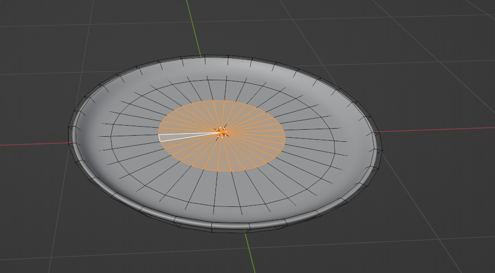

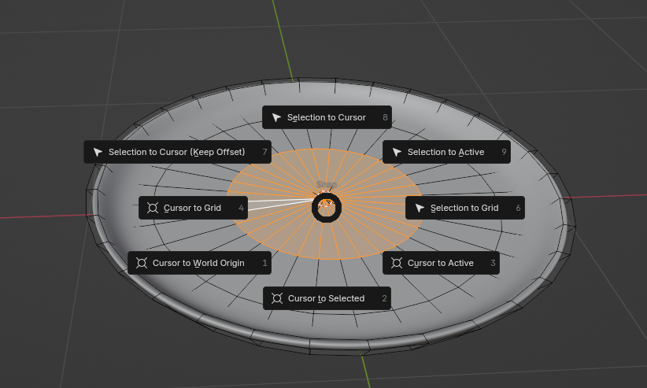

 
Chapter 16 - Let’s model a cake 
Now, you have a plate. 
It is time to add a cake. 
Position the 3D cursor on the plate by clicking “SHIFT+RMB” on the place you want to add 
your next object  
 
or if you want to do it more precisely, switch to the edit mode with “TAB”. 
Select the faces where you want your 3D cursor to be 
 
Press “SHIFT+S” to get this pie menu 
 
141 

 
and choose Cursor to selected. 
 
Now your 3D cursor is in the middle of a plate. 
 
Switch back to object mode and add a new object. 
This time, you will add a cylinder because it's the best shape for making a cake out of. 
Click “SHIFT+A” —> add Mesh —> Cylinder. 
 
 
 
 
 
 
 
 
 
 
 
 
 
 
142 

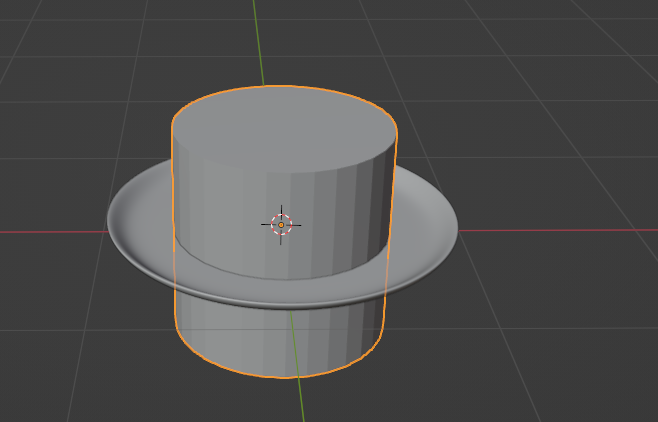

 
Scale it with “S” until you think it is the perfect size for the cake. 
 
Move it up with “G+Z” and apply scale with “CTRL+A” — apply Scale. 
 
You want to have your cake on the plate, right? 
So it is time to teach you something called SNAP. 
 
 
 
143 

 
Select the object you want, in this case cylinder, and turn on snap tool by clicking where the 
arrow is pointing, or simply turn it on (and off) by pressing “SHIFT+TAB”. 
 
Now move it down along the Z-axis and place the mouse on the face to which you want it to 
snap and confirm it with the LMB. 
 
 
 
 
 
 
144 

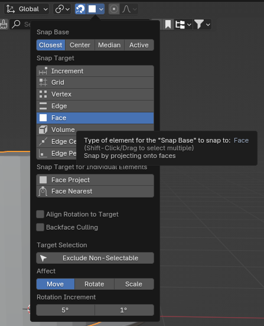

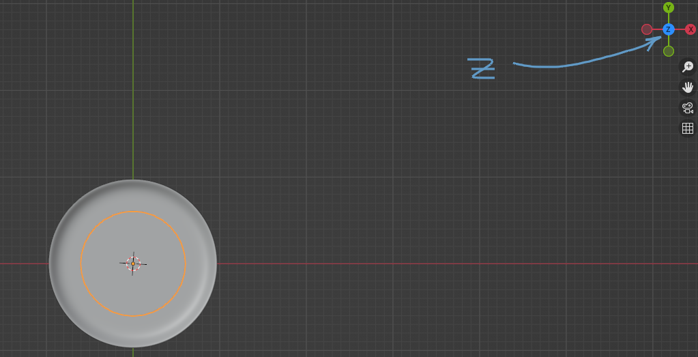

 
You can snap to the face, vertex, edge, and much more. I will show you more examples of 
snapping in the future, but for now, learn at least face snapping. So be sure that for a snap 
target is selected the face before you snap. 
 
Now you can switch to edit mode with “TAB”. 
Change the view to the top orthographic with 7 on the numpad or click on this blue Z in the 
top right corner. 
 
145 

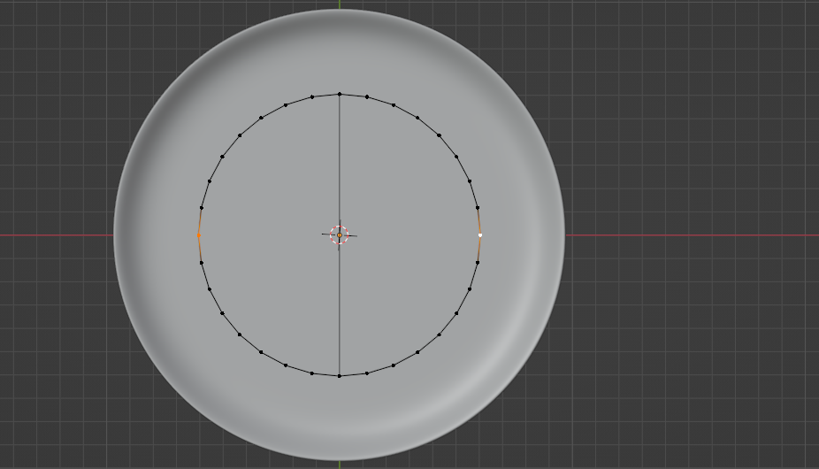

 
Select vertices as shown  
 
and join them with “J”. 
 
Select the other two vertices 
 
146 

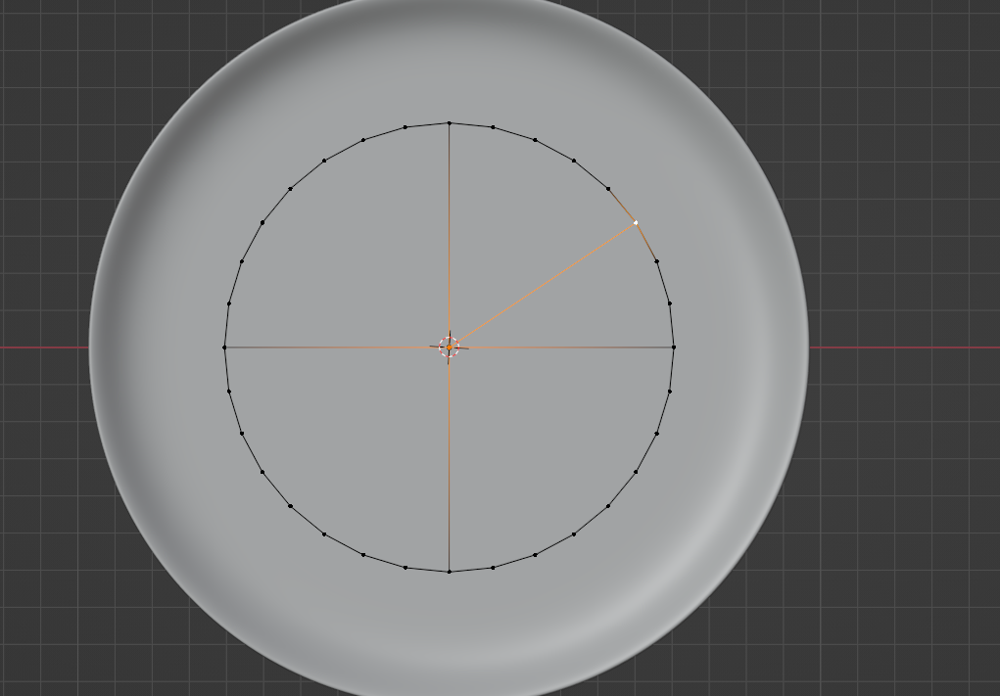

 
and joined them again with “J”. 
 
Select these two vertices and join them with “J”. 
 
Turn on X-ray mode with “ALT+Z” so you can select all vertices. 
 
 
 
 
147 

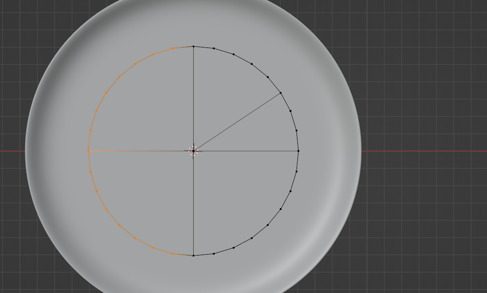

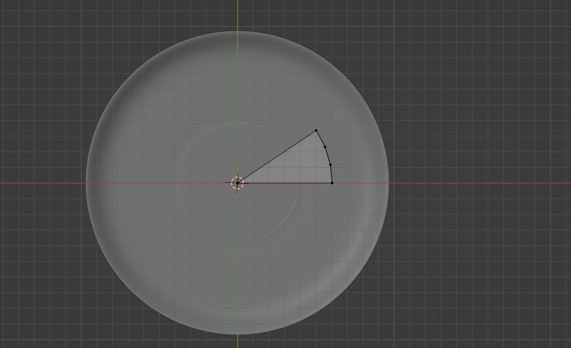

 
Select this left part,  
 
and delete vertices with an “X”. 
 
Repeat the previous steps until you get this. 
 
 
 
 
 
 
 
 
148 

 
I just realized that I didn’t teach you about moving the view until now. So let’s correct that 
because you will need it in the next step. 
MOVING THE VIEW 
If you want to zoom in on something, you scroll your mouse wheel up. 
 
If you want to zoom it out, scroll your mouse wheel down. 
 
 
 
 
 
 
 
149 

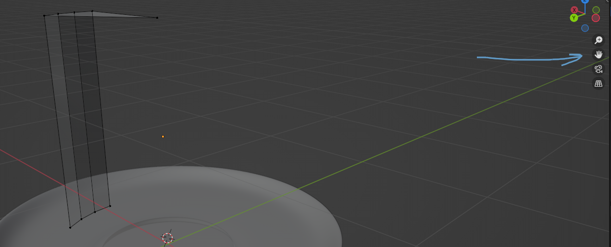

 
When you are holding the mouse wheel and moving the mouse, you can see all the different 
views. 
 
If you are holding “SHIFT+mouse wheel,” you can move the view without rotating the object. 
You can also zoom in/out the view if you click where the arrow is pointing and hold LMB 
while moving the mouse up or down. 
 
You can also move the view if you click where the arrow is pointing and hold LMB while 
moving the mouse around. 
 
150 

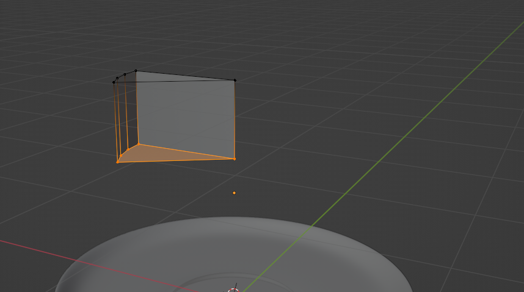

 
Now we can move on with the cake. 
After you delete all those vertices, move the camera while holding the mouse wheel and 
delete those vertices with “X” as well. 
 
Select all with “A”. 
 
And extrude it down along the Z-axis with “E+Z”. 
 
151 

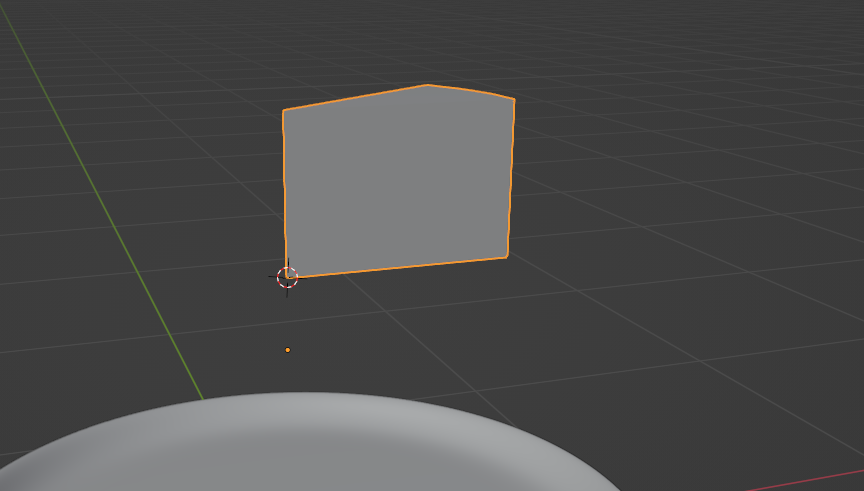

 
Switch to object mode with “TAB” and turn off X-ray with “ALT+Z. 
 
Position the 3D cursor with “SHIFT+RMB” to the bottom of the cake as it is shown. 
 
 
 
 
 
 
 
 
 
152 

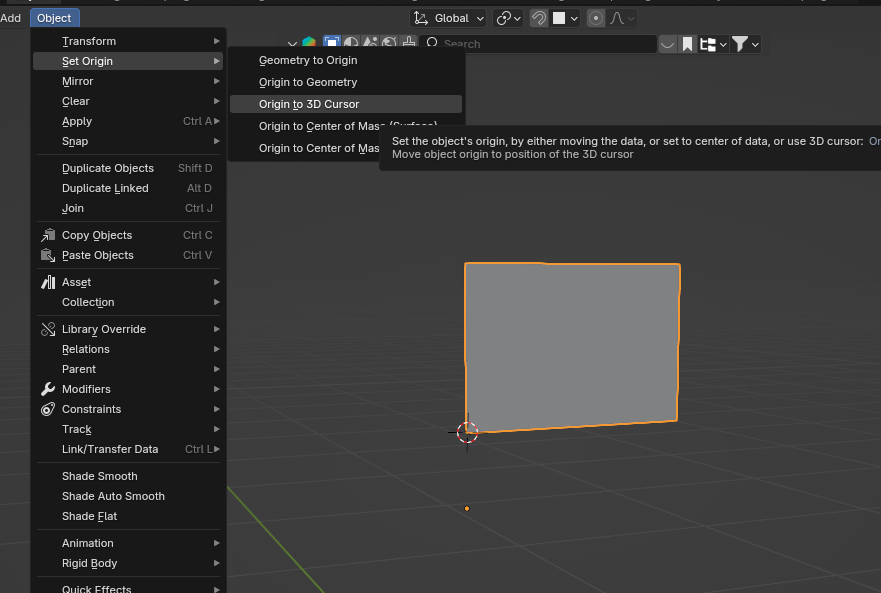

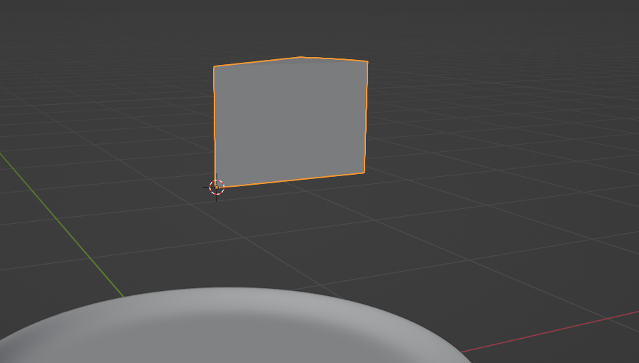

 
Go to object —> set origin —> origin to 3d cursor. 
 
And you will see that the origin is moved where the 3D cursor is. 
 
 
 
 
 
 
153 

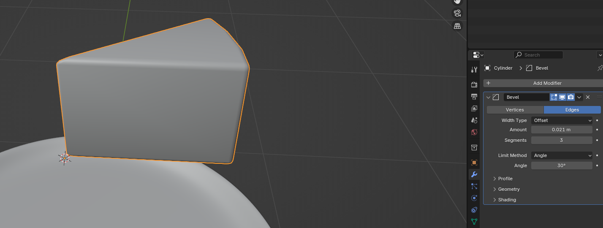

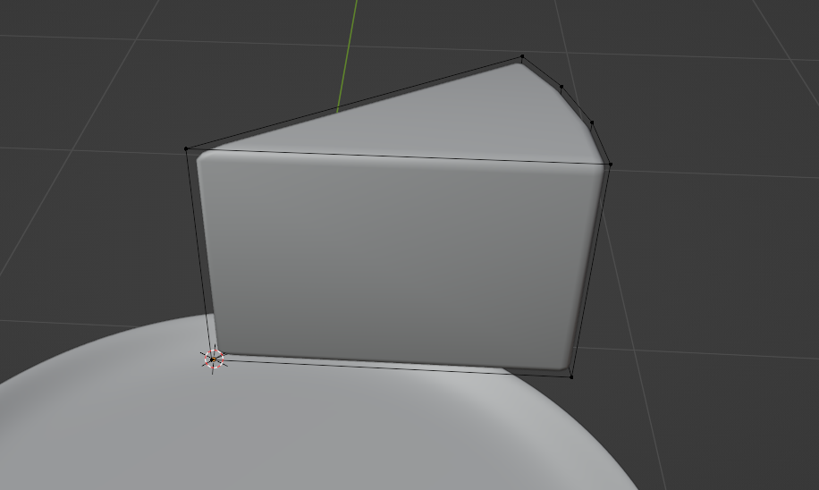

 
Click on the wrench icon and then add a modifier.  
Add modifier —> generate —> Bevel. 
 
Change the Amount to around 0.021 and the segments to around 3. (You can change those 
as you want. Adjust the numbers as you think they would look best.) 
 
Switch to edit mode with “TAB”. 
 
154 

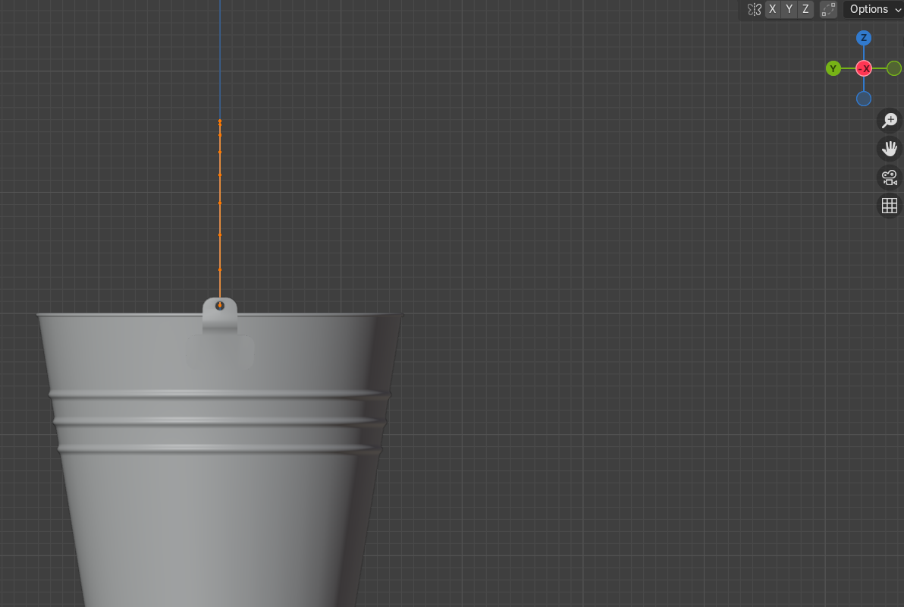

 
Switch from selecting vertices to selecting faces with 3, and select those faces. 
 
And now you are encountering something new and useful again - duplicating faces. 
If you press “SHIFT+D,” you can duplicate the face. 
 
So press it to duplicate selected faces. You want those duplicated faces at the exact same 
position as they were, so just click RMB to return them to the original position. 
 
 
 
 
155 

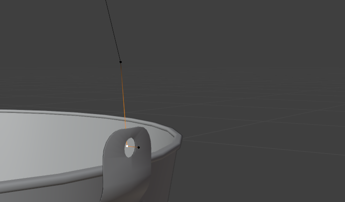

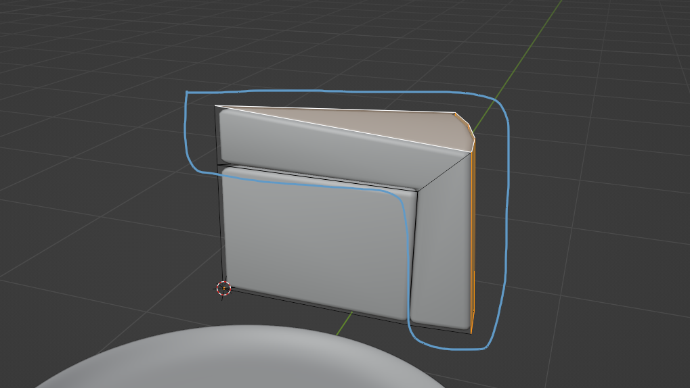

 
 
Click “ALT+E” and choose Extrude Faces Along Normals. 
Last time, I think I didn’t mention about Even thickness off and on. 
You 
can see 
that 
currently, after you started extruding along normals, the cake shape is a bit off. 
 
 
 
 
Because Even thickness is turned off, this happens. 
 
156 

 
To turn on” Even thickness”, either press S (for turning it off and on) or hold ALT. 
And this is the result after turning on Even thickness. 
 
Much better, right? 
Now you can extrude your cake as much as you want. 
 
 
 
 
 
 
157 

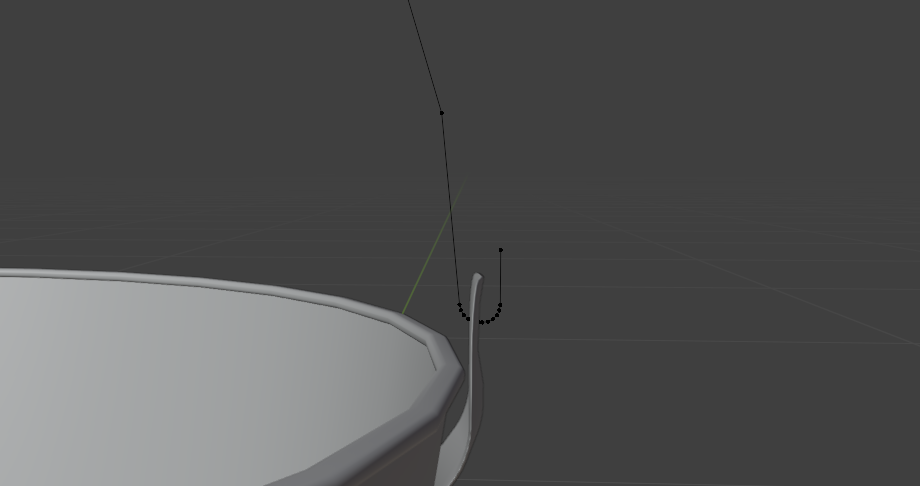

 
Select this part of the cake by showing your pointer somewhere on the inside part of the 
cake, and then click “L” for linked. 
 
Click “CTRL+R” to add loops to that part of the cake. 
 
 
 
 
 
 
 
158 

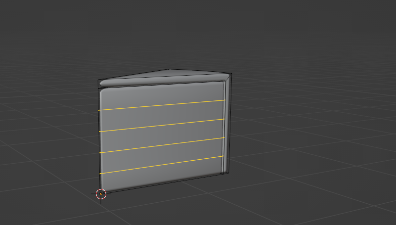

 
Scroll the mouse wheel how many loop cuts you want to add. In this case, I added 4 loop 
cuts. 
Click LMB to confirm the number and then ESC or RMB to center them. 
 
It is time to learn some basics about adding materials to objects. 
 
 
 
 
 
 
 
 
 
 
159 

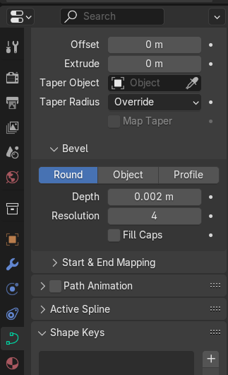

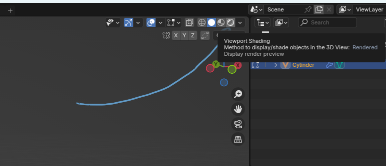

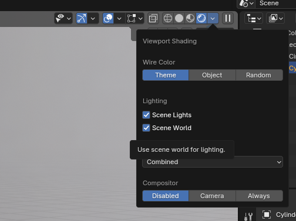

 

ADDING MATERIALS TO THE OBJECTS 
If you want to add material to your objects, click where the arrow is pointing - Material 
properties. 
 
Switch to a rendered view so you can see all the materials that you add. 
 
I don’t want to bother you with adding light for now, so just click here and turn off the Scene 
world. 
 
160 

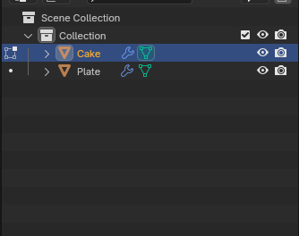

 
Thatwill do for a start. 
Before you add materials, let’s rename your objects. 
 
So instead of a cube and a cylinder, you can rename it to a plate and a cake. 
Double-click with the LMB on the object that you want to rename. When letters look like this, 
type your new name. 
 
 
 
161 

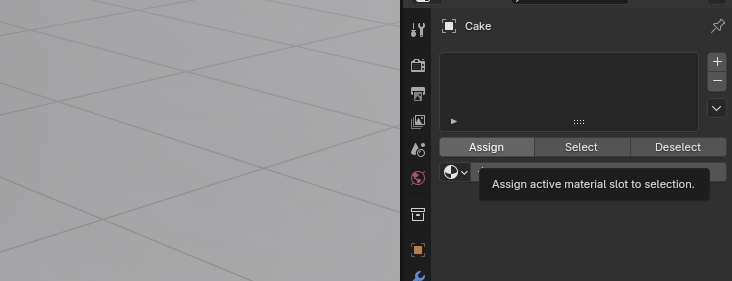

 
 
Try to rename your objects from the start because it will be much easier to work like that, 
and you will save yourself a lot of time. 
Now you can add a material. 
 
Select this part with “L”. 
 
Click this + to add a new material slot. 
 
Click Assign to assign material to the selected face. 
 
162 

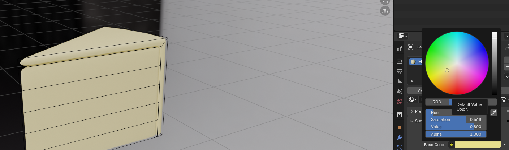

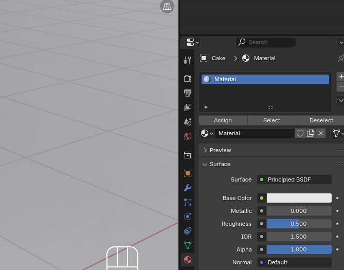

 
Click “NEW” to add new material. 
 
Choose the base color as desired. I chose yellow. 
 
Switch to selecting faces with 3. Press “ALT” and select this first loop. 
 
 
163 

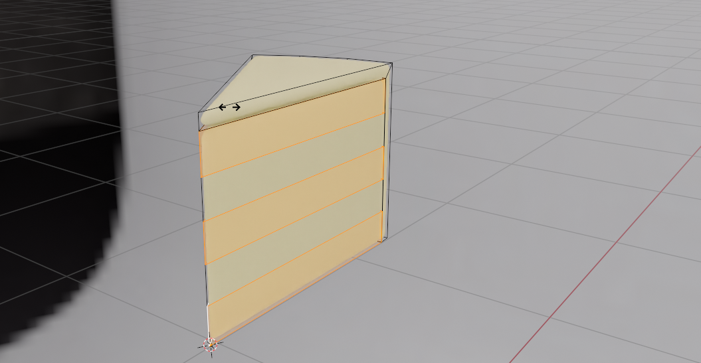

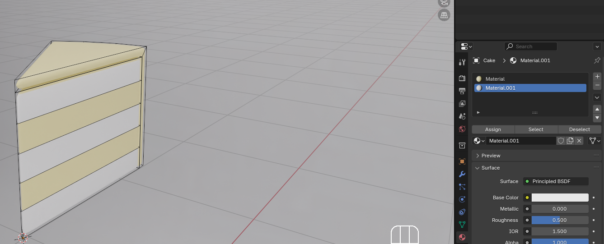

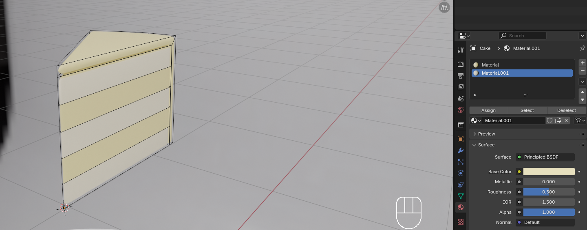

 
While holding “SHIFT+ALT,” select two other loops. 
 
Click + again to add a new material slot, assign, and a new. 
 
Choose the base color as desired. I chose a lighter shade of yellow. 
 
164 

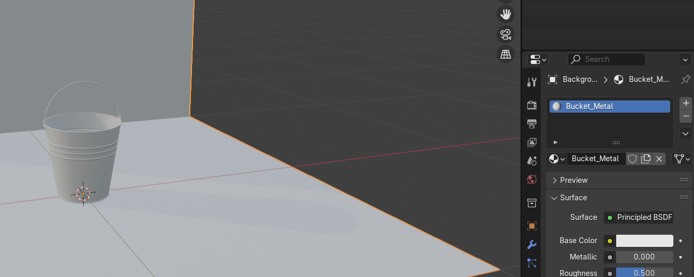

 
Switch to object mode. Select the cake. Turn on snap. Make sure that for a snap target is 
selected the face before you snap. 
Click “G+Z” and snap it to the plate. 
 
Change the view to the top orthographic with 7 on the numpad. 
Duplicate the cake with “SHIFT+D” click “ESC” or RMB to return it to the original position. 
Click “R” and rotate it as you want. When you decide on your new position for a piece of 
cake, confirm it with the LMB. 
 
165 

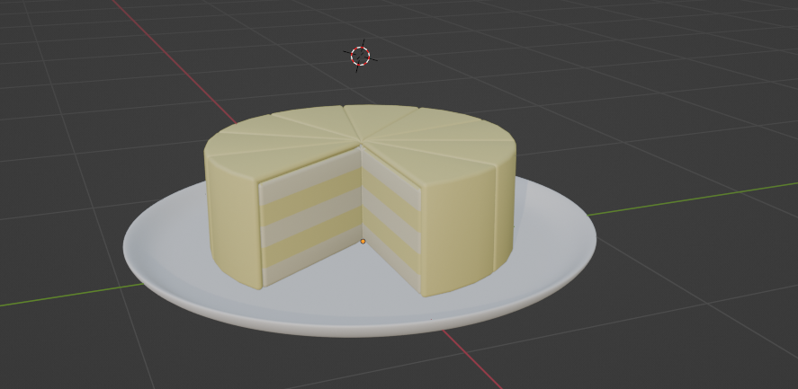

 
It is time to learn a new, fun trick. 
If you want to repeat the same action again, you don’t need to duplicate and rotate it again, 
but just click “SHIFT+R” to repeat this step with as many pieces as you want to create. 
 
Congratulations! You just made your 3D cartoony cake! 
 
I think it is time to learn how to render. 
 
 
 
166 
