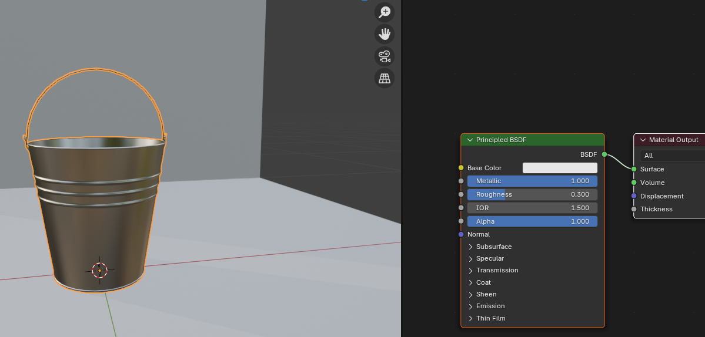
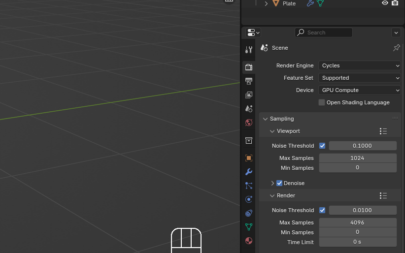
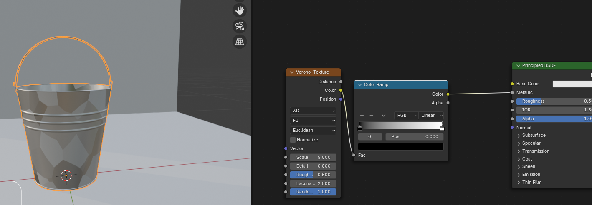
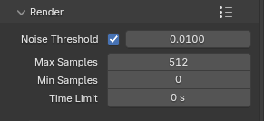

# Chapter 17: Let's learn how to render

Chapter 17 - Let’s learn how to render 
Go to render properties, and switch from Render engine Eevee to Cycles. 

Also if you have a good graphics card, you can switch from CPU to GPU. 
Turn on the viewport denoise to get rid of the noise and make things easier for the eyes 

Add a camera. 

Click on the camera icon. 

Click “N” to open the sidebar, go to view, and turn on camera to view. 
Now you can adjust the view far or close by scrolling up or down the mouse wheel, and 
rotating the view while pressing the mouse wheel and moving the mouse left or right. 
If you want to move the whole camera, hold “SHIFT” and press the mouse wheel while 
moving the mouse up or down. 
Change samples in render to 512 or even 256, because there is no need for 4096 samples 
in this case. 

When you are satisfied with it, turn off the camera to view, click Render, and render the 
image. 

Congratulations! You just made your first render 
🙂
If you'd like, you can send me your cake renders along with your social media handle. I'll 
share them later on my social media and YouTube channel when I make videos about cake 
modeling. 
Send all your works to 
skolar7@gmail.com