# Chapter 18: Your first animation

Chapter 18 - Your first animation 
This part, at which the arrow is pointing, is called the timeline. 
And those numbers are frame numbers. 
We can animate objects in different ways. 
Today I will show you one of the easiest ways, in my opinion - animating by changing the location of the object. 
Your goal will be to get your pieces of cake to fall from the air, straight onto the plate. 

So, how to do that? 
First, select all pieces of your cake and move them up with “G+Z”. 
I moved them like this. 

170 
Before starting to insert any keyframes, make sure that your blue pointer(also known as the scrubber) is positioned on 1. 
There are some cases when you will need to position it on 0 or even negative numbers, like in cases when you want to have an animation of falling snow, but I will explain that in later chapters. It can also be positioned on 2,5,10, etc. 
Depending on which frame you want your animation to start, insert the keyframe to that location. 

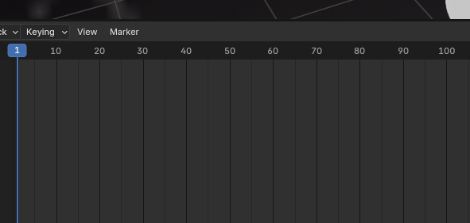

In my animation, I want my first piece of cake to start to fall from the first frame, so that is why I positioned the scrubber there. After you position the scrubber, select the first piece of cake. 

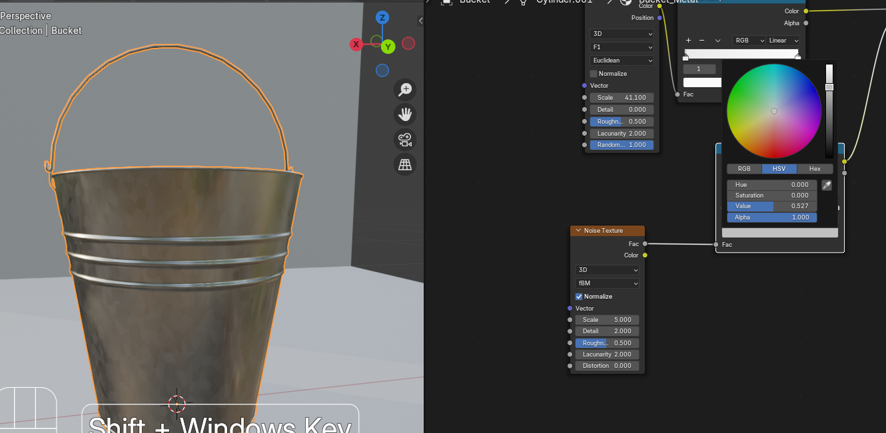

171 
Because this is your starting location, you want to keyframe that location for the first piece on the 1st frame. 
Click “K” (in previous Blender versions, it was “I,” so don’t let that confuse you if you are using older Blender versions) and choose Location from “Insert Keyframe Menu.” 

This means that your animation will start on the 1st frame, and that the location of your first cake piece will be up in the air. 
ATTENTION! In Blender version 4.2 (the one that I am using currently), if you click “I”, you will insert at the same time location, rotation, and scale. Even if you do it like that, it is not a mistake, but it’s lots of unnecessary data since we’re not animating either rotation or scale. 
In this example, I am not planning on doing any of that; I will just move the cake down on the plate, so this is why I inserted only the location.!ATTENTION! 
You know that the keyframe is inserted when this orange/yellow rhombus appears on your timeline. 

172 
Now drag the blue scrubber from the first frame and move it to the frame you want your piece to be on the plate. 
I want my first piece on the plate on the 30th frame. So I will move the scrubber there. 

If you want your pieces of cake to fall more slowly, you will make your second keyframe further from the first one. If you want them to fall quicker, you will make your second keyframe closer to the first keyframe (like on the 10th frame or 15th, or something like that). 
Play around with this so you can understand better what I mean. 
Now, when you position the scrubber, make sure that your first piece is selected. 
As I said, I want it on the plate.  
So, to position it correctly, turn on snap and snap it to the plate. Then keyframe the location with “K” and choose the location. 
Because your final location is the plate, you are finished with animating the first piece, and you can now move to the second piece of the cake. 

173 
My previous animation ended on the 30th keyframe. I want my piece of cake to start falling immediately after the first piece lands down onto the plate. 
If you don’t want that, just start with some further frame like 35,50… depending on how much of a delay you want. 
To have your piece falling, without delay, select the second piece of the cake, position the scrubber to the 30th keyframe (you are positioning it to the keyframe that was the ending keyframe in your previous animation), and again, press K and keyframe the location. 

Now drag the blue scrubber from the 30th frame and move it to the frame you want your piece to be on the plate. 
I want my second piece on the plate on the 60th frame. So I will move the scrubber there. 
 If you want your pieces to fall with the same speed, you will always make sure that the distance between the frames is the same (30-60-90-120..). That is why my second keyframe is on the 60th frame. 
Now, when you position the scrubber, make sure that your second piece is selected. 
174 
Snap it to the plate. Then keyframe the location. 

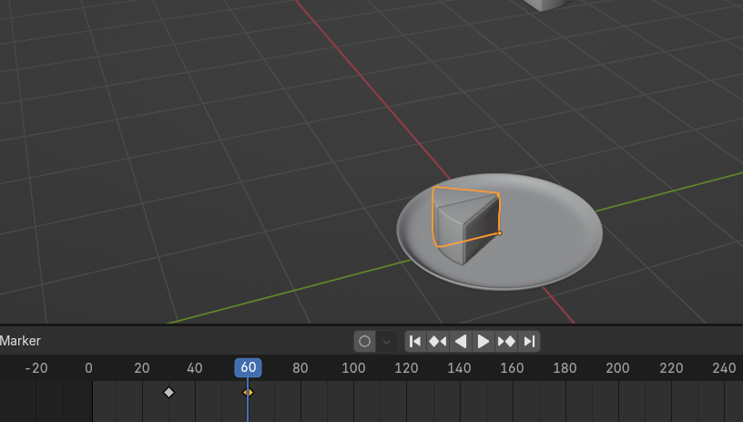

If you click where the arrow is pointing, you will be automatically moved to the first frame. Now click either the play button or the “SPACEBAR” to start your animation.  
The same way is to stop the animation. 

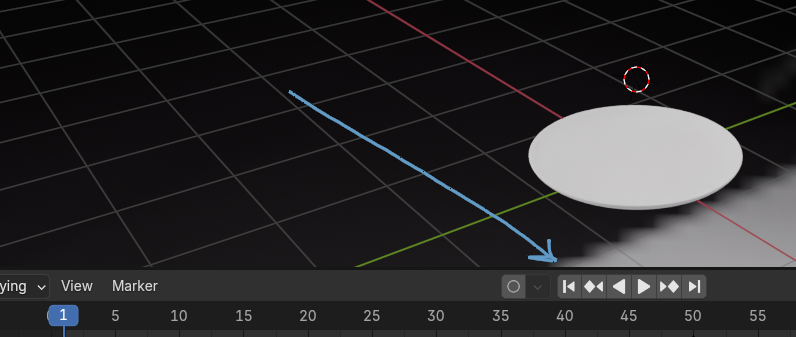

If your animation looks good to you, you can continue with the next piece of cake. 
If you want your animation to be a bit quicker, you can do it easily in this way. 
Select the rhombus from the second frame (in my case 60th frame) and just drag it where you want it to be instead.  
You can check your animation again, and if you are satisfied with it, you can move to the next piece of the cake. 
175 
When you select any piece, you will see that you have only one keyframe. It is because the inserted keyframes are only showing for pieces that are currently selected. 
It is time for the next piece of the cake. You will do the same thing. 
Select the third piece of the cake, and position the scrubber at the 60th keyframe. 

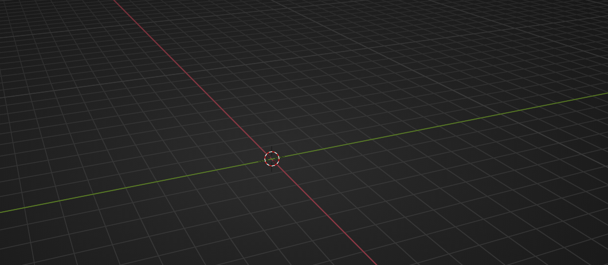

Keyframe the location.  

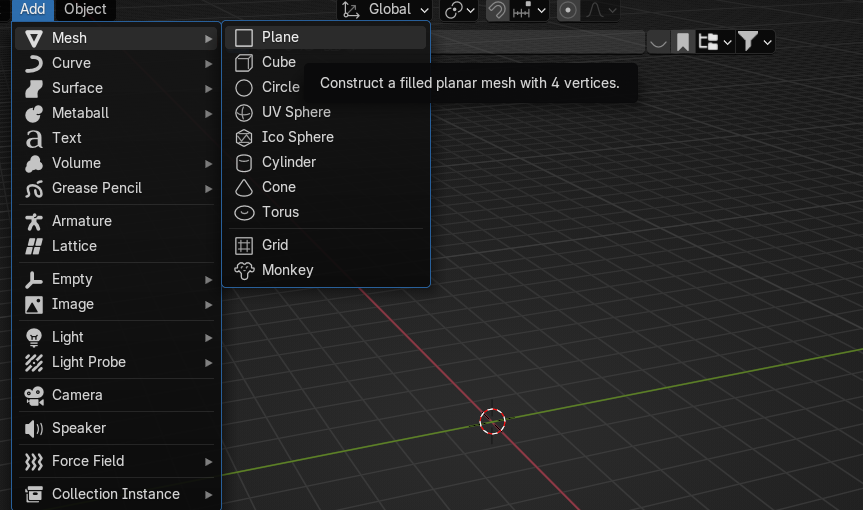

176 
Move the scrubber to the frame you want your piece to be on the plate. In my case, that is the 90th frame. Snap the piece to the plate. Keyframe the location to the 90th frame. 

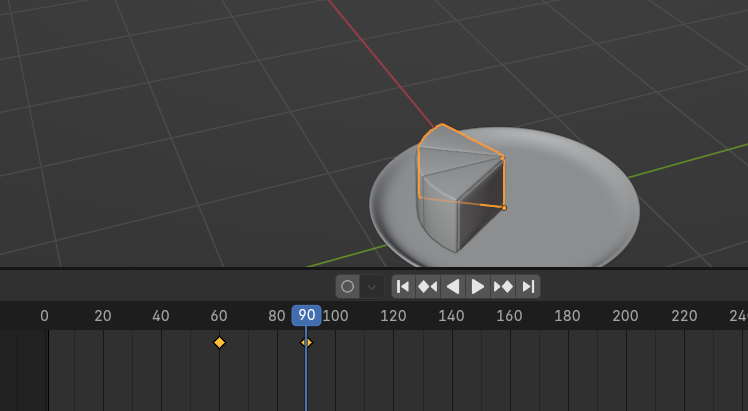

I think you now understand how to do it for the rest of the cake. 
Try to do it by yourself until the end, and I will continue to explain so you can check out the final result and correct it if you make any mistakes. 
The fourth piece of the cake is coming. Select it. Keyframe the location to the 90th frame. 
Move the scrubber to the frame where you want your fourth piece to be on the plate. I will select the 120th frame. 
Now snap the piece to the plate, and keyframe the location to the selected frame ​(120th frame in my case). 

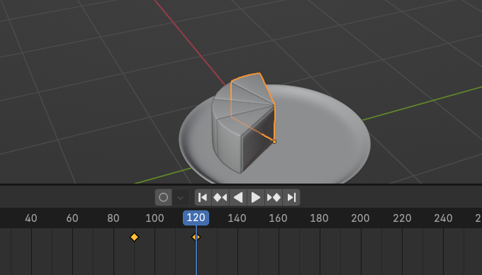

177 
If you want to move the timeline to see more numbers, just move it by clicking LMB where the arrow is pointing while moving the mouse.  

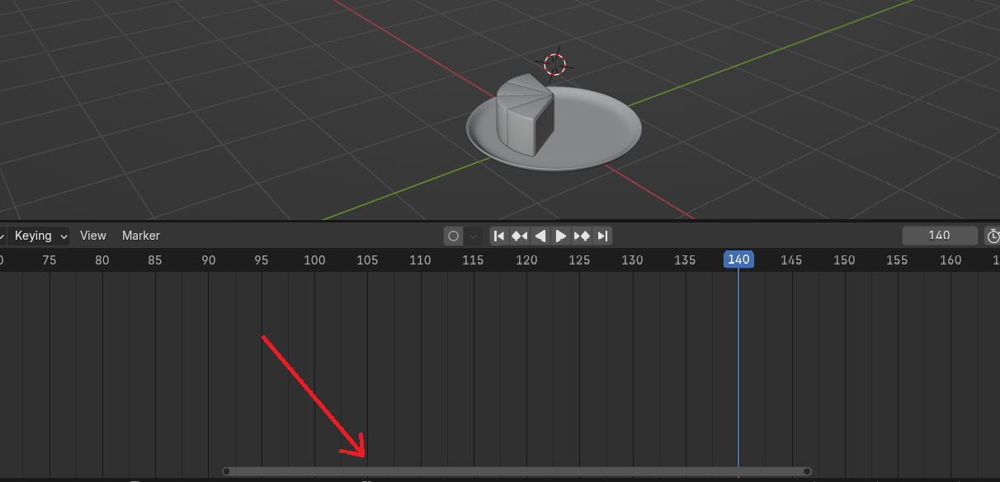

You can also zoom in and out by scrolling the mouse wheel up and down. 

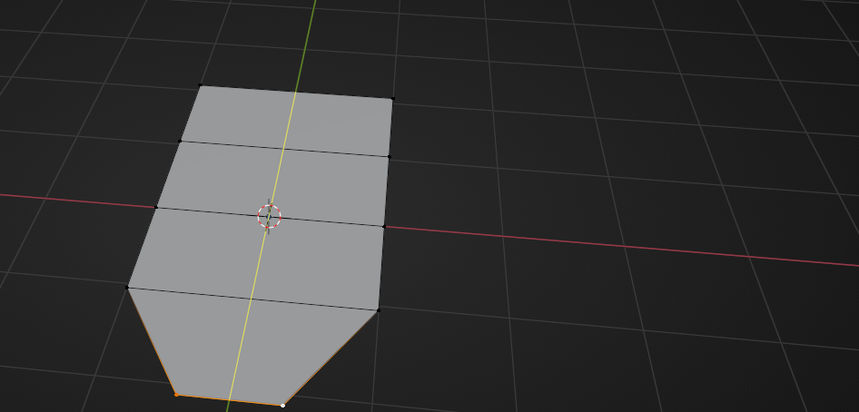

Time for the fifth piece.  
Select it. Keyframe the location to the 120th frame. 
Move the scrubber to the frame where you want your fifth piece to be on the plate. I will select the 150th frame. 
178 
Now snap the piece to the plate, and keyframe the location to the selected frame ​(150th frame in my case). 

Time for the sixth piece.  
Select it. Keyframe the location to the 150th frame. 
Move the scrubber to the frame where you want your sixth piece to be on the plate. I will select the 180th frame. 
Now snap the piece to the plate, and keyframe the location to the selected frame ​(180th frame in my case). 

179 
Time for the seventh piece.  
Select it. Keyframe the location to the 180th frame. 
Move the scrubber to the frame where you want your seventh piece to be on the plate. I will select the 210th frame. 
Now snap the piece to the plate, and keyframe the location to the selected frame ​(210th frame in my case). 

Time for the eighth piece.  
Select it. Keyframe the location to the 210th frame. 
Move the scrubber to the frame where you want your eighth piece to be on the plate. I will select the 240th frame. 
Now snap the piece to the plate, and keyframe the location to the selected frame ​(240th frame in my case). 

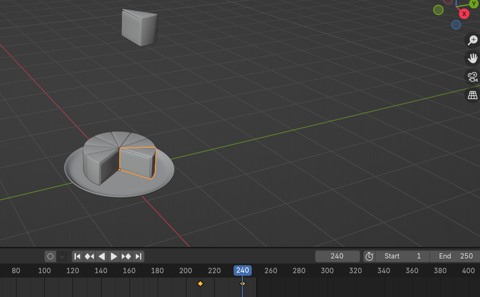

180 
Time for the ninth and last piece.  
Select it. Keyframe the location to the 240th frame. 
Move the scrubber to the frame where you want your ninth piece to be on the plate. I will select the 270th frame. Keyframe the location. 

Even if you can add a keyframe to that frame, if you start animation, your animation will go only until 250 frames.  
To add more frames, just change this number “END”  to some higher number. 

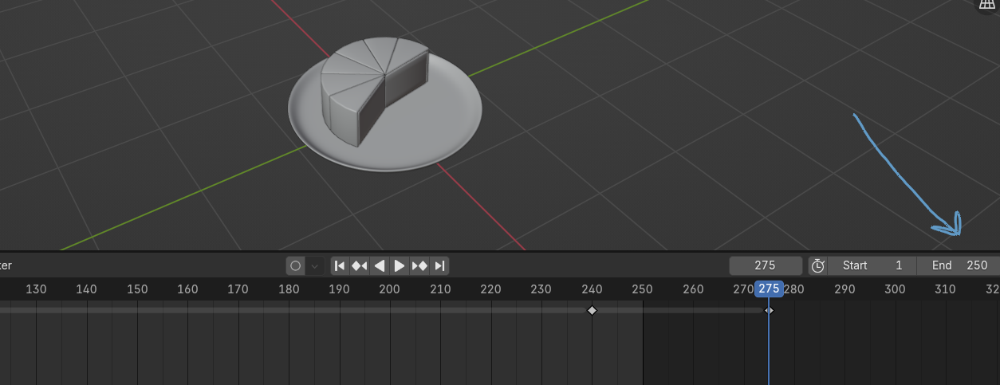

I will change it to 600. 
Now you have more frames. 

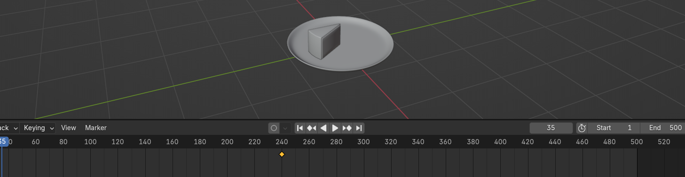

181 
If you start your animation again, you will have enough frames to play your entire animation. 

So, just after you finish your whole animation, like you did just now, change the end to the number of your last frame. In this case, to the 270. 

Your animation is finished! You can start it again to check if everything is good. 
If you are satisfied, you can render it.  
If you don’t know how to render animation yet, don’t worry. I will cover that in detail next time. 
—--------------------------------------------------- 
I hope you enjoyed the new chapter! I just wanted to say that I am so grateful for all likes, reposts, comments, downloads, ratings, and even donations! Also, I know that my YouTube subscribers also increased thanks to all of you, so I am grateful from the bottom of my heart! 
I never expected that much positive feedback and support from everyone! 
Also, I often see comments about “not giving me anything in return.” You are wrong, you already gave me more than enough. Your comments, likes, subscriptions, reposting, or even just the fact that I helped you or made you learn Blender again is more than enough for me. 
I wanted to write a longer chapter, but this week went so fast, so I didn’t have time for more stuff! I will try to make a longer chapter in the next update! 
Thank you once again for all the support and love! 
Happy Blending and see you next week 🙂 
182 