# Chapter 19: Rendering your first animation

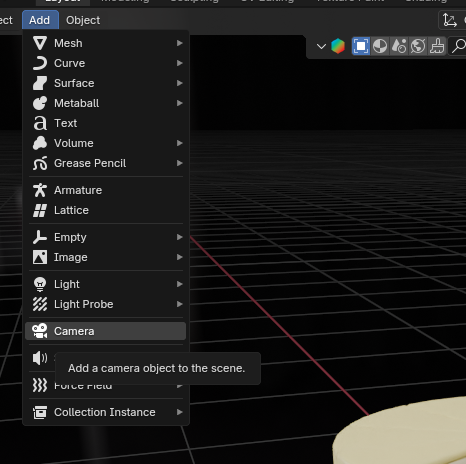

 
Chapter 19 - Rendering your first animation 
Add a camera. 
 
Click on the camera icon. 
Click “N” to open the sidebar, go to view, and turn on camera to view. 
Now you can adjust the view as you already learned. 
Before doing anything else, first adjust the render animation settings. 
Go to render properties. 
 
183 

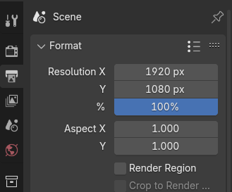

 
and change render samples to 512 or even 256. 
The important thing to remember is that fewer samples means less quality, but shorter 
rendering time. This is just an example, so that is why I am putting a low number of samples. 
 
You can change the render resolution to 1024x1024, 1920x1080, or whatever else fits your 
needs. This is entirely up to you and your wishes. 
 
I will leave it 1920x1080. 
Frame rate is the frequency (rate) at which consecutive images (frames) are captured or 
displayed. It is mostly expressed in frames per second or fps.

The more fps an animation has, the smoother it is, but that also comes at a cost of rendering 
times (because you have to render out more frames per length of animation) and also 
increased file size. 
Change frame rate from 24 fps to 30 fps. 
 
 
 
184 

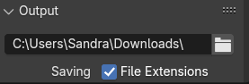

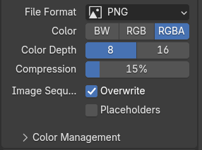

 
Start and End on the left are the same as Frame Start and End on the right, and they are 
both changing at the same time, so you don’t need to change anything there. 
 
Go to output - a place where your animation will be saved. 
Click on the folder on the right 
 
 
 
 
and when you choose where you want to save your animation, click accept. 
For example, I want it here. 
 
The next part is choosing a file format. 
 
185 

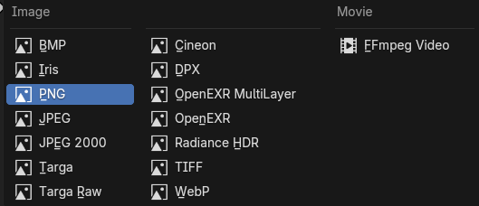

 
There are different options, but I will explain the two most common ones for now. 
 
You can either render your animation as an Image (JPEG, PNG, BMP…) or a Movie 
(FFmpeg video) 
So what is the difference? 
If you are rendering your animation as an Image, that means you will get a picture for each 
frame, and you will need to connect them together in Blender Image Sequencer (or any 
other video editor). 
What are some pros of rendering as an Image? 
● You can stop and continue your renders at any moment
 
● You can fix the animation more easily if something is wrong on a few 
frames by just rendering those frames again
 
● You have more control in general over your animation 
● increased video quality 
 
What are some cons of rendering as an Image? 
● Some work has to be done after the animation has been rendered (turning all 
the separate frames into a video using a sequencer)
 
● Depending on the file type, the folder size can grow very large 

If you are rendering your animation as a Movie ( “FFmpeg video”), that means you will get 
one video for the whole animation, and you won’t need to connect it together. 
 
 
186 

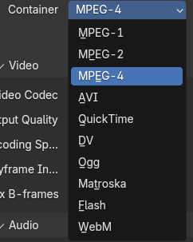

 
What are some pros of rendering as a Movie? 
● It is much quicker
 
● Not much work afterward if you aren’t doing any compositing in 
third-party software
 
 
What are some cons of rendering as a Movie? 
● You can’t stop and continue your renders at a whim
 
● If something goes wrong with the animation during the rendering process, you 
usually have to start all over again, and you can end up losing hours or 
potentially days of progress
 
● You have less control in general over your animation 
 
This time, I will render it as a Movie. 
When you choose that option, you will get new options such as Encoding. 
Open the container. 
 
and choose MPEG-4 (.mp4). 
Change the output quality to High Quality if you have a good computer and graphics card. 
Otherwise, choose medium quality or less.  
187 

 
This is just for practice, so you don’t need to render your animation in the highest quality. But 
in the future, if you have an important project, you will probably need to render it in higher 
quality, even if it will take a lot longer to render. 
You will probably use other options as well, but you will learn more about them in future 
lessons and through practice. 
 
Those were basic rendering settings. Now you can go back to preparing your render scene. 
Add a plane as a background so your cake isn’t just floating in the air(unless that is what you 
want). 
Shift+A -> Mesh -> Plane 
 
 
 
188 

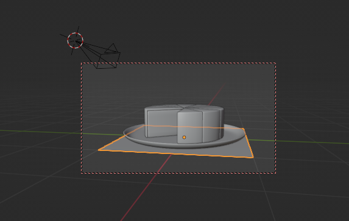

 
Turn on the camera to view  
 
and scale the plane according to the camera view. 
Something like this. 
 
Now you can switch to edit mode to extrude the plane and bevel it so it looks even better. 
Extrude that edge behind the cake along the Z-axis. 
 
189 

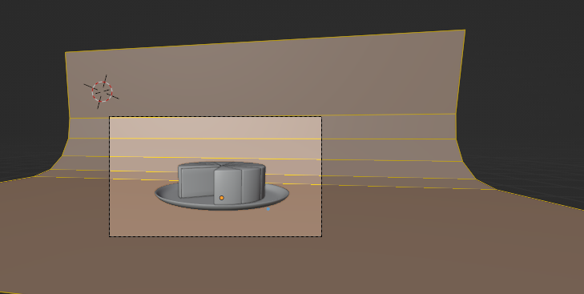

 
Select this middle loop 
 
and bevel it with “CTRL+B” while scrolling the mouse wheel to add more segments. 
 
If it’s necessary, select all with “A” and scale the plane more along the y-axis. 
 
190 

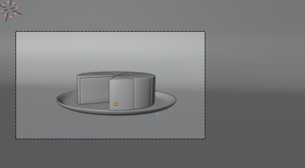

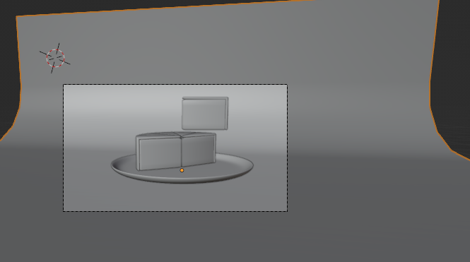

 
Switch to object mode, select the plane -> RMB -> shade smooth. 
 
Start your animation again and check if everything is ok with the camera angle. 
 
I want it to be like this, so I won’t change anything. 
You can switch now again to Rendered view and see if you can do anything to make your 
render better. 
 
191 

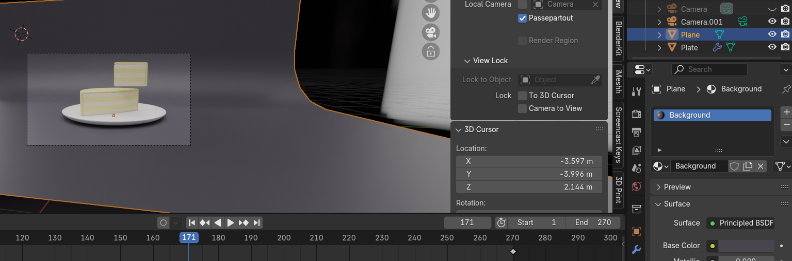

 
For example, I want my plane to be a different color, so I will change it. 
Select plane, go to material properties, click New. 
 
Rename the material to “Background” or anything you want. 
And choose the base color to any color you like. 
 
If you are satisfied, click Render - Render animation and just wait until it’s finished. 
Depending on your settings, it can take a while, but since it’s a simple little animation, it 
shouldn’t take that long. 
That is it! Now you know how to make a plate with a cake and animate it. 
 
 
192 
