# Chapter 21: Texturing a book

 
Chapter 21 - Texturing a book 
Place the cursor on the upper side of the screen as shown, and when you see plus, 
 
 just pull it down to the left while holding the left mouse click. 
 
Open the shader editor in the window you just created. 
 
212 

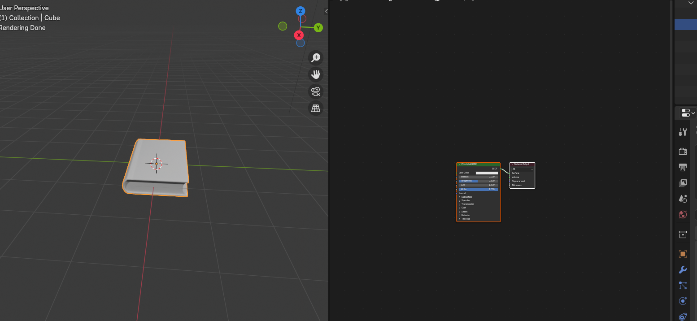

 
 
Click “N” to hide that sidebar on the right because you don’t need it. 
 
Select Book_covers material. 
 
213 

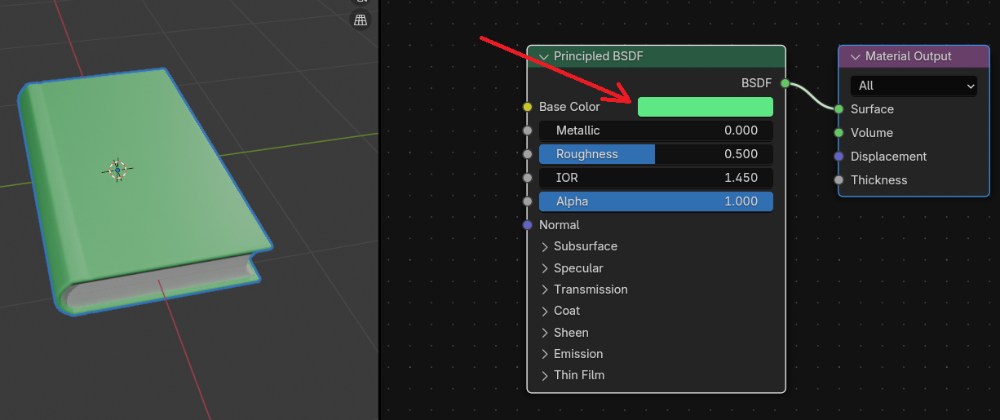

 
What you are currently seeing are two nodes: the Principled BSDF shader node and the 
Material Output node. 
Before anything else, let me first explain what are parts of nodes are. 
 
The title shows the name/type of the node. 
Sockets are input and output values for the node. They appear as little colored circles on 
either side of the node.  
Properties are settings that can affect the way they interact with inputs and outputs. 
I will now explain in detail the Principled BSDF shader - Physically- based, easy-to-use 
shader for rendering surface materials, based on the OpenPBR model. 
That is the official definition of it, but let’s try to understand it better with real examples. 
You can change the color of the material by changing the Base Color. 
 
 
214 

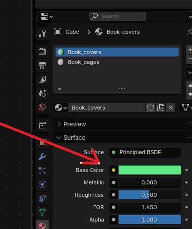

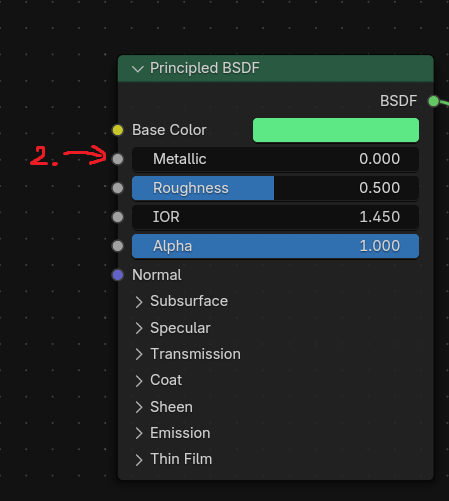

 
Or here, like you already did it previously. 
 
It is exactly the same thing, so when you change the base color in the shader, it will also be 
changed there. You can also change other options like Metallic, IOR, etc… 
The second option that you see in the Principled BSDF shader is Metallic. 
 
 
 
215 

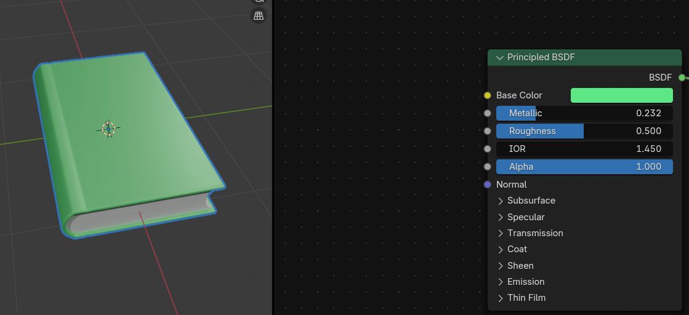

 
When metallic is on 0, that means that it is turned off. If you want something not to be 
metallic, you need to put it to zero. 
 
As you can see, this book isn’t metallic. 
But if you change metallic to the 1, it suddenly becomes metallic. 
 
Of course, you can also make variations between 0 and 1. So if you want your object to be 
slightly metallic, you will put it closer to 0,  
 
 
216 

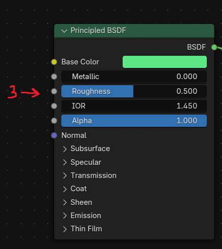

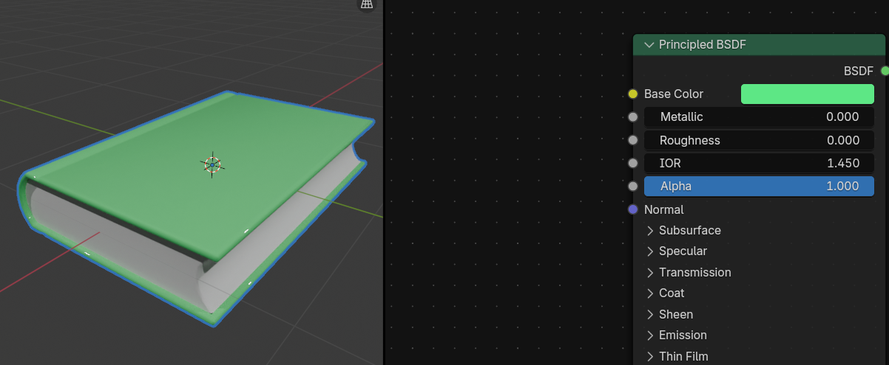

 
and if you want it to have a strong metallic color, you will put it closer to 1. 
 
The third option that you see in the Principled BSDF shader is Roughness. 
 
It is the same case as it was with a metallic. If roughness is 0, the object isn’t rough but it is a 
perfect mirror reflection. 
 
 
217 

 
If the roughness is 1, then the object is completely rough. 
 
The fourth option that you see in the Principled BSDF shader is IOR. 
IOR or index of refraction for specular reflection and transmission. 
For most materials, the IOR is between 1.0 (vacuum and air) and 4.0 (germanium). 
The default value of 1.5 is a good approximation for glass. 
 
The fifth option that you see in the Principled BSDF shader is Alpha. 
218 

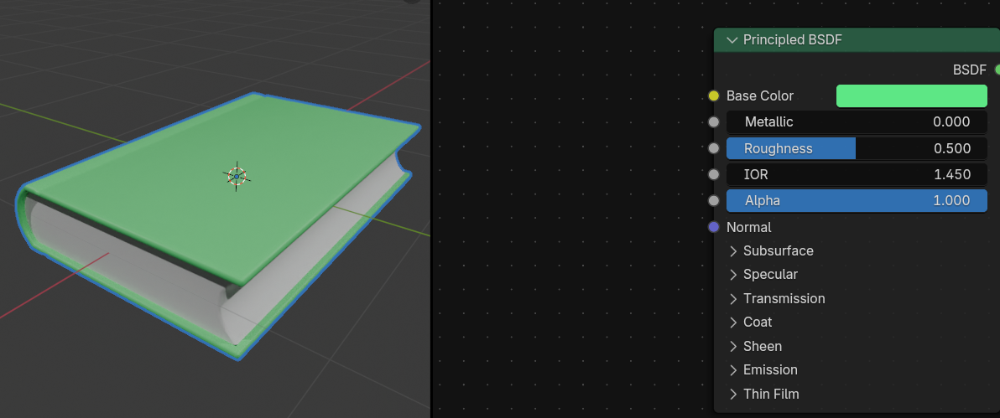

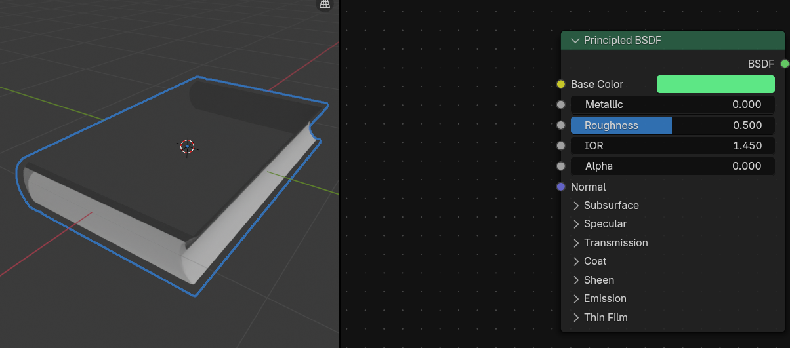

 
With Alpha, you control the transparency of the surface.  
 
If alpha is 1.0, then it is fully opaque. 
 
If alpha is 0.0, then it is fully transparent. 
 
 
 
219 

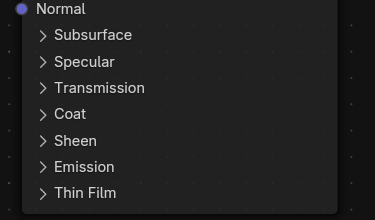

 
I wanted to explain just the basic stuff for the start, so I won’t explain any of those without a 
real example. 
 
The second thing that is important is the material Output node. 
The only thing that is currently important here is Surface.  
 
If you want to show your material, then you have to connect the Principled BSDF output 
socket -  BSDF to the Material input socket - Surface. 
 
220 

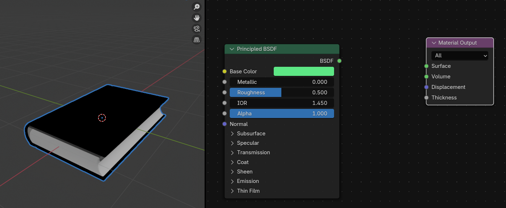

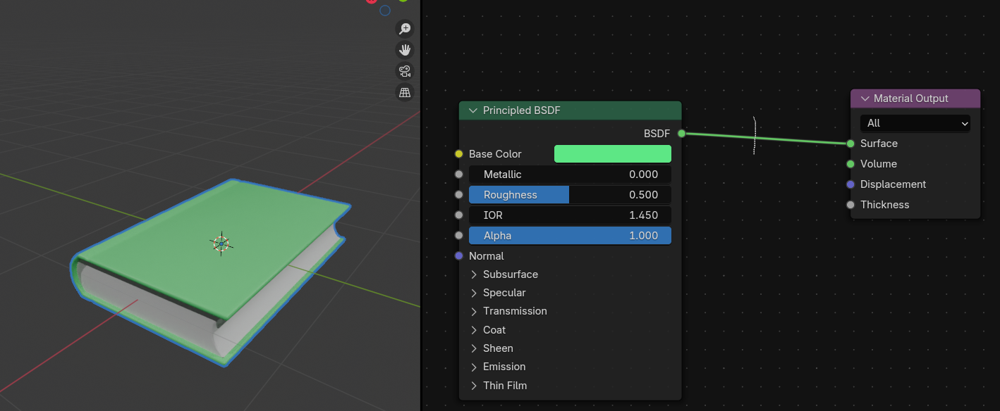

 
They are automatically connected when you create material, but if you accidentally delete it, 
this will happen. 
 
And how do you disconnect the sockets? 
Hold CTRL and RMB, and a knife will appear. Then just disconnect the sockets by cutting 
the line with a knife. 
 
and you will get this. 
 
221 

 
And what if you want to connect the sockets? 
Put your mouse pointer on the output socket that you want to connect and this line will 
appear. 
 
Now just drag it to the input socket that you want to connect with. 
 
 
 
 
 
 
 
222 

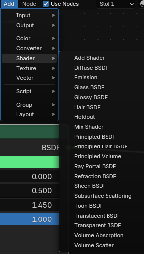

 
How to add a new node? 
If you click here on this Add 
 
You will see all nodes grouped (input, output, color converter…) 
So, for example, if you want to add one more Principled BSDF shader node, you click: ADD 
→ Shader → Principled BSDF. 
 
 
You can also add them by dragging from the socket with a mouse, and a new window 
appears where you can search for a node that you want to add. So just type the name, and 
confirm with LMB. 
223 

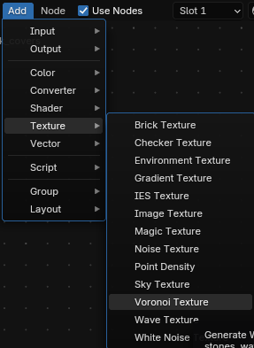

 
 
One more thing before you learn new nodes: to move around the node territory, just use the 
mouse wheel and hold it while moving the mouse, and if you want to zoom in or zoom out, 
scroll the mouse wheel up or down. 
Now you can finally continue with texturing a book. 
The first node that you will add after those two that you already had is a Voronoi texture. 
 
 
Voronoi texture generates Worley noise based on the distance to random points. 
224 

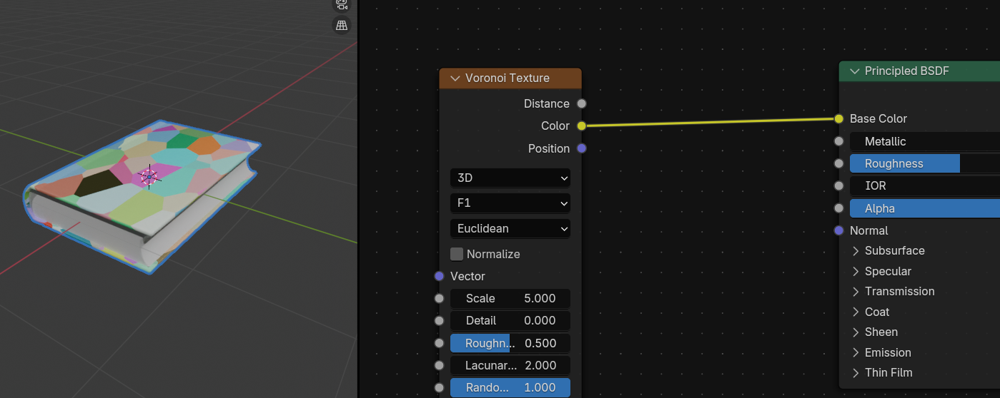

 
 
Connect Color from Voronoi texture with Base Color from Principled BSDF and you will 
get this. 
 
Click on Vector from Voronoi texture and connect with Vector from Mapping. 
Mapping node transforms the input vector by applying translation, rotation, and scale. 
 
225 

 
When you connect those two vectors, the Voronoi texture loses its function because you 
need to add one more node. 
 
Connect Vector from Mapping to Object from Texture Coordinate. 
The Texture Coordinate node retrieves multiple types of texture coordinates. Typically used 
as inputs for texture nodes. Because you don’t have a real image texture (PBR material) but 
a procedural material (made procedurally with nodes), you connect the vector with an object 
input socket. 
 
 
 
 
 
 
226 

 
Change Scale in Voronoi texture from 5  
 
to somewhere around 60. As you can see by changing the scale to a smaller number, you 
get more little details on your book cover. If you change it to a larger number, those details 
would be bigger. 
 
Connect Color from Voronoi texture with Height from Bump. 
Bump node generates a perturbed normal from a height texture for bump mapping. 
227 

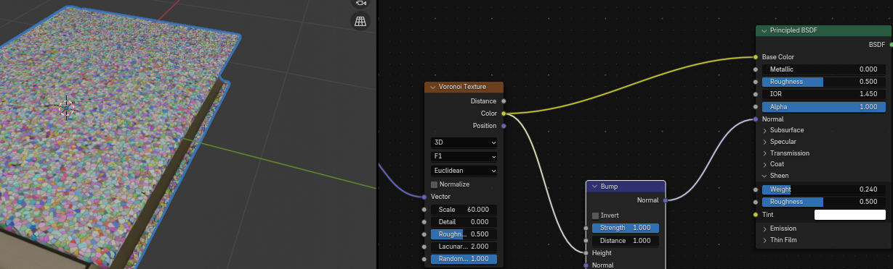

 
It is typically used for faking highly detailed surfaces, like for example book cover in this 
case. 
 
Connect Normal from Bump with Normal from Principled BSDF. 
 
228 

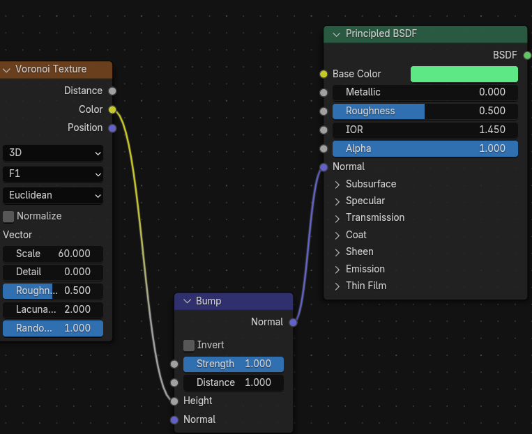

 
Click and hold “CTRL” and while holding RMB cut that yellow line that connects Color with 
Base color. 
 
Change feature output in Voronoi texture from F1 
 
229 

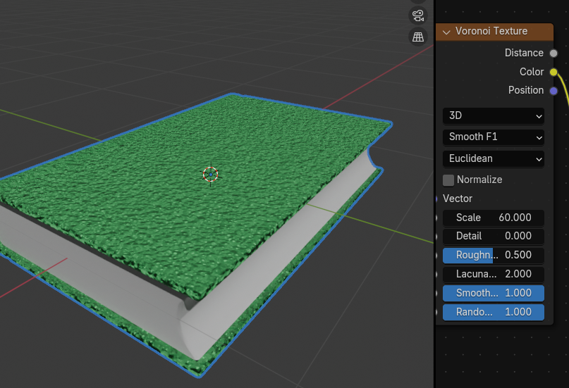

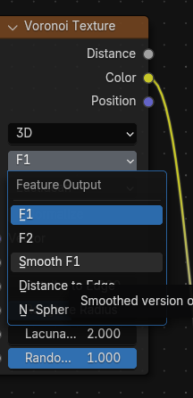

 
 to Smooth F1. 
 
F1 computes the distance to the closest point as well as its position and color. 
Smooth F1 is a smoothed version of F1. 
 
230 

 
Change the strength in Bump from 1 
 
 to somewhere around 0.370 to make the bump less noticeable. 
 
 
 
 
 
 
231 

 
and distance to somewhere around 0.180 to reduce the overall distance of the bump. 
 
Connect Base Color from Principled BSDF with Pointiness from Geometry to create 
some edge highlights on the book. 
 
Add Converter -Color Ramp and put it between Geometry and Principled BSDF. 
It will automatically connect what needs to be connected. 
 
232 

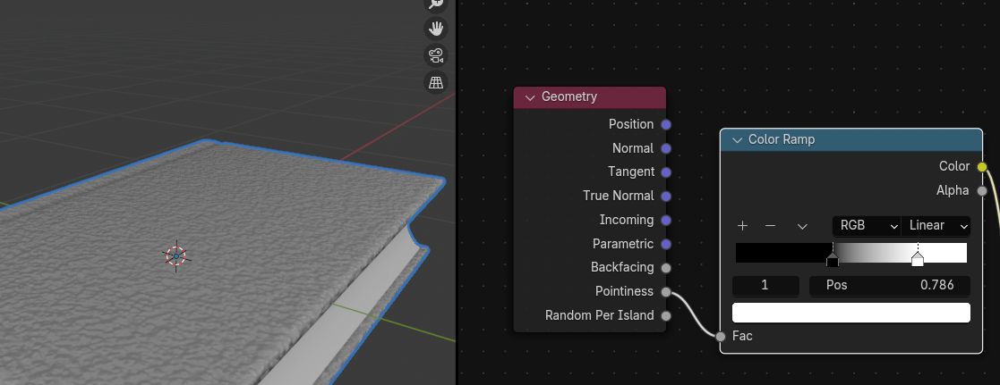

 
Click on the first color of the color ramp and move it to more to the right. 
 
Click on the second color of the color ramp and move it more to the left. 
 
Change strength in Bump to somewhere around 0.085. 
 
Click on the second color of the color ramp to set your edge color. 
233 

 
I chose a pale orange color.  
You can then change the first color of the color ramp to set the overall color of the book. For 
this, I chose darker brown. 
 
You can play around with those colors and make your book look like whatever you want. 
Add texture - noise texture. 
Noise texture generates fractal Perlin noise. 
234 

 
Perlin noise is a type of gradient noise developed by Ken Perlin in 1983. 
 It has many uses, including but not limited to: procedurally generating terrain, applying 
pseudo-random changes to a variable, and assisting in the creation of image textures. 
 It is most commonly implemented in two, three, or four dimensions, but can be defined for 
any number of dimensions.  (source: Wikipedia) 
 
Connect Fac from Noise texture with Roughness from Principled BSDF. 
 
Change detail of the noise from 2 
 
235 

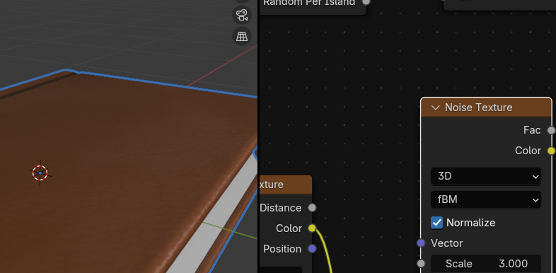

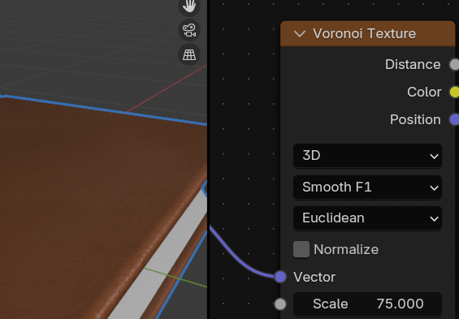

 
 to 15 or similar  
 
and scale to 3. 
 
Change Scale in Voronoi texture from 65 to something similar to 75. 
 
 
236 

 
Change strength in Bump to somewhere around 0.050. 
 
Click on Sheen in Principled BSDF and change weight from 0 
 
to somewhere around 0.240. This will give the book a nice dusty look.  
 
 
 
 
237 

 
You can use sheen for all kinds of stuff, like adding dust, such as in this case, or giving a 
material, such as fabric or peach skin, an illusion of having a bunch of tiny hairs. 
 
Select the second material BookPages. 
 
Add texture - Wave texture. 
Wave texture generates procedural bands or rings with noise. 
 
238 

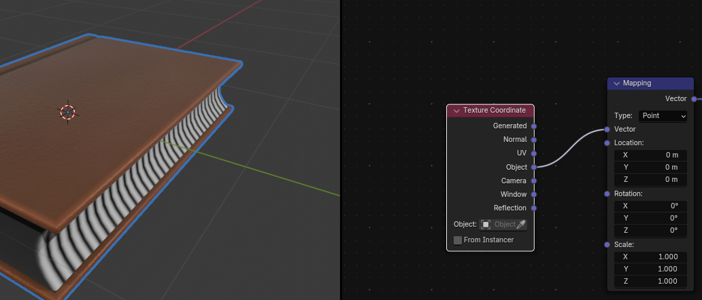

 
Connect Color from Wave texture with Base Color from Principled BSDF. 
 
Click on Vector from Wave texture and connect with Vector from Mapping. 
 
Connect Vector from Mapping to Object from Texture Coordinate. 
 
 
239 

 
Change Rotation of Y in Mapping to 90 degrees so your pages are correctly rotated. 
 
Change scale in Wave texture from 5 
 
 
 to somewhere around 70 so your pages look better. 
 
 
 
 
240 

 
Connect Fac from Wave texture with Height from Bump. Nothing has changed with how 
the book looks because you still didn’t connect the output socket Normal from node Bump. 
 
Connect Normal from Bump with Normal from Principled BSDF. You can already see a 
difference, but as you can see the color has become a bit darker. To change that you need to 
do the next step. 
 
Click and hold “CTRL” and while holding RMB cut that yellow line that connects Color from 
Wave texture  with Base color from Principled BSDF. 
 
 
 
241 

 
Add Converter -Color Ramp and put it between Wave texture and Bump. 
 
Click on the first color of the color ramp and change it to gray. 
 
Add input-ambient occlusion. Ambient occlusion computes how much the hemisphere 
above the shading point is occluded. Be careful if you have a slower computer, and think 
about if you should add it because your render time might slow down significantly.  
 
 
 
Connect Color from Ambient occlusion with Fac from new Color ramp node. 
242 

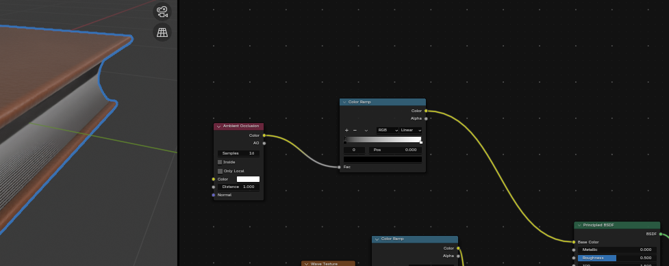

 
 It still doesn’t work because output sockets from the color ramp aren’t connected to 
anything. 
 
Connect Color from Color ramp with Base Color from Principled BSDF. 
 
Click on the first color of the color ramp and move it to more to the right. 
 
Click + on the Color ramp 
 
243 

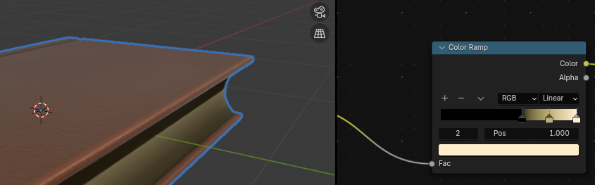

 
 to add one more color. After you clicked the plus sign, the middle pointer appeared for a 
new color. 
 
Choose something light yellowish. 
 
Click on the third color picker of the color ramp and change to something light yellowish as 
well. 
 
Click on the camera icon. 
 
 
 
244 

 
Go to view, and turn on the camera to view. 
 
Now you can adjust the view far or near by scrolling up or down the mouse wheel, and 
rotating the view while pressing the mouse wheel and moving the mouse left or right. 
If you want to move the whole camera, hold “SHIFT” and press the mouse wheel while 
moving the mouse up or down. 
 
When you are satisfied with it, turn off the camera to view, click Render, and render the 
image. 
 
That's it! Now you know how to model and texture a book in Blender. 
245 

 
 
 
I hope you enjoyed the new chapter! I tried to explain it the best I could, but feel free to ask if 
you don’t understand something. 
 
Thank you once again for all the love and support for this guide and my YouTube channel. 
We passed 900 subscribers, so we are closer and closer to our main goal of 1000! 
You can follow this whole chapter on YouTube as well! 
https://www.youtube.com/watch?v=onF5s2bXhZ0&t=2s 
 
Happy Blending! Byee, see you next time 😀 
 
 
 
 
 
 
 
 
 
 
 
 
 
 
 
 
 
 
 
 
 
 
246 

 
Chapter 21 - Modeling a hay bale 
I decided to teach you how to model a hay bale because it is a good way to introduce you to 
something new in Blender called particles. 
So let’s begin with the modeling. (You can check out a video tutorial on my YouTube 
channel: https://youtu.be/fw8SMNxWnm8?si=GCreoaZfE1eH-ZhR) 
Just as you did while modeling a book, you won’t delete the cube, but you will use it from the 
start because the most similar shape to the hay bale is a cube. 
Until now, you haven’t done any modeling by dimensions, so this time I will teach you how to 
do that. Those are the dimensions that I decided are the best for my 3D model of a hay bale, 
but feel free to change the dimensions as you like. 
Open the right sidebar with “N”, and choose “Item”. 
 
Current dimensions of this cube are 2x2x2. 
Change cube dimensions to x = 1 m, y = 1.5 m,  z = 0.6 m (or anything else you think is 
best). 
 
 
 
 
247 

 
As you have already learned, the scale must be 1, so click “CTRL+A” and apply scale. 
 
Before you start doing anything else, first rename your object to the name you like. I will 
rename it to Hay_bale. 
 
Go to modifier properties and Add Modifier - Generate - Bevel. 
 
 
 
 
248 

 
Change segments to 3 (or any other number you think is the best). 
 
Click the right mouse button and choose shade smooth. 
 
Switch to edit mode with “TAB.” 
Click “CTRL+R” to add a loop.  
Scroll the mouse wheel up to add one more loop. Click LMB to confirm the number and then 
ESC or RMB to center them. 
 
249 

 
Scale them along the X-axis to the inside with “S+X.” 
 
Rotate the view to the other side and add two more loops. Click LMB to confirm the number 
and then ESC or RMB to center them. 
 
Scale them along the Y-axis to the inside with “S+Y.” 
 
250 

 
Now add two more loops inside.Click LMB to confirm the number and then ESC or RMB to 
center them. 
 
Scale them along the Y-axis to the inside with “S+Y.” 
 
Rotate the view to the other side and add two more loops. Click LMB to confirm the number 
and then ESC or RMB to center them. 
 
 
 
251 

 
This time, when scaling, scale along the x-axis with “S+X.” 
 
Switch from selecting edges to selecting faces with “3.” 
Choose the whole loop with “ALT+ LMB.” 
 
While holding the mouse wheel rotate the view. Hold “SHIFT” and  choose the other loop 
with “ALT+LMB.” 
 
252 

 
Scale them down with “S”. 
 
Duplicate them with “SHIFT+D” and press the RMB to return them to the previous position. 
 
Click “P” selection to make a new separated object out of it. 
 
253 

 
 
Switch to object mode with “TAB.” 
Select the new object and scale it up a bit with “S”. 
 
Change the render engine to Cycles and the device to GPU if your graphics card is better 
than the processor. 
Also, turn on denoise in the viewport. 
 
254 

 
Switch to rendered mode. 
 
Select the Bale, go to the modifiers - bevel. Click on this dropdown menu and select Apply. 
When you do that, your bevel modifier is applied to your object, and you can’t modify it 
anymore. 
 
PARTICLES 
Particles are lots of items emitted from mesh objects, typically in the thousands. Each 
particle can be a point of light or a mesh, and can be joined or dynamic. They may react to 
many different influences and forces, and have the notion of a lifespan. Dynamic particles 
can represent fire, smoke, mist, and other things, such as dust or magic spells. 
Hair-type particles are a subset of regular particles. Hair systems form curves that can 
represent hair, fur, grass, and bristles.  
(source: https://docs.blender.org/manual/en/latest/physics/particles/introduction.html) 
255 

 
I copied this definition from the official Blender manual because it is the best explanation. 
Now I will show you a real example of what particles are. 
Go to Particle Properties 
 
and click on + to add a new ParticleSystem. 
 
Here you will see two options: Emitter and Hair. 
 
256 

 
If you choose an emitter, particles are emitted from the object. 
If you choose the hair, particles are rendered as strands. 
Because I want the second option, I will choose Hair. 
 
As you can see, the hair length is too long, so I will change the Hair Length from 4m  to 
0.03m. (You decide which length works best for you). 
 
I want to have more strands so I will change the number from 1000 to 5000. 
 
 
 
 
 
 
257 

 
Now scroll down a bit, and go to hair shape. 
 
Change Tip from 0 to 1m (With this option you are changing the strand diameter width at the 
tip.) 
 
 
 
 
 
 
258 

 
And uncheck - close tip because you want your radius tip to be zero. 
 
Go to Children. 
Children are Hair or Emitter particles originating from individual particles. They make it 
possible to work primarily with a relatively low amount of Parent particles, for whom the 
physics are calculated. The children are then aligned to their parents. The number and 
visualization of the children can be changed without a recalculation of the physics. 
If you activate children, the parents are no longer rendered. (source: 
https://docs.blender.org/manual/en/latest/physics/particles/emitter/children.html) 
 
There are three types of children in Blender: None, Simple and Interpolated. 
If you select none, there are no children generated. 
If you select, simple, children are emitted from the parent position. 
If you select interpolation, children are emitted between the Parent particles on the faces of a 
mesh. 
To show you a real example, this is Hay Bale when you choose none children 
259 

 
 
 This is Hay Bale when you choose Simple children 
 
 This is Hay Bale when you choose Interpolated children 
 
In this case, the best is interpolated, so switch from none to interpolated. 
 
 
 
 
 
 
260 

 
Go to Roughness 
 
and change Roughness Endpoint to around 0.125. 
 
Change the render amount from 100 to 10 because otherwise, your computer will have a 
hard time rendering. 
 
 
261 
