# Chapter 22: Texturing a hay bale

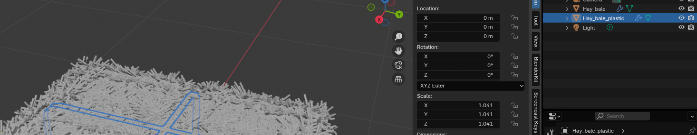

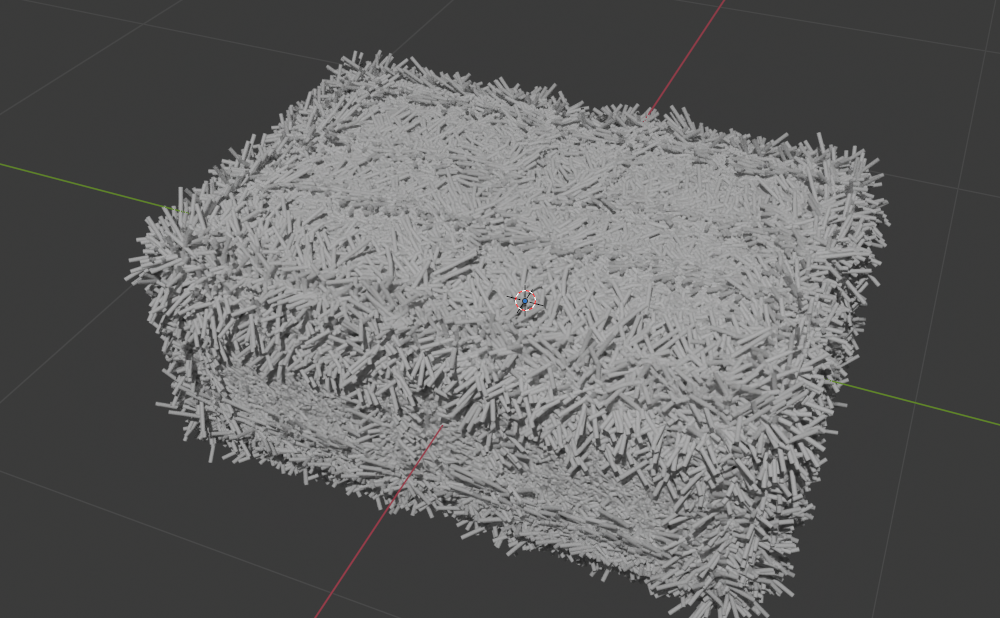

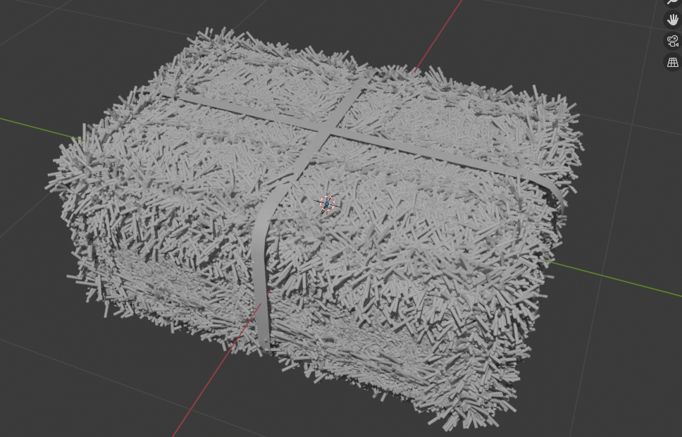

 
Chapter 22 - Texturing a hay bale 
It’s time to texture a hay bale. 
Firstly, if you haven't, rename the second object to Hay_bale_plastic (or something similar). 
 
If you can’t see the plastic, like in my case 
 
 scale it a bit with an “S”. 
 
 
 
 
262 

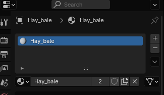

 
Choose Hale_bale and go to Material Properties. 
 
Rename material to Hay_bale. 
 
 
 
 
 
 
263 

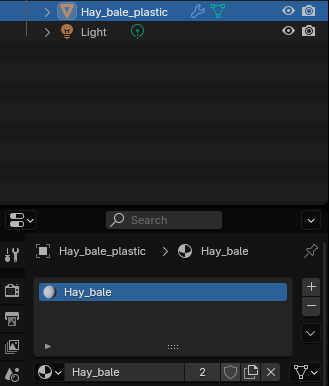

 
Select the Hay_bale_plastic and go to Material Properties. 
 
Because you duplicated and separated the object in the beginning, they are sharing the 
same material. This “2” is displaying the number of users of this data or to say it more simply, 
it is showing the number of objects that have the same materials. 
You don’t want to have the same material on Hay_bale object and Hay_bale_plastic so you 
need to separate them. 
There are two ways to do that. 
The first way to do it is to click on the number “2”. This way, you made a new, separate 
material. Now you just need to rename it to something else, 
 
and that is all. 
264 

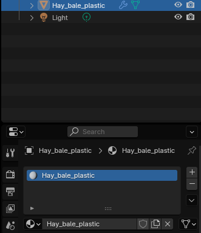

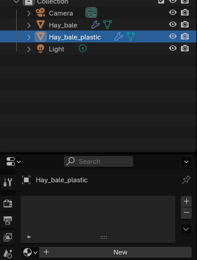

 
 
The second way is just to click minus, delete the material on Hay_bale_plastic 
 
 
 
 
 
 
 
265 

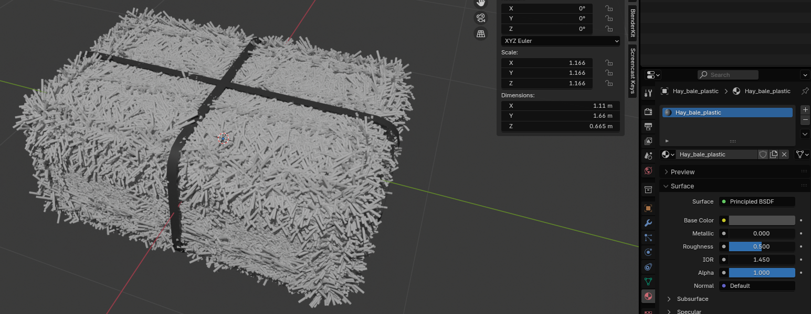

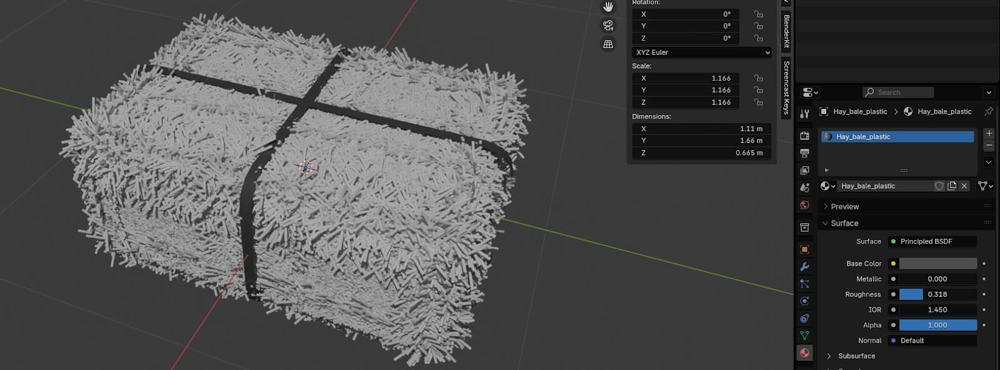

 
Click “+” and add a new material, and rename it to Hay_bale_plastic. You can see that 
number two disappeared because this material is only on one object. 
 
Both are the correct ways, so it is up to you to decide which one you want to use. 
Change Base Color of material Hay_bale_plastic to black (or any other color you want). 
 
Change Roughness to around 0.3
 
Select the Hay_bale. 
 
266 

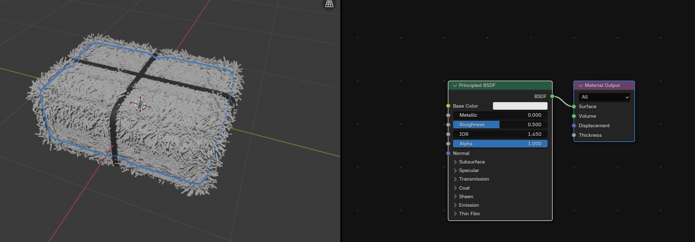

 
Place the cursor on the upper side of the screen as shown, and when you see plus, 
 
 Just pull it down to the left while holding the left mouse click. 
 
Open the shader editor in the window you just created. 
Click “N” to hide that sidebar on the right because you don’t need it. 
 
Connect Base Color from Principled BSDF with Color from Color Ramp.  
 
 
 
 
267 

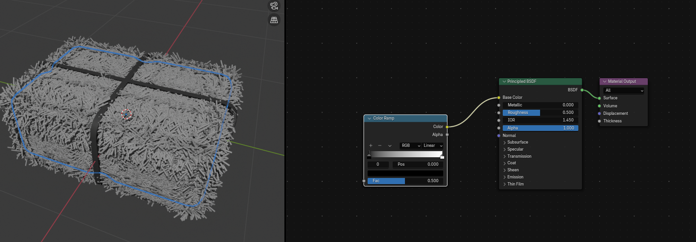

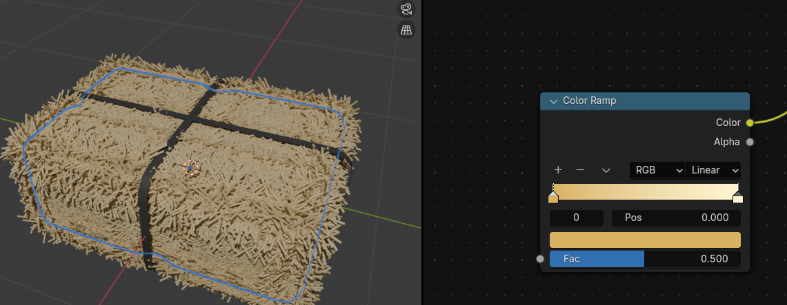

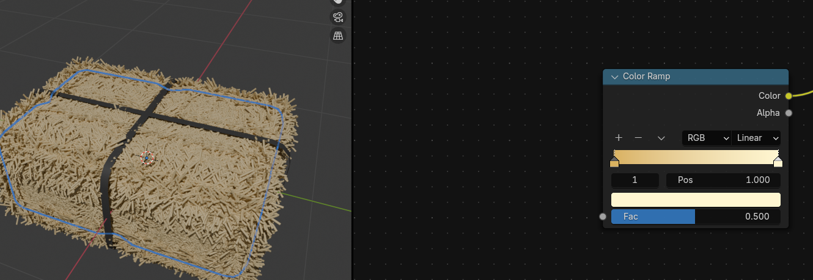

 
I added a color ramp because I want to have some variations of more than one color, and 
doing that is best with a color ramp. 
 
Change the first color in Color Ramp to some combination of light brown and yellow. 
 
Change the second color in Color Ramp to some light yellow. 
 
 
 
 
 
268 

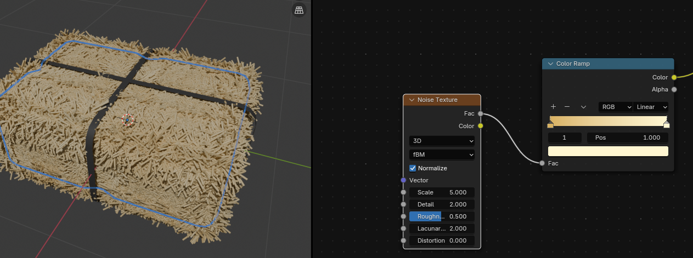

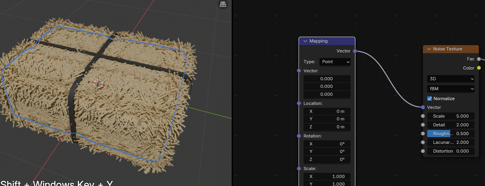

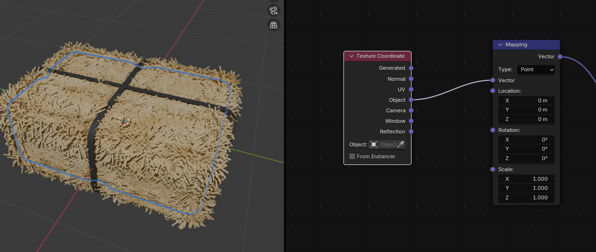

 
Connect FAC from Color Ramp with FAC from Noise Texture. 
 
Connect VECTOR from Noise Texture with VECTOR from Mapping. 
 
Connect VECTOR from Mapping with OBJECT from Texture Coordinate. 
 
 
 
 
269 

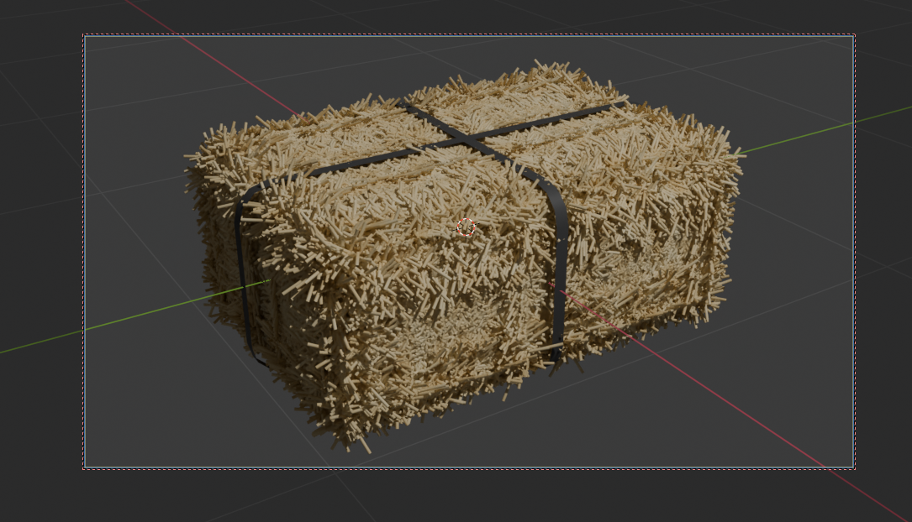

 
Change Scale of Noise Texture to around 13.300. 
 
If you are satisfied with the color and look of your Hay Bale, select the camera, and adjust it. 
 
When you are satisfied, turn off the camera to view so you can move freely and not lose your 
perfect rendering angle. 
Place the cursor near the editing boundary, and right-click when you see the double-sided 
arrow. 
 
 
 
270 

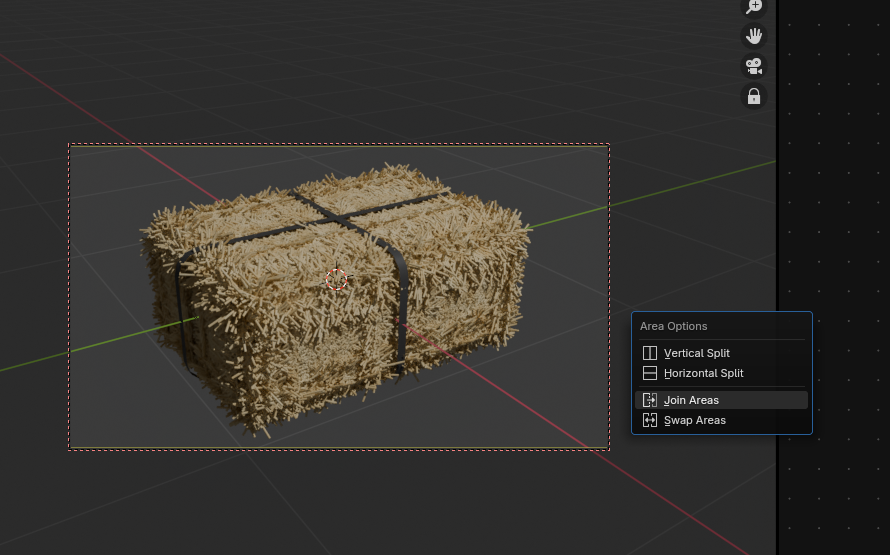

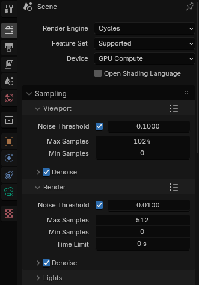

 
This time, select join areas and press the left mouse button to confirm joining. 
 
Change samples in render to 512 because there is no need for 4096 samples in this case. 
 
 
 
 
 
271 

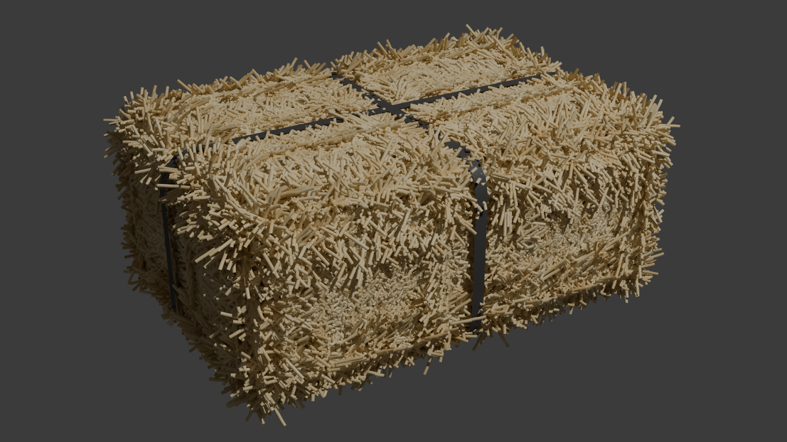

 
And now you can render it. 
 
Congratulations! You’ve learned how to model and texture a hay bale in Blender! 
I hope you enjoyed the new chapters! 
I didn’t have time to write new chapters last week, so I made up for it by writing two chapters 
this week. I also have an exciting announcement! 
I’ve created a Discord channel for all Blender users, where I’ll be very active and share more 
about upcoming projects, tutorials, guide chapters, and much more. 
In the channel, you’ll be able to share your current projects, promote your tutorials and social 
media, suggest improvements for the guide, and more! 
I hope to see you there soon!  
I’m excited to connect with you, see your Blender progress, help with any questions you 
might have, and even learn new things from you. 
Happy Blending!  
Byee, see you next time! 
https://discord.gg/DrVsr8khtp 
 
 
 
 
 
 
272 
