# Chapter 23: Modeling and texturing of a pumpkin

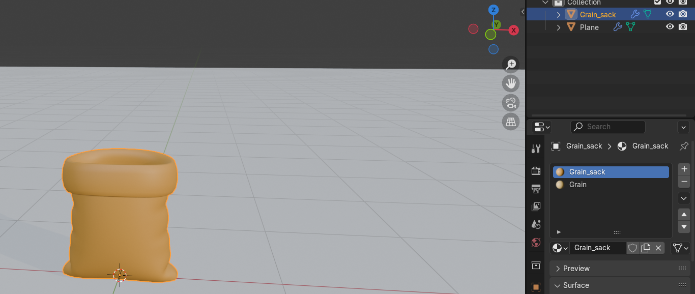

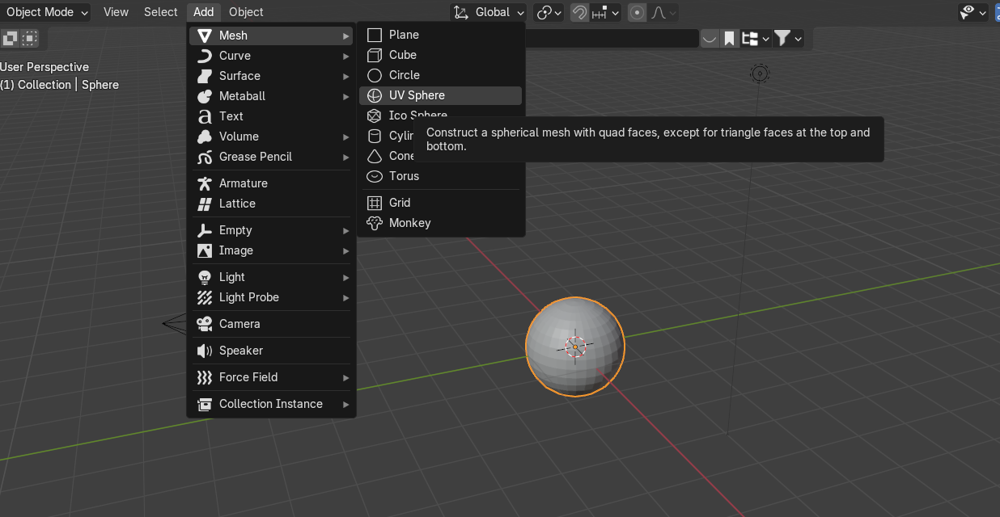

 
Chapter 23 - Modeling and texturing of a 
pumpkin 
Since Halloween is approaching, I decided to teach you how to model and texture a pumpkin 
in Blender.  
Let's start with the modeling. (You can check out the video tutorial on my YouTube channel: 
https://youtu.be/s9HeDfgO6nU?si=C4KRc9KMnQ9IS5P) 
This time, you will delete the cube because this basic shape isn't ideal for modeling a 
pumpkin.  
Delete the cube by pressing 'X'. 
 
Add a mesh - UV Sphere. 
 
 
 
273 

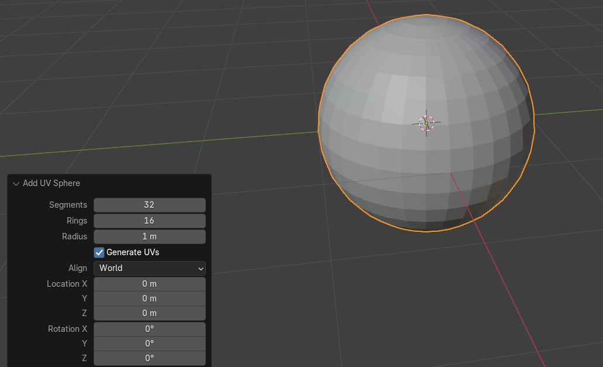

 
A new panel appeared in the bottom-left corner. This is how the sphere looks with 32 
segments. Since you don’t need that much topology for a simple pumpkin model, you can 
reduce the number of segments. 
 
I changed it from 32 to 21. 
 
 
Switch to edit mode with “TAB”. 
 
 
 
274 

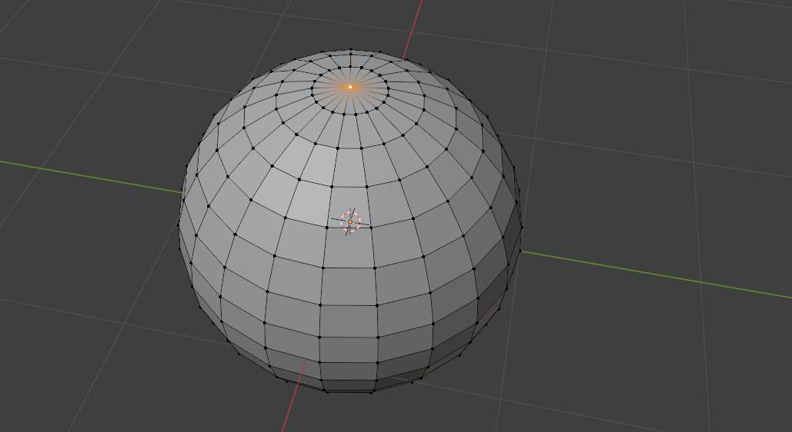

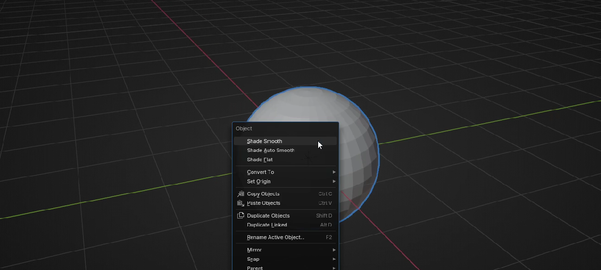

 
Select this top vertex 
 
Move to the bottom of the pumpkin 
 
And while holding “CTRL”, click the LMB on the bottom vertex to select the whole loop. 
 
275 

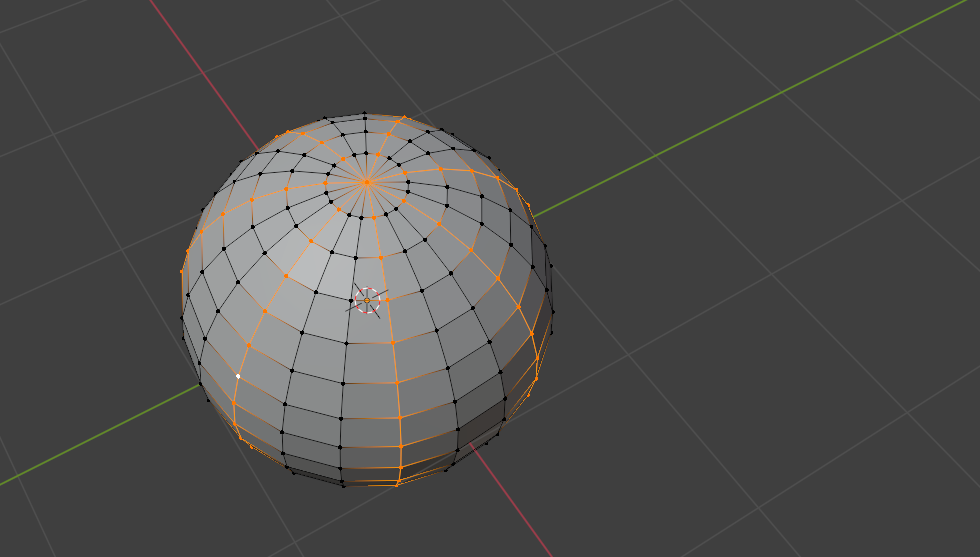

 
Select every third loop. You can select additional loops by holding 'SHIFT' and clicking 
'CTRL' on the desired loop. 
 
When you selected all the loops 
 
Turn on the proportional editing with “O” 
 
276 

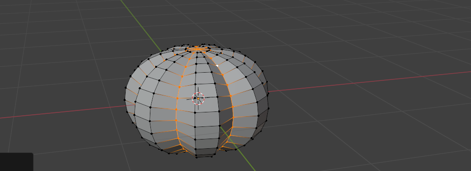

 
make the area of the influence smaller by scrolling the mouse wheel 
 
and scale it with “S”. 
 
Then scale it using 'S+Z' to make it look more like a pumpkin. 
 
 
 
277 

 
Select only the top vertex 
 
make the area of influence a bit bigger 
 
and move it down a bit with “G+Z”. 
 
 
 
 
 
278 

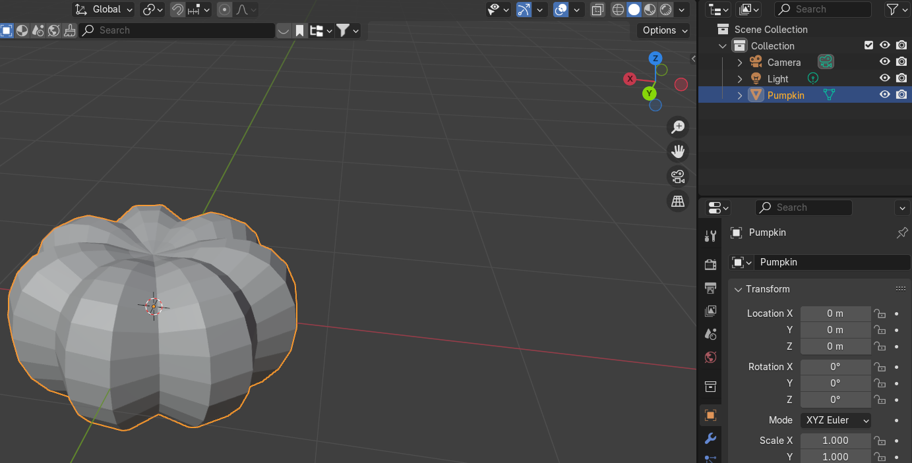

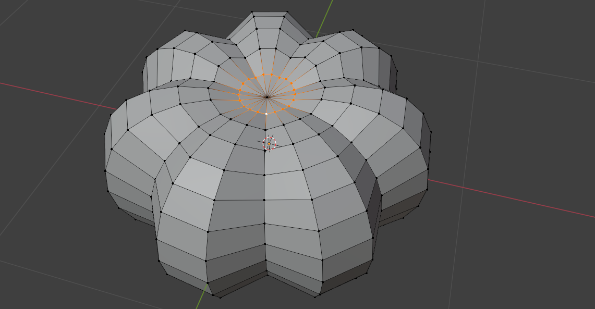

 
Select only the bottom vertex, and do the same. 
 
 
Switch to object mode with “TAB” and rename the sphere to pumpkin. 
 
Switch to Edit Mode by pressing 'TAB' and select the loop by holding 'ALT' and clicking with 
the LMB. 
 
 
279 

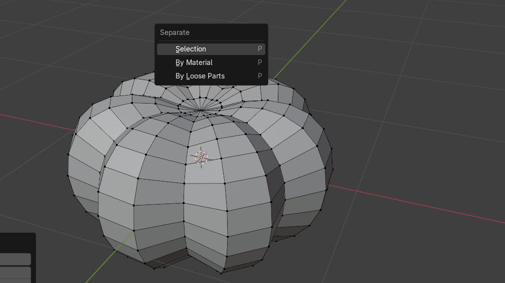

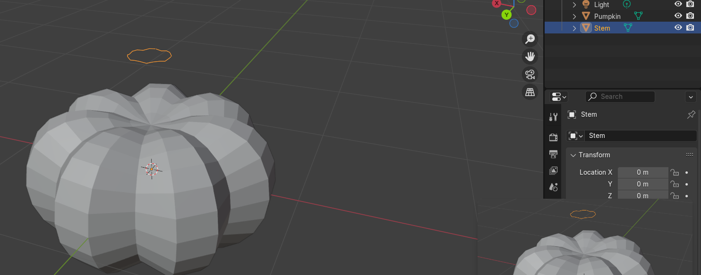

 
Duplicate it with “SHIFT+D” and move it up with “Z”. 
 
Press “P” and choose separate collection. 
 
Switch to object mode, select that separated part and rename it to “Stem.” 
 
Switch back to Edit Mode. Select the stem, then go to Select → Checker Deselect to choose 
every second vertex.  
280 

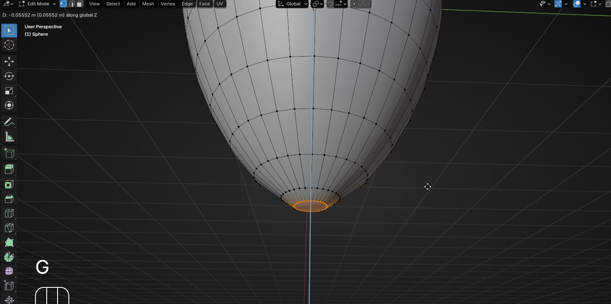

 
Since you have an odd number of vertices, they won’t be evenly selected, but this won’t 
affect the stem. In fact, the slight imperfections will make it look more realistic. 
 
Scale it with “S”. 
 
 
 
281 

 
Switch to the back orthographic view with “CTRL+1” on Numpad or click on the Y on the 
Gizmo. 
 
Select all with “A”. 
 
Extrude with “E” 
 
282 

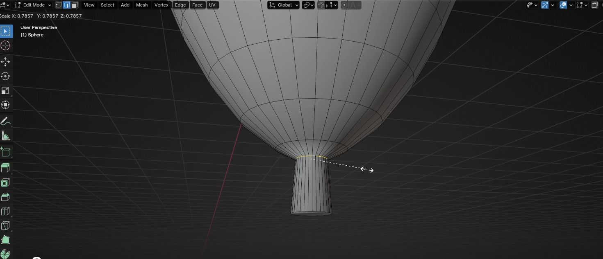

 
Extrude it with “E” one more time. 
 
Rotate with “R”  
 
and scale with “S.” 
 
283 

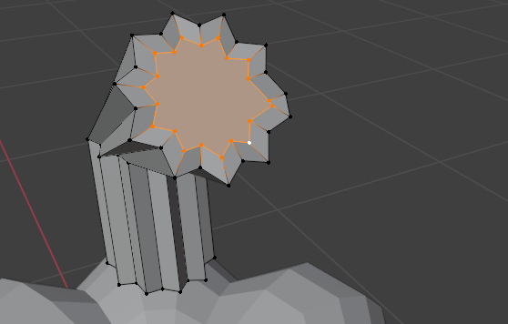

 
Turn off proportional editing with “O” and fill with an “F.” 
 
Inset a new face with an “I”. 
 
And extrude inside with “E.” 
 
284 

 
Switch to object mode with “TAB” and select the Pumpkin. 
Go to modifier properties. Add modifier → Generate → Subdivision subsurface. 
 
Change Levels Viewport to 2. 
 
Click the RMB  and choose shade smooth. 
 
 
 
 
285 

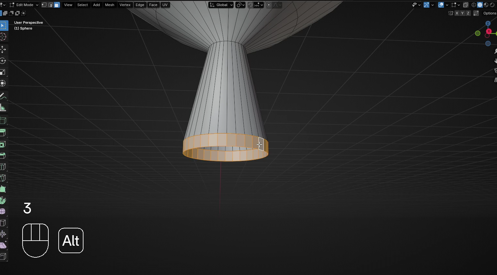

 
Select the Stem. Go to modifier properties. Add modifier → Generate → Subdivision 
subsurface. 
 
Change Levels Viewport to 2. 
 
As you can see, something seems off with the stem. Do you remember what I told you about 
face orientation? Let's go over it again, just in case. 
Click on overlays and turn on Face orientation. 
 
286 

 
Face orientation shows the direction in which the normals are facing. 
The blue color indicates that the face is facing outward, while the red color indicates it's 
facing inward.  
Ideally, most of the mesh should appear blue rather than red, so you need to flip the red 
faces to ensure all surfaces are facing the correct direction. 
Switch to Edit Mode by pressing 'TAB' and select all by pressing 'A'. 
Go to Mesh - Normals - Recalculate Outside. 
 
Switch to object mode with “TAB.” 
Click on overlays and turn off Face orientation. 
 
Switch to edit mode with “TAB.” 
 
287 

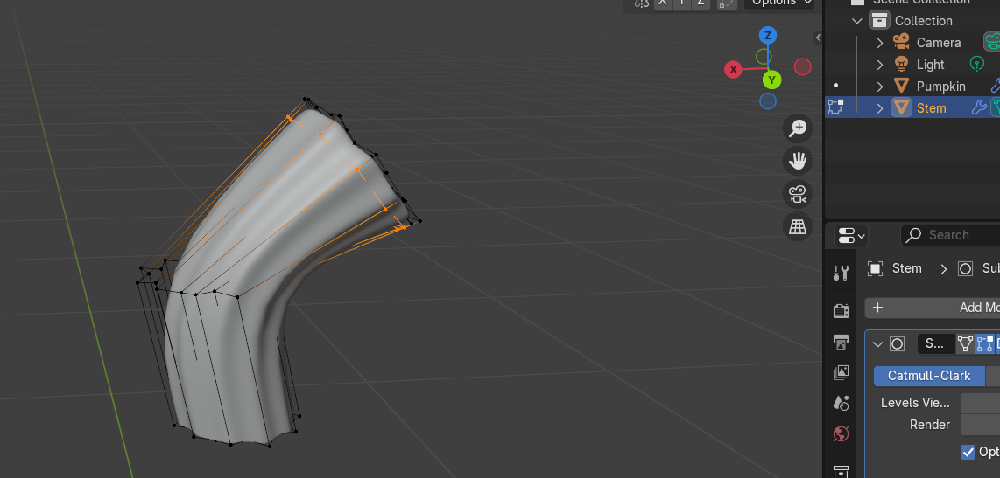

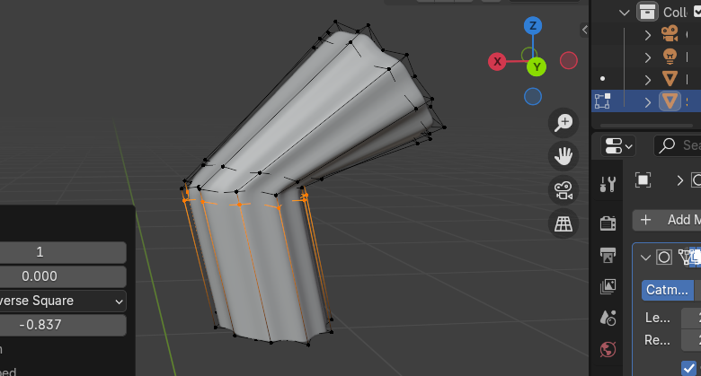

 
Add a loop with “CTRL+R” and move it up. 
 
Add one more loop and move it down. 
 
Add loop once again and move it up as shown. 
 
 
 
288 

 
Choose the bottom loop while holding “ALT”+ LMB and scale it with “S” to the inside. 
 
Switch to object mode with “TAB.” 
Move the Stem down along Z-axis with “G+Z.” 
 
 
Click on the camera icon. Click “N” to open the right sidebar. 
 
289 

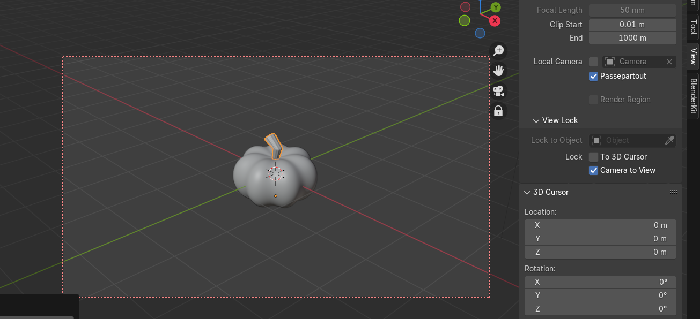

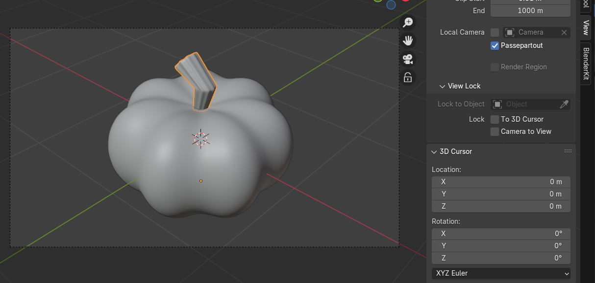

 
Choose view and turn on Camera to view. 
 
Adjust the camera. When you're satisfied, turn of camera to view to move freely without 
losing your perfect rendering angle. 
 
Switch to rendered mode. 
 
 
290 

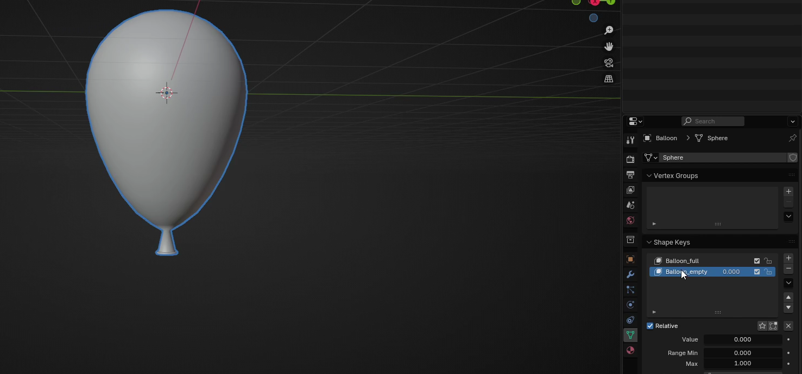

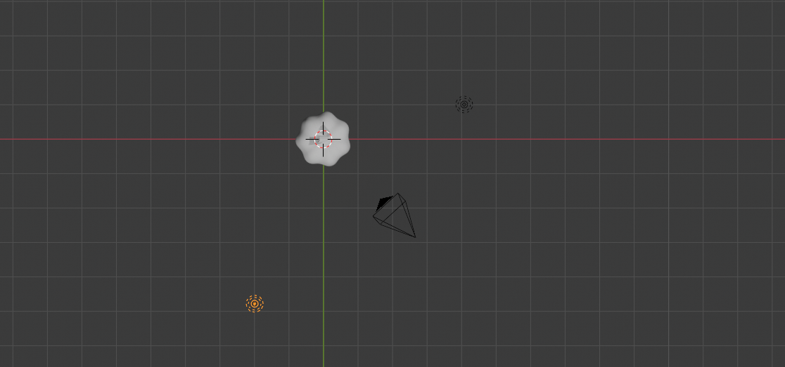

 
Change the render engine to Cycles and the device to GPU if your graphics card is better 
than the processor. Also, turn on denoise in the viewport. 
 
Click Blue Z on the Gizmo or 7 on your keyboard for the view from the top. 
 
Select the point light that you already had on the scene and duplicate it with “SHIFT+D.”  (If 
you deleted it, just go to Add → Light → Point.) 
Move it with “G.” 
 
 
 
291 

 
Choose both lights and move them with “G” a bit if needed. 
 
Choose a second point light and duplicate it with “SHIFT+D.” 
Move it with “G” as shown. 
 
 
Click on the light icon on the right and change the power to 500. 
 
 
 
 
 
 
 
292 

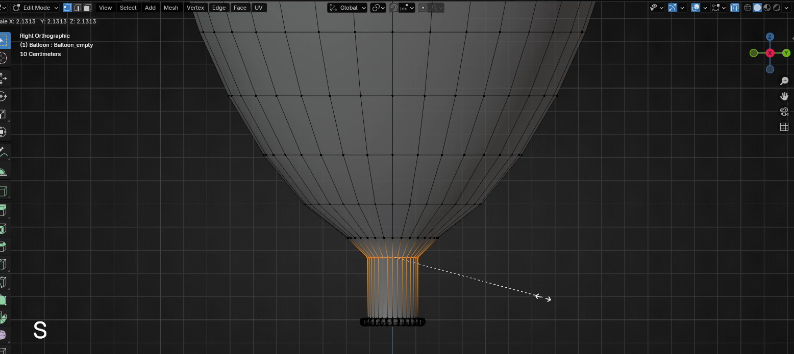

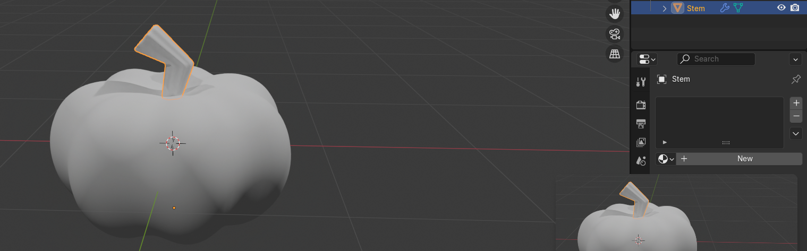

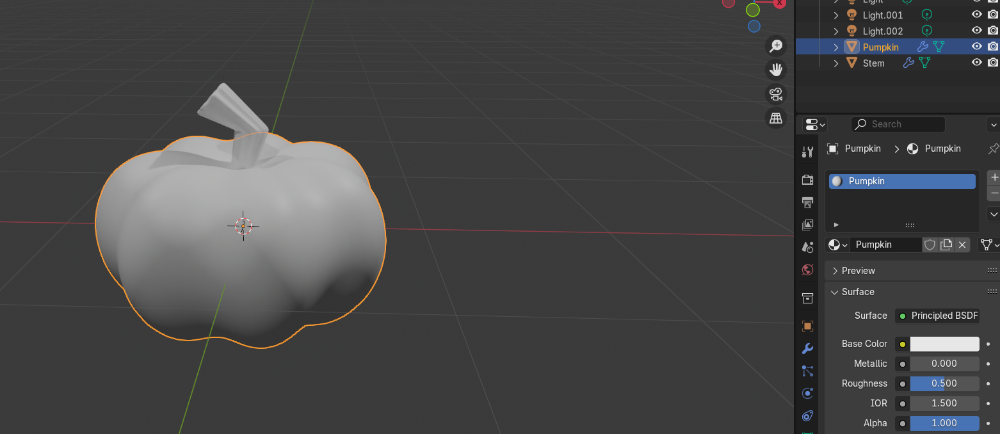

 
Do the same for the second light. 
 
Select the stem and go to the material properties. 
 
Click new and rename the material to Stem. 
 
Select the Pumpkin and go to the material properties. 
Click new and rename the material to Pumpkin. 
 
293 

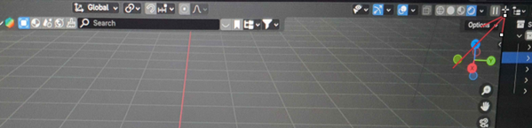

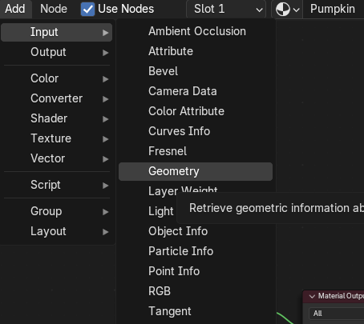

 
Place the cursor on the upper side of the screen as shown, and when you see a plus, 
 
 just pull it down to the left while holding the left mouse click. 
 
Open the shader editor in the window you just created. 
Click “N” to hide that sidebar on the right because you don’t need it. 
 
Add → Input → Geometry. 
 
294 

 
Connect Pointiness from Geometry with Fac from Color ramp to create some edge highlights 
on the pumpkin. 
 
Connect Color from ColorRamp with Base Color from Principled BSDF. 
 
Move the first color picker more to the right. Change the first color in Color ramp to some 
brown. 
 
 
 
 
295 

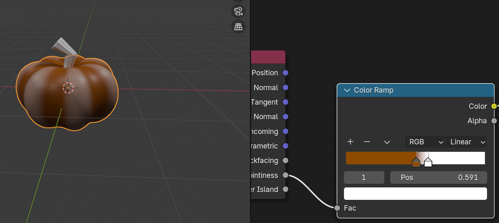

 
Move the second color picker the left.  
 
Change the second color in Color ramp to light orange. 
 
Adjust the colors more if necessary. 
 
 
Select the stem. Add a Geometry. Connect Pointiness from Geometry with Fac from Color 
ramp. 
 
296 

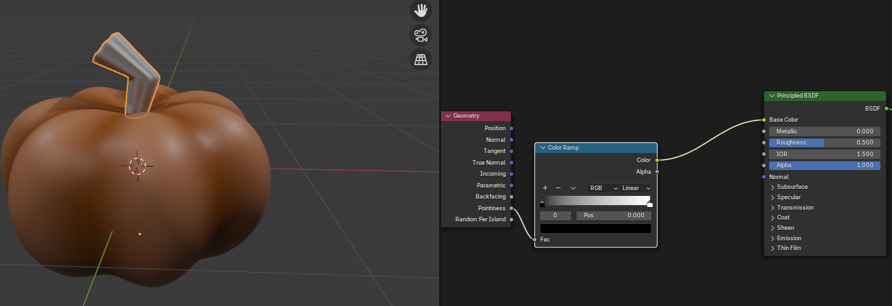

 
Connect Color from Color ramp with Base Color from Principled BSDF. 
 
Move the first color picker more to the right. 
 
 
 
 
Right mouse click on the stem, shade smooth. 
 
297 
