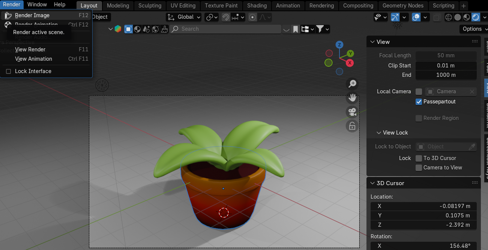

# Chapter 27: Rigging a cute 3D Mushroom character

Beginners guide to Blender
That is it for today’s lesson. I hope you learned something new.
Happy Blending everyone!
Byee, see you next time!
Chapter 27- Rigging a cute 3D Mushroom
character
214

Beginners guide to Blender
(Blender Version 4.2.0)
Rigging
Hello everyone!  Thank you so much for supporting me on Patreon! It means a lot!
I hope you’ll enjoy this tutorial. It is the 3rd part where I will teach you how to rig this Cute
Mushroom Character. If you want to learn how to model and texture it, check out my Patreon
SaTales , and if you subscribe to the 1st tier which is less than the price of a coffee you will
get access to this tutorial and many more.
If you want video tutorial check my YouTube channel:
https://youtu.be/SeiSyuQzcW8?si=xjhgTyKQRYijhyDa
Now, let’s begin with rigging!
Switch to Solid mode
Switch to the front orthographic view by clicking on that green -Y on Gizmo or pressing
“CTRL+ Numpad 1”
Go to Add → Armature (Single Bone - if you have an older version of Blender, if not, just click
on Armature)
215

Beginners guide to Blender
Select the bone and switch to edit mode with “TAB”
Select all with “A” and scale it with “S” for around 0.22
Turn off snapping with “SHIFT+TAB” and go to Object Data Properties
216

Beginners guide to Blender
Go to Viewport display and turn on In Front so you can see bones in front of your character
Move the bone down with “G+Z” for around -0.28
Select only this top part of the bone
217

Beginners guide to Blender
Move it with “G+Z” for around -0.14
Select all with “A”
Move it with “G+Z” for around -0.004
Extrude it with “E+Z” for around 0.07
218

Beginners guide to Blender
Select only the top of the bone
Extrude it with “E+Z” for around 0.1
Select only the top of the bone and extrude it with “E+Z” for around 0.15
219

Beginners guide to Blender
Select this bone
Duplicate it with “SHIFT+D”
And move it with “G”, something like this
220

Beginners guide to Blender
Rotate it for around 108°
and move it with “G”
Select this part of the bone
221

Beginners guide to Blender
Move it with “G”
Extrude it with “E” 2x
222

Beginners guide to Blender
Change from Median Point to 3D cursor so that all the transforms are based around the
world origin.
If you placed your 3D cursor somewhere else, you can press “SHIFT+S” and choose Cursor
to World Origin to reset its position.
223

Beginners guide to Blender
Select these bones
Since we placed the 3D cursor at the world origin and our character and the armature are
centered on the X-axis we can mirror the bones by duplicating them with “SHIFT+D” and
scaling them with “S+X” -1.
Change from 3D Cursor to Median Point
224

Beginners guide to Blender
Select this bone
and duplicate it with “SHIFT+D” and move it with “G”
Rotate it for around 178°
225

Beginners guide to Blender
Move it with “G”
Select this part
and move it with “G”
226

Beginners guide to Blender
Extrude it with “E+Z” so that the end goes a bit past the leg
Select both bones
Change from Median point to 3D Cursor
227

Beginners guide to Blender
Duplicate them with “SHIFT+D” and scale them with “S+X” -1
Select these two bones
And this one in the middle
228

Beginners guide to Blender
Press “CTRL+P” and choose Keep Offset. That way we can parent leg bones to our root
pelvis bone so that when we move the root bone, leg bones also move. Else, if we were to
move our character the legs would just stay in place while the rest of the body moves about.
Now, these bones are connected
Switch to object mode with “TAB” and select in the Outliner first Mushroom and then while
holding “CTRL” select Armature
229

Beginners guide to Blender
Press “ALT+P” and choose with Automatic Weights. By choosing this option, Blender
automatically sets bone influence to different parts of the mesh. It’s not perfect but works well
for simple characters and saves some time.
Switch from Object Mode to Pose Mode. In Pose mode you can move, scale, and rotate each
bone of the armature and see how it influences the mesh of your character.
Switch from 3D Cursor to Median Point
Select this bone
230

Beginners guide to Blender
And move it with “R” to see if anything is influenced when you move this bone
Select this bone
Rotate it with “R”. As you can see, the eye is moving when you move the bone and that
shouldn’t be happening.
231

Beginners guide to Blender
Select this bone and check it
and this one
And this
232

Beginners guide to Blender
And this
233

Beginners guide to Blender
and this
As you can see, the first problem is those bones are influencing the eye so let’s fix that first.
Switch to object mode, select the character, and while holding SHIFT select the armature.
Switch to Edit Mode
234

Beginners guide to Blender
Select both eyes with “L” for linked
Press “CTRL+I” for inverted selection
And press “H” to hide
Switch from Edit mode to Weight Paint. In Weight Paint mode you can manually adjust
weights (influence) of each bone.
235

Beginners guide to Blender
Select this bone with “ALT” + LMB. You can see that when you click this bone, eyes are blue.
That means that this bone doesn’t have any influence on the eyes.
Maybe your skeleton will show differently. It all depends on the position and size of your
bones and automatic weights.
Click on every bone and try to find the one that shows either one or both eyes in red. You can
also check influence by rotating the bone with “R”.
236

Beginners guide to Blender
For example, this bone is showing red eye
and when you rotate it, the eye is moving. This is obviously wrong since arm bones shouldn’t
affect the eyes.
So how to fix it?
237

Beginners guide to Blender
Put weight to zero. That means that when you paint your eye, you will paint it blue which
means it has zero influence and your bone won’t affect this part of the mesh.
So paint it like this from all sides
If you didn’t paint it well somewhere, your eyes will still move when you rotate your bone.
Like this
So keep coloring it until it is not moving. Now it’s good.
238

Beginners guide to Blender
Select this bone, as you can see the eye is red, so do what you did previously, paint it blue
until it is not moving when you are rotating the bone.
Select this bone and try to rotate it. Eyes are not moving, but they should.
It’s the bone for the head part so check it and if it is not affecting the eyes then you need to
paint them red while this bone is selected.
If you want to increase the influence of the bone, change weight to 1.
239

Beginners guide to Blender
and paint both eyes red. They are now moving so it is all good.
Now switch back to edit mode
Unhide everything with “ALT+H”
240

Beginners guide to Blender
Switch to object mode with “TAB” and rendered mode.
Select the armature and switch to the pose mode.
241

Beginners guide to Blender
Select each bone and rotate it with “R” to see if it’s working properly.
242
