# Chapter 30b: New Blender 5.0 feature: circle array - modeling a flower

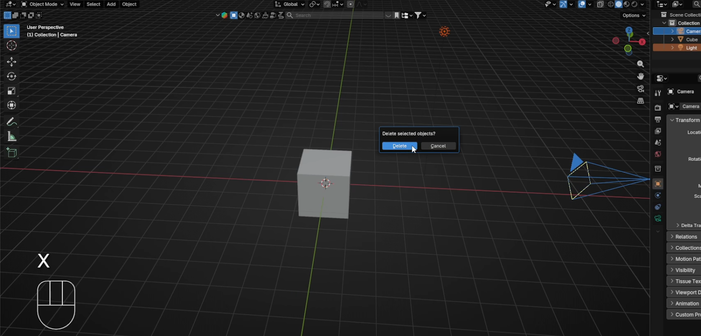

Beginners guide to Blender
Chapter 30 - New Blender 5.0 feature: circle
array - modeling a flower
Hello everyone! I am SaTales, and today it’s time for a new Blender lesson
If you haven’t heard already, Blender 5.0 is out!
You can download it from the official Bender page,Blender.org
The new Blender version is full of amazing features. I wanted to show all of them, but for
now, I decided to first go with one of my favorites - the circle array.
So let’s get started!
(Full video on my YouTube channel:https://youtu.be/2b3mqOPaAZQ)
Firstly, select the camera and light and delete them with “X”.
Select the cube with LMB, and go to modifiers.
327

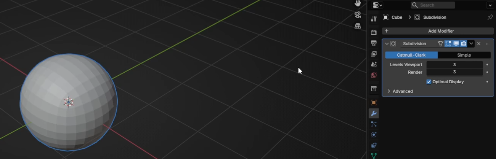

Beginners guide to Blender
Go to Add modifier → Generate → Subdivision subsurface.
Change Levels Viewport and Render to 3.
Click RMB and choose Shade Smooth
328

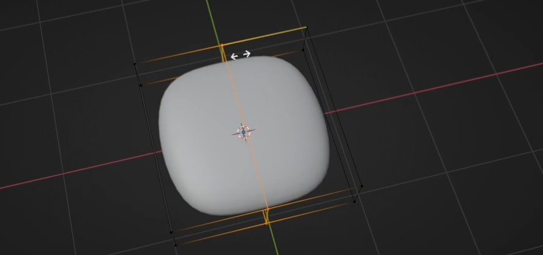

Beginners guide to Blender
Switch to edit mode with “TAB”.
Scale it with “S+Z” for around 0.25.
Add a loop with “CTRL+R”
329

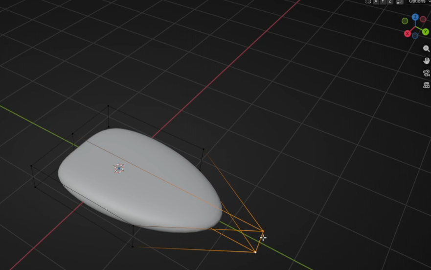

Beginners guide to Blender
Switch to selecting vertices with 1 and select these two vertices.
Move them with “G+Y” for around 1.5.
Add a new loop with “CTRL+R”
330

Beginners guide to Blender
And add one more
Switch to selecting edges with 2 and choose both loops
And move them up with “G+Z” for around 0.4
331

Beginners guide to Blender
Switch to selecting edges with 2. Select these two edges.
Move them with “G+Y” to the left for around 0.6
Switch to object mode with “TAB”
332

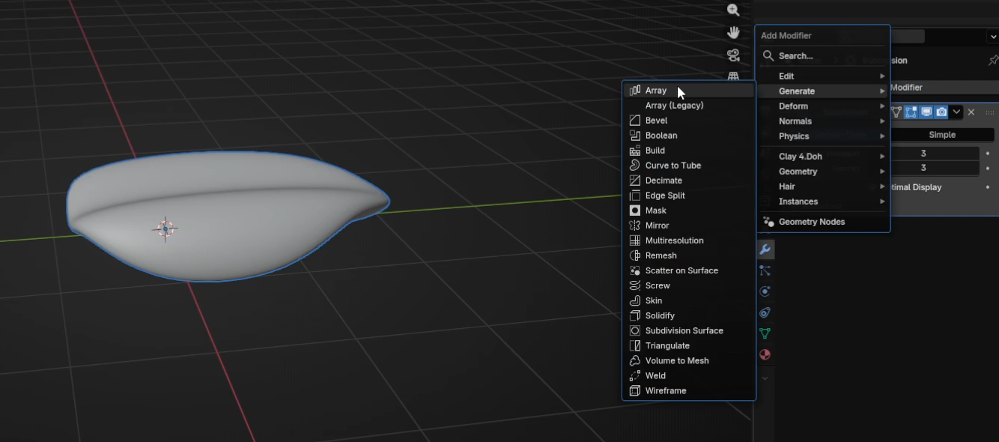

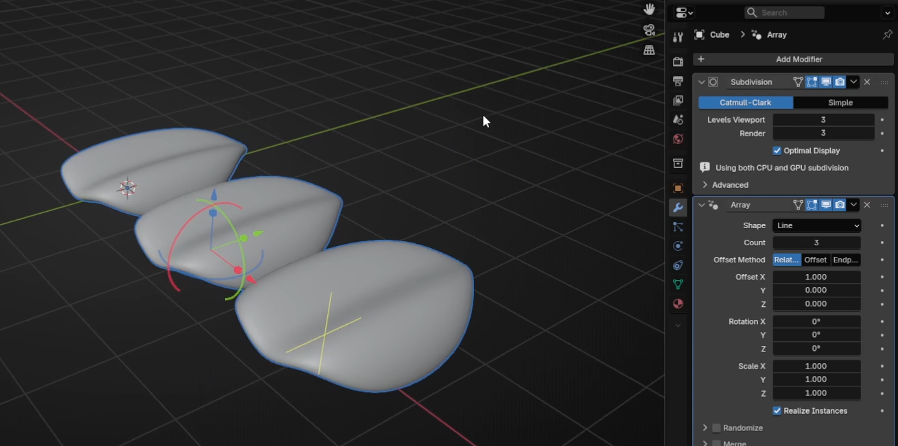

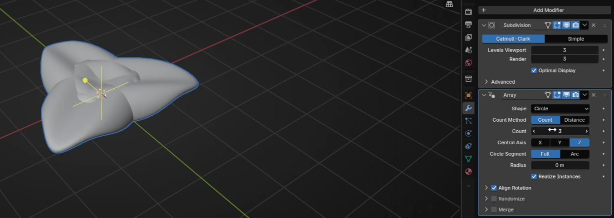

Beginners guide to Blender
Go to modifier → Add Modifier → Array (not Array Legacy, that is the old one)
Change Shape to Circle.
333

Beginners guide to Blender
Change radius to around 0.95
And count to 6 (or any other number you want)
And now adjust the radius again. I changed it to 1.38
334

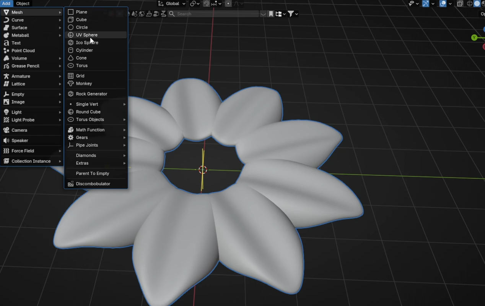

Beginners guide to Blender
You can play even more with count and radius if you don’t like how your flower
currently looks. In the end, I decided to count 9 and with a radius of 1.84.
Go to Add → Mesh → UV Sphere
335

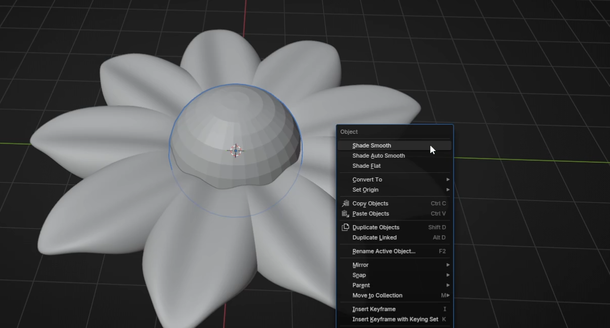

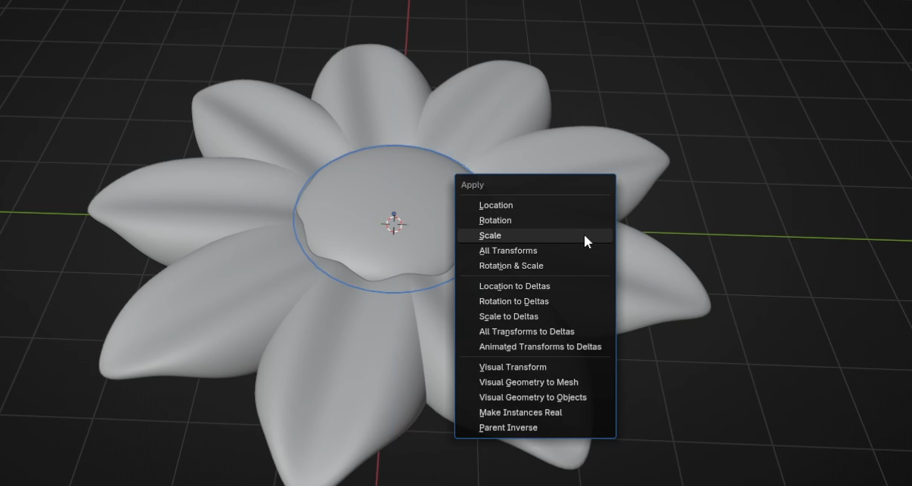

Beginners guide to Blender
Scale it with “S” as you think it is the best. RMB and choose Shade Smooth.
Scale it with “S+Z” as you think looks the best.
And move it up a bit with “G+Z”. Press “CTRL+A” and apply the scale.
336

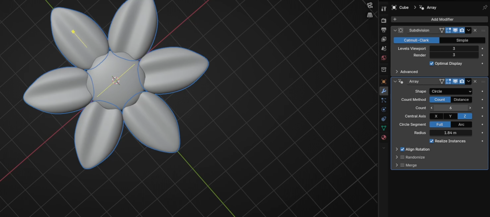

Beginners guide to Blender
You can again change the look of your flower by adjusting the number in the count.
This is just one example of how a new array can simplify modeling in Blender.
Did you think of anything else?
Let me know in the comments!
If you had fun learning with me, don’t forget to subscribe to my channel.
I recently started a Patreon with more exclusive content, including 3D models, .blend
files, and sharing my experience on how to sell your 3D models, how to find clients in
ArchViz, etc. You can also download a free Blender guide based on this lesson, so
feel free to check it out if you prefer text tutorials over video tutorials. It is updated
regularly.
There is something for both free and paid members, so don’t forget to check the
The link in the description.
And if you have any questions, write them down in the comments :D
Happy Blending, everyone! Bye, see you next time.
337
